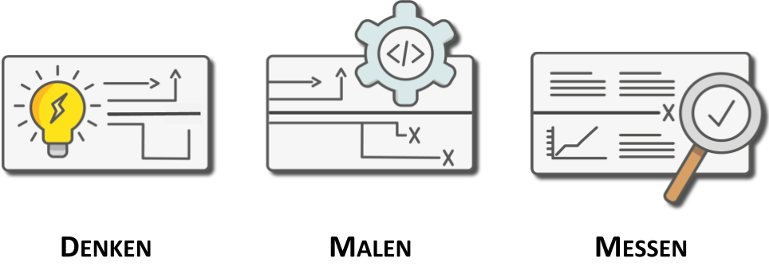

# Bestandteile process-engine.io {#bestandteile}

Die Marke process-engine.io besteht aus vier Bestandteilen:

1. Vorgehensmodell
1. BPMN-Studio
1. ProcessEngine
1. API Domänen

## Vorgehensmodell {#vorgehensmodell}

Innerhalb der letzten zwei Jahre, hat sich aus unseren Beratungserfolgen ein
Vorgehensmodell entwickelt, dass schlussendlich zu der Entwicklung von
process-engine.io geführt hat.

Wir wollen alle Beteiligte an einem Prozess adressieren und:

1. die verantwortlichen Fachanwender,
1. umsetzende Softwareentwickler und
1. den Betrieb

an einen Tisch bringen, denn wir sind überzeugt nur so nachhaltig Software
entwickeln zu können. Der Erfolg der letzten Jahren bestärkt uns in diesem Weg.

Zu diesem Vorgehensmodell haben wir einen *Dreiklang* entwickelt, der im
Folgenden erklärt werden soll.

### Denken-Malen-Messen {#denkenmalenmessen}

#### Denken (Think)

Eine Übersicht der Prozesslandschaft und Zusammenspiel aller Prozesse ist
essentiell um geschäftskritische Schnittstellen zu identifizieren und steuernd
eingreifen zu können. Wir denken, überlegen und legen den besten
Domänenzuschnitt fest.

#### Design (Design)

Prozessverantwortliche und Techniker gestalten gemeinsam in dieser Phase: ein
Bild sagt mehr als tausend Worte. Missverständnisse werden minimiert, denn es
wird eine gemeinsame Sprache entwickelt; iterativ wird die geplante Vision
umgesetzt und Bausteine heben die Qualität und fördern Nachhaltigkeit.

#### Inspect (Inspect)

Performance zu analysieren und Leistung der Prozesse zu validieren ist
essentiell. Dashboards unterstützen bei der Identifikation von Engpässen;
Heatmaps helfen Hot-Spots zu erkennen; wir finden das optimale Design.

Die gewonnenen Erkenntnisse liefern eine wertvolle Grundlage für die optimale
Ausnutzung der Wertschöpfungskette; indem auf der Basis von Metriken neu
gedacht wird.

### Gesamtbild {#gesamtbild}

Ganzheitlich betrachtet kann der Vorteil einer prozessbasierten
Entwicklung darauf reduziert werden, dass ein Unternehmen nachhaltig
transformiert wird; Es wird zur Gewohnheit iterativ das Geschäft selbst zu
Messen, zu bewerten und evtl. neu auszurichten. Alle Unternehmensbereiche sind
damit Teil der Wertschöpfungskette.

## BPMN-Studio {#bpmnstudio}

### BPMN-Studio {#bpmn-studio}

Das BPMN-Studio ist die integrierte Entwicklungsumgebung für Geschäftsprozesse.

Mit dieser Software lassen sich:

* Geschäftsprozesse modellieren,
* Prozesse für die Ausführung deployen und
* Prozesse analysieren und optimieren.

## API Domänen {#apis}

Wir wollen eine stabile Software liefern, die sich flexibel in Lösungen
integriert.

Dafür liefern wir drei API-Domänen:

1. Management Domäne,
1. Consumer Domäne und
1. Runtime Domäne,

die stabile Zusicherungen für die Verwendung darstellen.

Jeder Domäne, ordnen wir eine Anwendergruppe zu:

1. Prozess-Ersteller - der Management Domäne
1. Prozess-Beteiligte - der Consumer Domäne
1. Laufzeitumgebung - der Runtime Domäne

Die APIs, die wir in diesen Domänen zusammenfassen, richten sich an diese
Personen bzw. an ihr Bedürfnisse.

## ProcessEngine {#processengine}

Die ProcessEngine selbst, stellt die Ausführungsumgebung für BPMN-Diagramme dar.

Sie implementiert im Standard alle API-Domänen. Die ProcessEngine ist in zwei
Technologien verfügbar:

1. TypeScript
1. .NET

TypeScript ist aktuell als Open-Source verfügbar, die .NET Variante ist
speziell für ein Kundenprojekt entstanden und (noch) nicht Open-Source
verfügbar. Wir haben bewiesen, dass die Ideen hinter unserer ProcessEngine sich
in beliebigen Technologien umsetzen lassen und so die Vorteile der
jeweiligen Platform optimal zu nutzen.

Die TypeScript ProcessEngine ist aktuell die einzige Engine, die sich
vollständig im Browser ausführen lässt.
