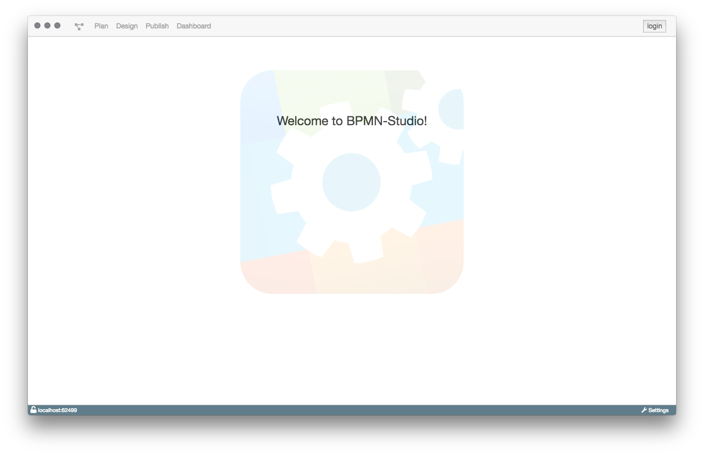

# Installation BPMN-Studio

Die aktuellste, stabile Version des BPMN-Studios und alle vorherigen Versionen
kann man
[hier](https://github.com/process-engine/bpmn-studio/releases/latest)
herunterladen. Diese Installation wird empfohlen.

Generell unterscheiden wir zwei Versionen des BPMN-Studios:

1. BPMN-Studio Stable
1. BPMN-Studio Develop

**Develop**

Die Develop-Variante ändert sich häufig und zeigt den aktuellsten Stand der
Entwicklung; Wir bemühen uns jeden Release mit Sorgfalt durchzuführen, können
aber die Stabilität der Entwicklungsversion nicht gewährleisten.

Die Develop-Variante ist an dem "Pre-release" Label zu erkennen, und sie
enthält im Namen den Bestandteil "-pre-".

Beispiel: "4.0.1-pre-b313"

**Stable**

Die Stable-Variante bietet die stabilste Erfahrung mit dem Umgang des
BPMN-Studios. Durch sorgsames Testen übernehmen wir für die Funktionalität eine
Garantie. Für diese Variante geben wir zusätzlich Release Notes- die über die
Änderungen zur Vorgänger-Version informieren- heraus.

Diese Version wird ohne den Hinweis "Pre-release" veröffentlicht. Sie wird mit
"Latest release" gekennzeichnet.

Beispiel: [4.3.0](https://github.com/process-engine/bpmn-studio/releases/tag/v4.3.0)

Die Installation der aktuellsten Version wird empfohlen.
Sie kann
[hier](https://github.com/process-engine/bpmn-studio/releases/latest)
gefunden werden.

Eine Übersicht aller Versionen, befindet sich
[hier](https://github.com/process-engine/bpmn-studio/releases).

Nachfolgend befindet sich eine Anleitung für die verschiedenen Platformen, für die BPMN-Studio verfügbar ist.

Wir unterstützen:

1. Windows
1. macOS

### Mac

Die oben verlinkten Releases enthalten eine `.dmg`-Datei.

Diese Datei kann direkt ausgeführt werden oder zur Installation in den
Programme-Ordner verschoben werden.

Wir empfehlen BPMN-Studio in den `Programme`-Ordner zu verschieben,
es kann aber auch direkt ausgeführt werden.

### Windows

Für die Windows-Version sollte die `.exe`-Datei des entsprechenden Releases
heruntergeladen werden.

Diese kann zur Installation des BPMN-Studio ausgeführt werden. Nach der
Installation ist das BPMN-Studio startbereit.

### Linux

Es wird zusätzlich eine Linux-Variante als Snap bereitgestellt, die Windows-
und macOS-Versionen werden jedoch zurzeit intensiver gepflegt.

### Nach der Installation

Wurde die Anwendung erfolgreich installiert und ausgeführt,
öffnet sich die Startseite des BPMN-Studios.

