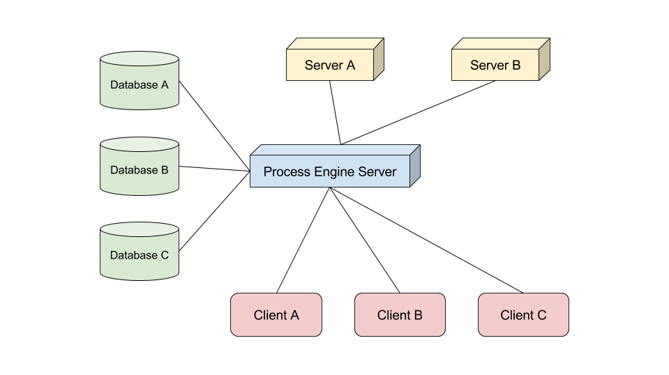

# Infrastructure

## 1 What components make up the solution?

Typically an environment working with the process engine will contain the following:

* one or many database servers
* one or many machines running distinct tasks
* one or many servers hosting the process engine
* many clients

### 1.1 Databases
The process engine is database independent, so it can work with any number of different databases combined. Each process engine uses its own data model and exposes it in a generic datastore. This data model can be queried against using the HTTP REST API, GraphQL or the Client API (via Messagebus).

### 1.2 Apps
Besides the process engine you might have several other machines - e.g. a client pc next to a production line or a server running archiving jobs. Those could be part of your business processes as well and the process engine can make them work as a part of the process execution.

### 1.3 Clients
Your business processes will most likely contain manual user tasks at some point. A user can log into the process engine frontend in the browser and take care of these tasks. The UI will be automatically generated based on the preferences in the business process.

## 2 What are typical setups?

### 2.1 Single Server

In a setup with a single process engine server, this server:
* Knows database servers relevant to BPMN processes
* Knows other servers that may play a part in a BPMN process
* Serves all the clients running the process engine frontend

### 2.2 Multiple Servers

When running multiple process engine servers, each server:
* Knows some or all of the database servers relevant to BPMN processes
* Knows some or all other servers that may play a part in a BPMN process
* Serves some clients running the process engine frontend
  * This is usually split by a load balancer (or by use cases in a heterogeneous setup (see 2.2.2 Heterogeneous Setup))

#### 2.2.1 Homogeneous Setup

In a homogeneous server setup each of the process engine servers is deployed with the same components and has access to the same ressources.

This makes scaling the system easy, because you can scale it by increasing the number of the machines running the process engine.

#### 2.2.2 Heterogeneous Setup

In a heterogeneous server setup you have multiple servers running the process engine. But each of the servers can have different components or ressources. That means not every instance can perform every action. Instead if a system cannot execute the request action, it will hand it off to another process engine server that is capable of executing it.

## 3 What is supported / compatible?

### 3.1 Environments

The libraries that form the process engine are isomorphic wherever possible. But there will always be use cases where an environment cannot provide an adequate fallback - e.g. a browser won't provide access to the file system or network ports.

In cases like this the environment-specific parts are encapsulated into a separate library so that there is a library - containing only the isomorphic core functionality - that can be executed in every environment.  

* Node.js (Windows, Linux, OS X)
* Browser (every browser that supports ECMAScript 5 or higher)

To clarify: yes, the whole process engine stack can run in the browser as well - including data layer, access management and process execution

### 3.2 Database Adapters

The data layer is abstracted in the process engine so that the same data model can be used to consume a relational database and an object database.

* Postgres
* MongoDB
* OrientDB
* Redis
* Local Storage

#### 3.2.1 Special Adapters

Rather than building a bridge to a database technology, special adapters aim to provide a different way to work with the data layer.

* Proxy
  * Uses another process engine instance as a database adapter remotely
* In Memory
  * Stores data in memory without directly persisting it

### 3.3 Messagebus Adapters

The messagebus uses a channel-name-based pub/sub pattern. This is the only thing a messagebus has to support in order to be compatible to the process engine.

Currently implemented adapters:

* Faye

## 4 How can I get it to work with an unsupported technology?

In the previous section you learned which adapters to other technologies we already provide. This list will grow over time.

If you need an adapter for a technology that is not yet supported, you have several options:

### 4.1 Place your request in the backlog

You can open an issue in our backlog on Github. We will try to priorize the issue based on the popularity and demand of the technology and the progress of our roadmap.

Choosing this way is the easiest for you, but will also take the longest time to completion.

### 4.2 Write your own

Although writing you own adapters requires some basic knowledge of the process engine, most of the interfaces are rather self explanatory.

You can find in-depth guides on writing your own adapters here: TODO: link 

### 4.3 Pay us to do it for you

The process engine is not just the product of a single company. It is the shared vision of a network of multiple companies.

As such we offer custom implementations and consulting through our company network.

If you have a request, please send a mail to TODO: link for further information.