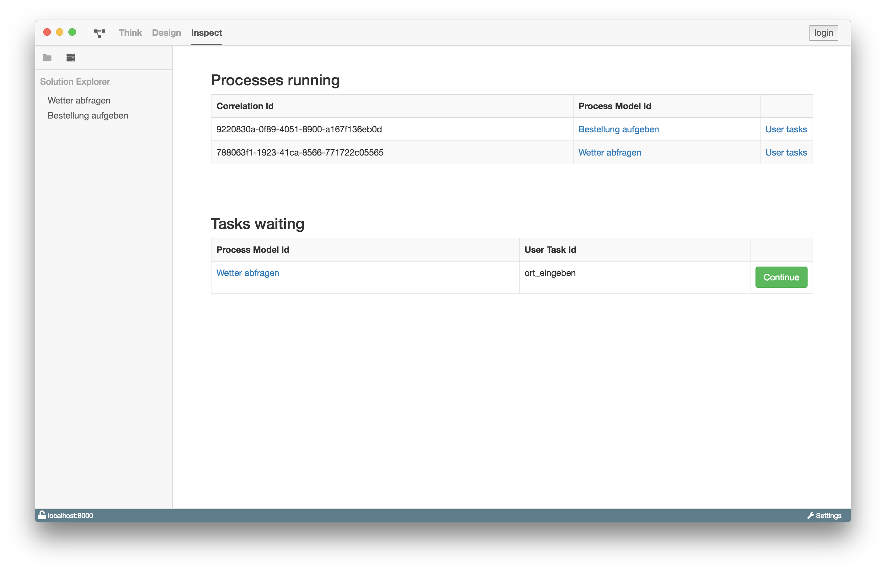

# Inspect

## Aufgaben und Motivation

Ziel der Inspect-Ansicht ist es, dem Benutzer einen schnellen Überblick über die
laufenden Prozesse zu geben. Diese Informationen werden von der verbunden
ProcessEngine bezogen.

## Aufbau und Strukturierung

Die Inspect-Ansicht kann über den Navigationseintrag `Inspect` geöffnet werden.

In der Inspect-Ansicht finden sich folgende zwei Abschnitte:

Im ersten Abschnitt, `Processes running`, werden die laufenden Prozesse als
Tabelle aufgelistet. In der Tabelle wird die `Correlation Id` und die
`Process Model Id` angezeigt.

Im zweiten Abschnitt, `Task waiting`, werden Aufgaben angezeigt, die auf
weitere Bearbeitung warten. In der Tabelle werden ebenfalls die
`Process Model Id` und die `User Task Id` angezeigt.

## Funktion

In der Tabelle `Processes running` werden für jeden laufenden Prozess zwei
Links angeboten. In der Spalte `Process Model Id` befindet sich jeweils ein
Link zu der Design-Ansicht des Prozessmodels. Mittels dem Link `User Tasks`
kann eine Ansicht mit allen Aufgaben zu dem entsprechenden Prozess angesteuert
werden.

Die `Task waiting` Tabelle enthält für jede wartende UserTask einen `Continue`
Button. Dieser dient dazu, die entsprechende Aufgabe fortzuführen.
