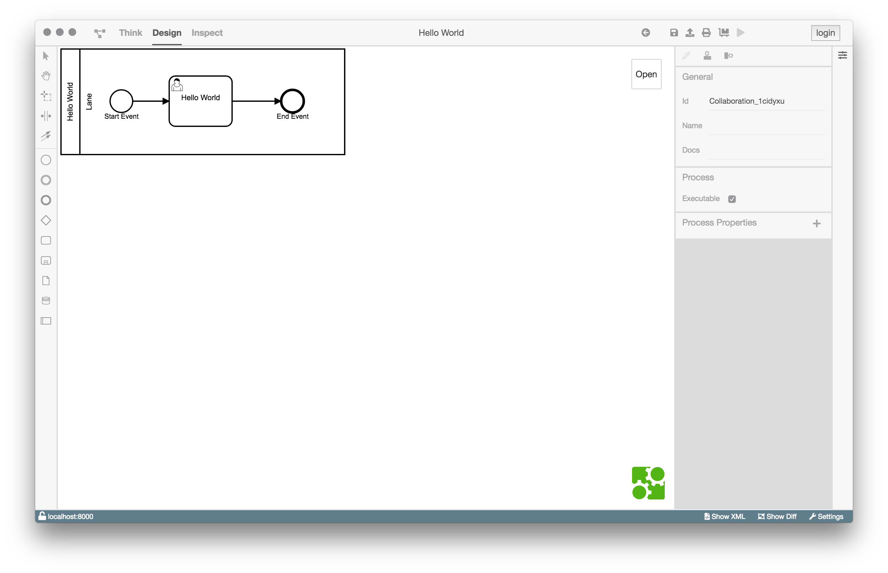
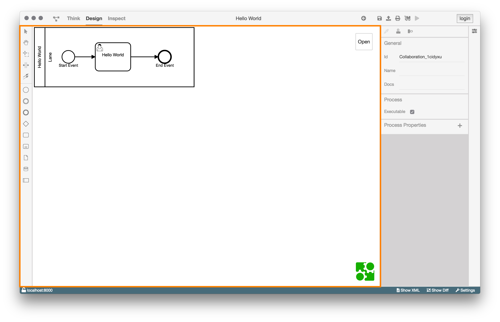
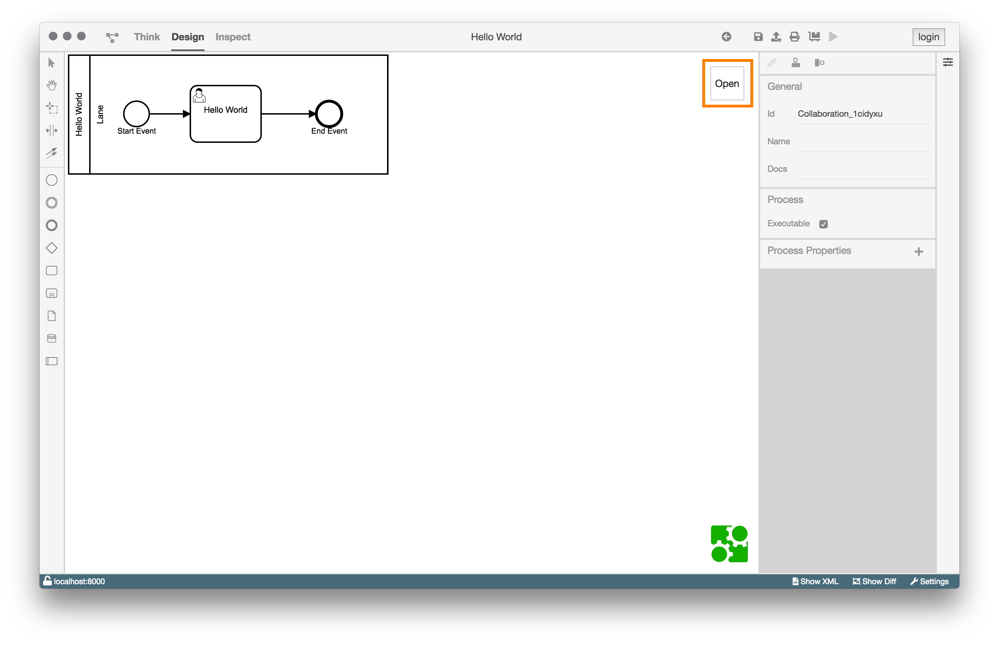
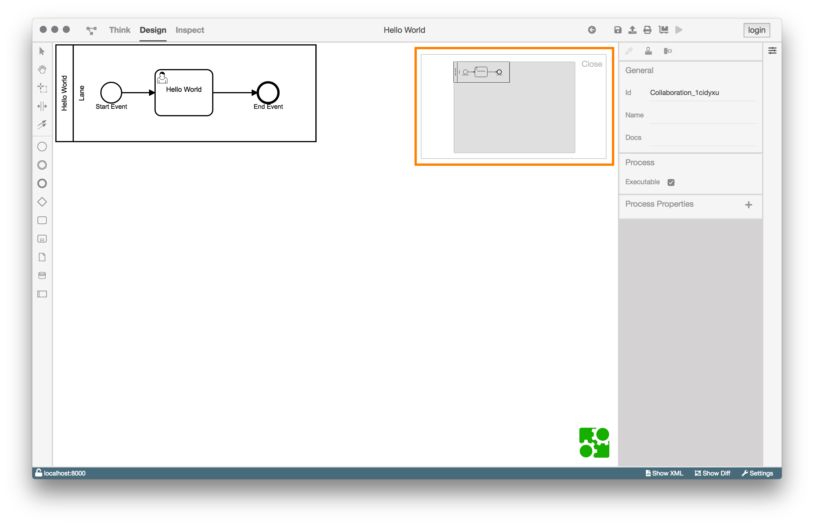
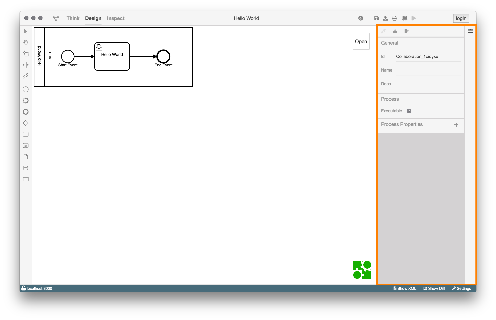
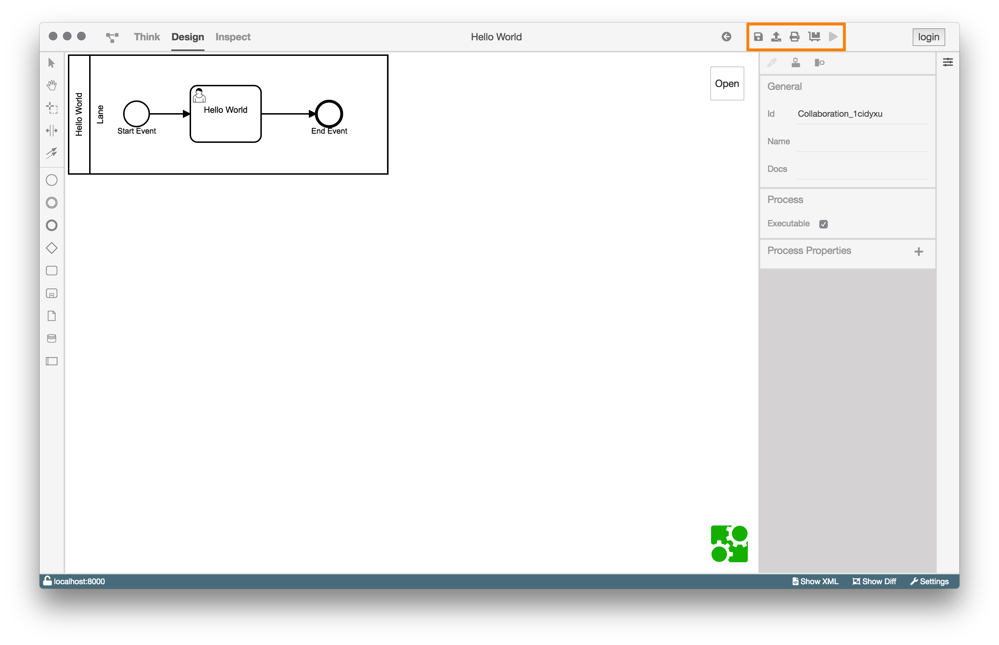
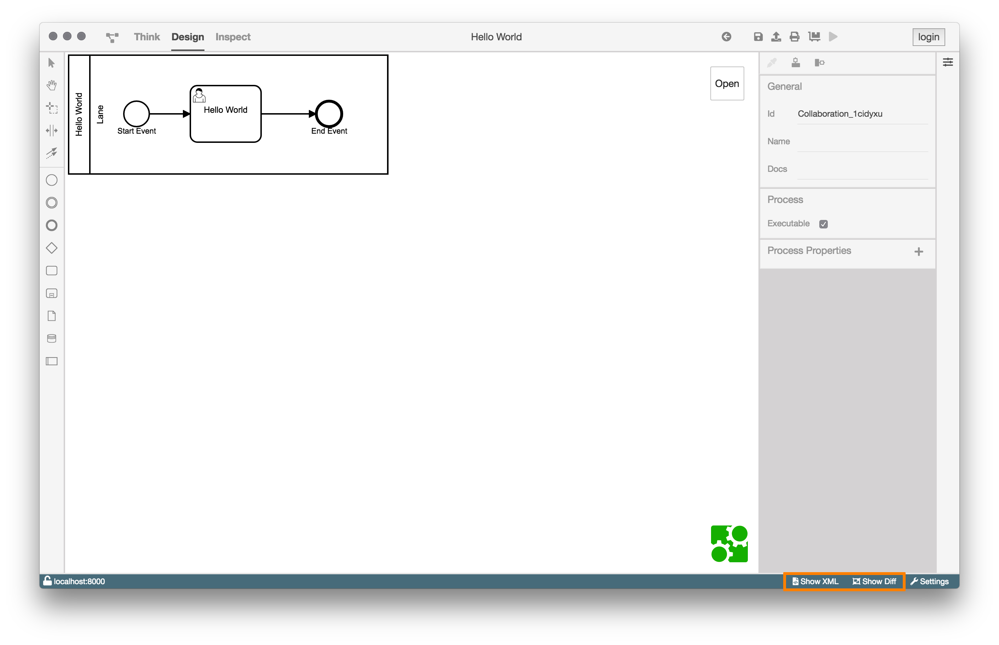

# Design-Ansicht

## Aufgaben und Motivation

Die Design-Ansicht ermöglicht dem Benutzer einen Prozess zu betrachten,
zu modellieren, zu konfigurieren, zu deployen, zu starten und zu exportieren.

## Aufbau und Strukturierung

Wenn die Design-Ansicht geöffnet wurde, wird in der Mitte des BPMN-Studios
(Modellierungsfläche) das Diagramm angezeigt.

Die Design-Ansicht ist in vier Bereiche aufgeteilt:

1. Modellierungsfläche

   

   In der linken Werkzeugleiste findet man im oberen Teil die Standardwerkzeuge
   zum bearbeiten von BPMN-Diagrammen und im unteren Teil BPMN-Elemente.

   Oben rechts in der Modellierungsfläche gibt es eine Minimap, welche sich
   mit dem _Open_ Button öffnen lässt.

   

   Die Minimap zeigt das Diagramm im Ganzen und erlaubt es dem Nutzer sie zur
   Navigation zu nutzen und zu zoomen.

   

2. Property Panel

   

   Das Property Panel bietet die Möglichkeit ein angewähltes Element
   zu konfigurieren und diesem Eigenschaften hinzuzufügen.

   Zusätzlich bietet das Property Panel eine Werkzeugleiste an, in der sich
   Tools befinden, um die optische Darstellung des Diagramms anzupassen.

   Es ist möglich:

   - Ein oder mehrere Elemente zu färben.
   - Mehrere Elemente horizontal auszurichten.
   - Mehrere Elemente vertikal auszurichten.

3. Aktionsmenü

   

   Befindet sich das Diagramm auf dem Dateisystem, kann es mit dem
   
    Button auf die ProcessEngine geladen/deployed werden.

   Anschließend wird man auf die Ansicht der ProcessEngine geleitet und der
   Deploy Button ausgegraut.

   Das Öffnen eines Diagramms macht den Start-Button verfügbar
   
   (Bild rechts). Mit diesem kann ein Prozess auf der verbundenen
   ProcessEngine ausgeführt werden.

   Die anderen Buttons haben immer die selbe Funktionalität.

|                                              |                                                          |
|----------------------------------------------|----------------------------------------------------------|
|    | Navigiert eine Seite zurück                              |
|    | Speichert den Prozess.                                   |
|  | Exportiert das Diagramm (.bpmn, .svg, .jpeg, oder .png). |
|   | Öffnet einen Drucken Dialog.                             |

4. Statusleiste

   

   Die beiden Buttons `Show XML` und `Show Diff` sind nur in der Statusleiste
   der Design-Ansicht sichtbar.

   Der `Show XML` Button wechselt zur [XML-Ansicht](../xml-view/xml-view.md)
   und zeigt das aktuelle XML des Diagramms.

   Der `Show Diff` Button wechselt zur [Diff-Ansicht](../diff-view/diff-view.md).
