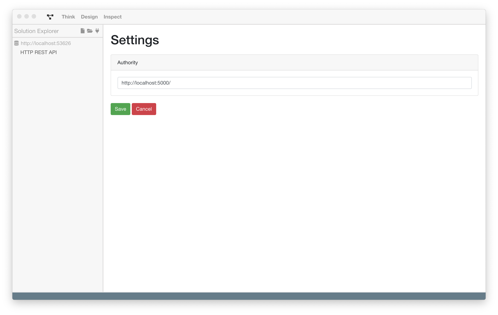

# Settings

## Aufgaben und Motivation

Die Settings dienen dazu, allgemeine Einstellungen an der in BPMN-Studio
integrierten ProcessEngine vorzunehmen.

## Aufbau und Strukturierung

Die Einstellungen können immer über das Zahnradsymbol an der rechten Seite
der internen ProcessEngine-Solution geöffnet werden.

Mit einem Klick öffnet sich die Settings Ansicht.

**Konfiguration der Authority:**

Im ersten und aktuell einzigen Feld kann die Authority der internen
ProcessEngine konfiguriert werden.
Die Authority muss eine HTTP URL enthalten.

## Funktion

Über den `Save` Button können die neuen Einstellungen übernommen werden. Diese
überschreiben die alte Konfiguration.

Mit dem `Cancel` Button können die Einstellungen verworfen werden. Die alten
Einstellungen werden nicht überschrieben.
