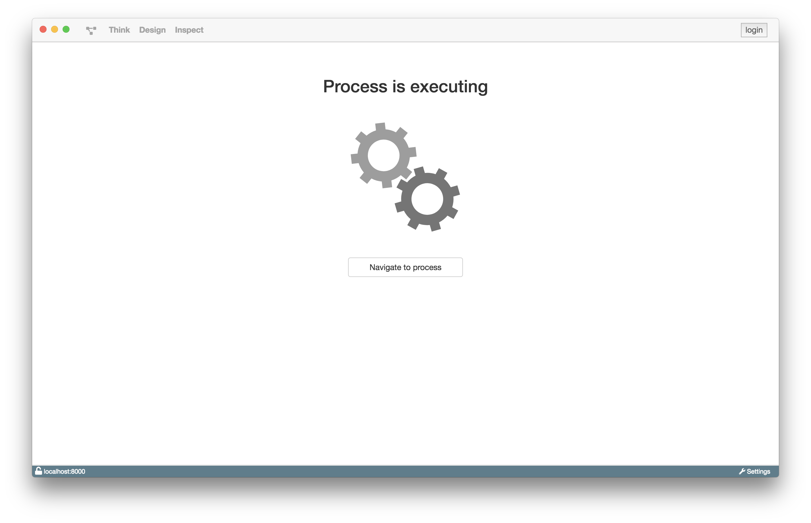

# Waiting Room

Der Waiting Room erscheint, sobald ein Prozess gestartet wurde und ausgeführt
wird. Er wird so lange angezeigt bis der Prozess und seine Aufgaben beendet wurden.

Man kann den Waiting Room verlassen und den Prozess, falls ein UserTask ansteht,
später weiter ausführen.

Wenn der Prozess keinen UserTask enthält, wird der
Prozess automatisch nach Fertigstellung seiner Aufgaben beendet.
