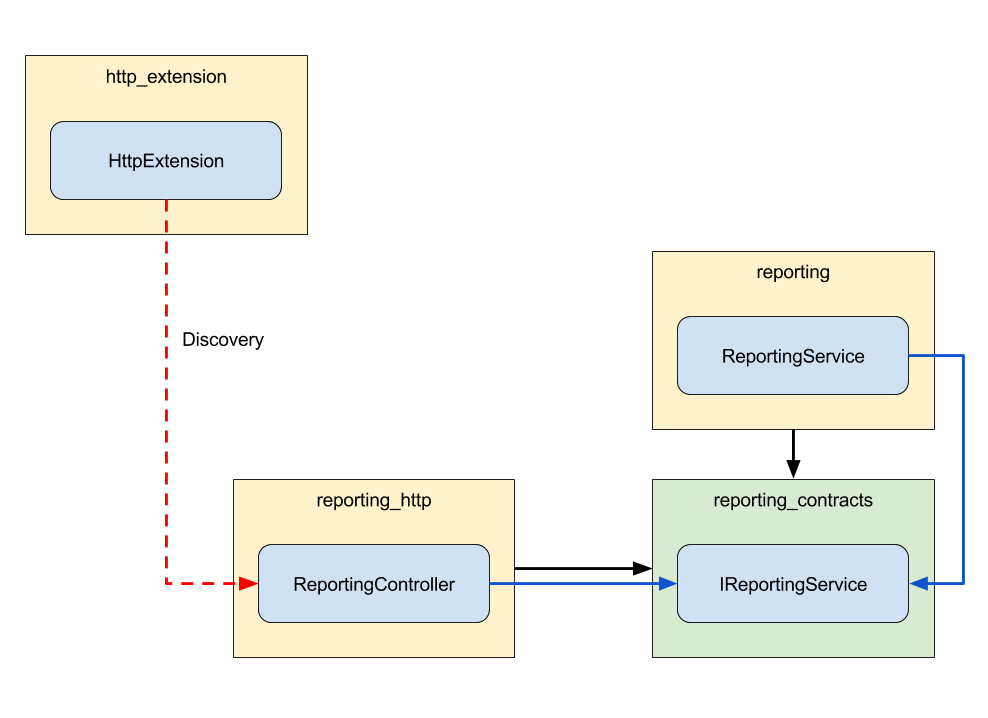

# The Stack

## 1 What does it consist of?

When we refer to the stack we're talking about a collection of loosely coupled modules.

Each module has a certain topic and should only have responsibilities for tasks associated with that topic.

These modules are regular npm packages that can be dependent from one another.

## 2 How is it structured?

Each module can be placed inside a category. For consistency we apply a naming convention to these categories:

package name | description
---------|----------
 messagebus | the isomorphic base module
 messagebus_contracts | the interfaces that represent the base module
 messagebus_http | the http bridge for the base module
 messagebus_adapter_faye | an adapter for the base module

### 2.1 Contracts

We learned already that modules are regular npm packages with dependencies. When dealing with a stack of this size we need to make sure that every component is exchangable through dependency injection without changing the code.

Imagine we have a class `ReportingService` in a module `reporting` that depends on the class `LoggingService` from the module `logging`.

The npm package `reporting` would not have a dependency on `logging`, but rather on `logging_contracts`.

Also the class `ReportingService` would not reference the class `LoggingService`. Instead it uses the interface `ILoggingService` from `logging_contracts`.


Now that the `reporting` module has no references to the implementation, we can completely change the implementation through dependency injection as long as our replacement fulfills the contract (implements the interface).

### 2.2 Bridges

When we need to tie one base module to another we want to do it in a way that keeps them loosely coupled. This means that the implementations we tied together are completely independent from one another.

We achieve the loose coupling by putting all the glue that ties modules together into bridge modules.

One example you will often find are `http`-bridges. Normally base module mostly contain services that encapsulate logic.

If we want to expose service logic via a HTTP endpoint we have to define which HTTP routes and methods can be used to execute the service logic. The code that does this resides in the bridge module.



Usually bridge modules are discovered using _Inversion of Control_ (see 3.1).

### 2.3 Adapters

Adapters are very similar to bridges, but have one important difference. They provide the glue needed to tie a base implementation of our stack to a third party component or technology outside of our stack.

The prime example for this are the data source adapters used in our stack.

For each third party database technology we want to support, we need an adapter that knows how our generic data layer can be tied to the database so that both will work together. 


### 2.4 Extensions

The entry point for the whole stack is the `AppBootstrapper`. It uses the `ExtensionBootstrapper` to discover extensions. After discovering them the `ExtensionBootstrapper` has two phases. First it initializes all extensions by calling the `initialize`-method. Then it starts them by calling the `start`-method.

When the two phases have completed and the bootstrapper is done, the application is considered as `started`.

Although extensions are technically suited for all kinds of uses we solely use them to represent the communication endpoints of an application.

For example, the `HttpExtension` starts a HTTP server and discovers components that can register routes on the HTTP server. An `AmqpExtension` could do something similar to that with the AMQP protocol.


## 3 How do modules work together?

### 3.1 Inversion of control (dependency injection)

## 4 What base implementations do I need to know to start developing?

### 4.1 Entities

An entity is a class used to persist a domain object.

We use the base class `Entity` to prevent boilerplate code as much as possible. There's basic functionality you don't want to implement yourself for every entity such as access management, lazy loading, serialization, etc.

By sticking to a small set of patterns and conventions you get this functionality by default.

#### 4.1.1 Logic

The logic implemented in entities should only apply to a single entity.

```typescript
myEntity.calculateSomething();
myEntity.applySomething();
```

As you can see the entity methods are meant to be called on a single entity to modify its state or to execute behavior based on that state.

#### 4.1.2 Properties

A property consists of a getter and a setter function. Both are pretty self explanatory.

```typescript
  public get name(): string {
    return this.getProperty(this, 'name');
  }

  public set name(value: string) {
    this.setProperty(this, 'name', value);
  }
```

By calling `getProperty` and `setProperty` you get all the goodies that lie under the hood.

#### 4.1.3 Schemas

As mentioned before the stack is database independent and uses its own data model to describe how things can be persisted.

When we declared the property in 4.1.1 you might have noticed that there is nothing that seems to configure the data model.

This is done by using ES7 Decorators (a modern JavaScript feature), in this case the `schemaAttribute`-decorator.

```typescript
  @schemaAttribute({ type: SchemaAttributeType.string })
  public get name(): string {
    return this.getProperty(this, 'name');
  }

  public set name(value: string) {
    this.setProperty(this, 'name', value);
  }
```

The decorator is placed above the getter function of the property and takes an `ISchemaAttribute` as its argument. In most cases you only need to specify what type you want to use to represent it in the database. The type can be either one of the options of the enum `SchemaAttributeType` or a `string` if you want to use one of your own types (e.g. other entities).

#### 4.1.4 Methods

Each public method you implement (except `initialize`) should accept the `ExecutionContext` as one of its parameters. The execution context is used to track information for access management. 

When calling other entities or services you are likely to need the `ExecutionContext` at some point anyway.

Technically this is not necessary as long as you don't use the parameter, but it is considered a best practice to avoid changing method signatures afterwards.

If you plan to execute a method via our HTTP REST API, it is mandatory to include the `ExecutionContext` in the method signature.

### 4.2 Entity Services

Entity services are a supplement to entities. In contrast to the entity there is no base class for entity services.

#### 4.2.1 Logic

While entities contain the logic to work on their own state, entity services hold no state at all.

An entity service can provide methods that create entities from a given state or work on multiple entities.

#### 4.2.2 Dependency Injection

To keep all responsibilities clean and encapsulated an entity should **NOT** have its own entity service as a dependency.

### 4.3 Datastore

If you want to work with entities you will need to load or save them somehow. This is done using the datastore.

#### 4.3.1 Service

The easiest and recommended way to consume the datastore is to use the `DatastoreService` directly via dependency injection.

Because the datastore is generic, the first thing you want to do is get a specialized repository for the entity you want to load or save. We call this the `EntityType`.

Now that you have a `EntityType` you can use it to create a new entity: 

```typescript
const processTokenEntityType = await this.datastoreService.getEntityType('ProcessToken');

const processTokenEntity = await processTokenEntityType.createEntity(context);
processTokenEntity.save();
```

You can also use the `EntityType` to get a specific entity (using `getById`) or to get a collection of entities that match your criteria (using `query`).

```typescript
const processTokenEntityType = await this.datastoreService.getEntityType('ProcessToken');

const processTokenEntity = await processTokenEntityType.getById(id, context);

const queryOptions = {
  operator: 'and',
  queries: [
    { attribute: 'id', operator: '=', value: myId },
    { attribute: 'process', operator: '=', value: this.process }
  ]
};
const processTokenEntities = await processTokenEntityType.query(context, queryOptions);
```

#### 4.3.2 HTTP REST API

If you want to consume the datastore from outside the domain you can use the HTTP REST API.

This is automatically hooked up on your HTTP endpoint (e.g. http://localhost:8000/datastore);

#### 4.3.3 GraphQL

If you want to consume the datastore from outside the domain you can use the GraphQL API.

This is automatically hooked up on your HTTP endpoint (e.g. http://localhost:8000/graphql);

### 4.4 IAM (Identity & Access Management)

#### 4.4.1 Decorators

You can protect your implementation and data by associating possible actions with a role required to perform them.

The decorator used to define these can be placed on classes, properties and methods.

_Note: You can override the class decorator with method- and property-decorators. This will only override it for the methods and properties decorated. Undecorated properties will still apply the class settings._

```typescript
@requiresClaim({
  actions: [
    [ClaimActionType.all, ['guest']]
  ]
})
export class MyClass {

  @requiresClaim({
    actions: [
      [ClaimActionType.execute, ['admin']]
    ]
  })
  public myMethod(): void {
    console.log('looks like you are an admin');
  }

  @requiresClaim({
    actions: [
      [ClaimActionType.read, ['special_role_a38']]
    ]
  })
  public get myProperty(): string {
    return this.getProperty(this, 'myProperty');
  }
}
```

#### 4.4.2 Configuration

Claims are configured under the following path:
```
.
+-- config
    +-- development
        +-- iam
            +-- claim_service
                +-- claims
                    +-- <<namespace>>
```

The `namespace` is the namespace of the claims you want to configure.
If you are using the default namespace, the namespace is called `default_namespace` in the configuration structure.

##### 4.4.2.1 Default

The default permissions for a namespace can be configured in the file `default_permissions.json`, directly in the namespace folder.

The file looks like the following:
```
{
  "permissions": {
    "all": [
      "user",
      "guest"
    ]
  }
}
```

##### 4.4.2.2 Entity Type
```
.
+-- <<namespace>>
    +-- entity_types
        +-- <<type>>.json
```

The `type` is the name of the entity described without any entity suffix.

Inside the JSON file the structure looks like the following:

```
{
  "permissions": {
    "<<action>>": [
      "_iam_internal"
    ]
  },
  "class_members": {
    "<<member>>": {
      "permissions": {
        "<<action>>": [
          "_iam_internal"
        ]
      }
    },
    ...
  }
}
```

##### 4.4.2.3 Entity Type Services

Entity Type Services are no different in configuration than Entity Types.

But they are defined in the folder `entity_type_services` instead of `entity_types`.
The JSON file doesn't contain a suffix as well.

The two block are representing roles defined to fulfill `class level` and `member level` claims.

#### 4.4.3 Usage

##### 4.4.3.1 Entity Types / Entity Type Services
Optional elements are marked with braces.

###### 4.4.3.1.1 Class Level
```
(namespace.)type(.action)
```

###### 4.4.3.1.2 Member Level
A member can either be a property or a method.
```
(namespace.)type.member(.action)
```

##### 4.4.3.2 Custom
There can be defined multiple segments before the type. 
```
(namespace.)(segment.)type(.member)
```

#### 4.4.4 Naming Convention

Claims consist of several segments separated by a dot as a spacer between the segments.

```
something.something.something
```

##### 4.4.4.1 Segments

There are special kinds of segments.

If a segment is no such special kind it is only used to define a namespace that is easy to understand and that correlates to the folder structure of the code.

##### 4.4.4.2 Action

An action is an optional element of the claim and has to be the last segment of the claim.

It can be one of the following values:
* create
* read
* write
* delete
* execute
* all

##### 4.4.4.3 Type

Types refer to a class type in the implementation.

Because types must be parsable from a string, only known types that are identifiable by a naming convention can be used as a type.

Currently the following types are supported:

Type | Naming Convention
---------|----------
 Entity | Suffix `Entity` in the type segment
 Entity Service | Suffix `EntityService` in the type segment

If a segment could not be parsed as a type, it will be parsed as a key (see 4.4.4.4 Key).

##### 4.4.4.4 Key

Keys refer to class members (properties or methods).

They are parsed by the segment position inside the claim. (see 4.4.4 Naming Convention) 

#### 4.4.5 Promotion (??)

### 4.5 Extensions (?? siehe 2.4)

#### 4.5.1 HTTP

## 5 What concepts are implemented and how?

### 5.0 Configuration (sollte vor 4.4.2 sein)

The configuration for a process engine instance can be read from a file or a folder.

The following structure applies to both, configuration file and folder.

```
./
+ - config                           // <- your config folder or file
    + - development                  // <- your runtime environment
        + - iam                      // <- your module name
            + - claim_service        // <- your class inside the module
                + - claims           // <- your configuration object
                    + - ...
```
```
./
+ - config
    + - development
        + - iam
            + - claim_service
                + - claims
                    + - <<namespace>>
```

### 5.1 Logging

### 5.2 Security

### 5.3 Routing

### 5.4 Internationalization

### 5.5 

