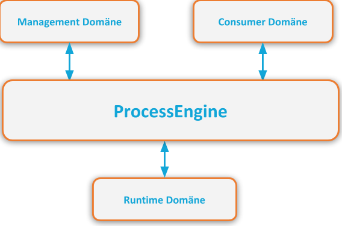

# API Domänen

Der Zuschnitt der ProcessEngine in fachliche API-Domänen, dient:

1. der Kommunikation der Features.
1. der Anpassung der ProcessEngine an das Einsatz-Szenario.

Die folgende Darstellung zeigt die ProcessEngine im Zentrum und die drei Domänen.

Dabei dienen:

1. Management Domäne,
1. Consumer Domäne und die
1. Runtime Domäne

als Verbindung zur Außenwelt und zur Sammlung von Features, die wir unterstützen.
