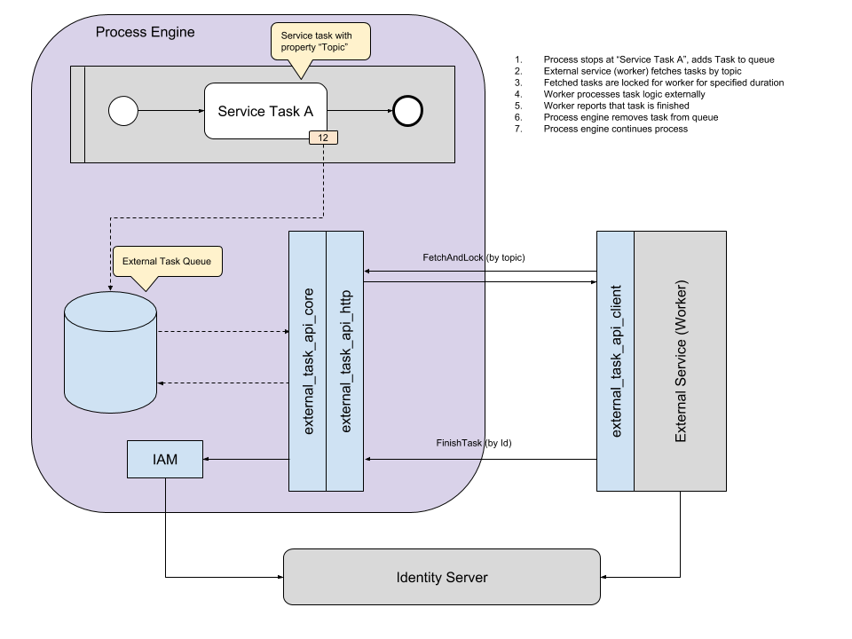

## Technischer Aufbau



Wie im Diagramm zu erkennen, unterscheidet man zwischen zwei Anwendungsfällen:

### Anwendung mit _integrierter_ ProcessEngine

Hier befindet sich der Worker in der selben Anwendung wie die ProcessEngine.
Der Worker fragt regelmäßig über den `ExternalTaskApiClient` derzeit verfügbare
ExternalTasks ab und verarbeitet diese.
Der Client wiederum fragt direkt den `ExternalTaskApiCore` an.

### Anwendung mit _externer_ ProcessEngine

Auch hier benutzen der Worker den `ExternalTaskApiClient`.

In diesem Anwendungsfall benutzt der `ExternalTaskApiClient` jedoch Http Routen
und/oder Messagebuskanäle um mit einer externen ProcessEngine zu kommunizieren.

Die Anwendung, in welcher die externe ProcessEngine liegt, implementiert dazu
das `ExternalTaskApiHttp` Paket, welches die passenden Http Endpunkte
bereitstellt.

## Komponenten

Nachfolgend werden nun die einzelnen Komponenten der ExternalTaskApi
im Detail erklärt.

### ExternalTaskApiContracts

Dieses Paket definiert die gemeinsam genutzten Schnittstellen.
Neben einem `IExternalTaskApi` Interface, welches die gemeinsam genutzten
Funktionen definiert, sind hier auch die Messagebuspfade und REST-Routen
definiert, über welche die ExternalTaskApi Pakete miteinander kommunizieren.

Sowohl `ExternalTaskApiClient` als auch `ExternalTaskApiCore` leiten
ihre Schnittstellen aus dem `IExternalTaskApi` Interface ab, wodurch
sichergestellt ist, dass sich beide Komponenten auf die exakt gleiche Art
verwenden lassen.

Dieser Aufbau gewährleistet eine einfache Austauschbarkeit, da es durch
diese Architektur mit nur wenig Aufwand möglich ist eine interne ProcessEngine
gegen eine ausgelagerte zu tauschen, oder umgekehrt.

### ExternalTaskApiClient

Der `ExternalTaskApiClient` ist für externe Anwendungen die primäre Komponente zur
Verwendung der ExternalTaskApi.

Dieser Client kann sowohl mit einer in der Anwendung integrierten, als auch mit
externen ProcessEngines kommunizieren.

Um die einfache Austauschbarkeit der ProcessEngine zu gewährleisten, sollte
jedwede Kommunikation mit der ProcessEngine über die ExternalTaskApi abgewickelt
werden.

### ExternalTaskApiCore

Das `ExternalTaskApiCore` Paket dient der direkten Kommunikation mit der
ProcessEngine.
Hierüber hat der Worker die Möglichkeit verfügbare ExternalTasks anzufragen,
zu reservieren und abzuschließen.

In einer Anwendung mit integrierter ProcessEngine wird dieses Paket durch den
`ExternalTaskApiClient` direkt angesteuert.

Wenn eine externe ProcessEngine angesteuert werden soll, wird dieses Paket
in die Anwendung implementiert, in welcher sich diese befindet.

### ExternalTaskApiHttp

Wird eine externe ProcessEngine verwendet, dient das Paket `ExternalTaskApiHttp`
als Schnittstelle für den `ExternalTaskApiClient` um mit dem
`ExternalTaskApiCore` zu kommunizieren.

Das Paket muss sich stets in der gleichen Anwendung wie `ExternalTaskApiCore`
befinden.

### REST/Messagebus-Schnittstelle

Wird eine externe ProcessEngine verwendet, kommunizieren `ExternalTaskApiClient`
und `ExternalTaskApiCore` über eine REST- und/oder eine Messagebus-Schnittstelle.

Die REST-Schnittstelle wird durch `ExternalTaskApiHttp` bereitgestellt,
der Messagebus wird durch die ProcessEngine selbst verwaltet.

Diese Schittstellen dienen keinem anderen Zweck und sollten niemals über
eine andere Komponente als dem `ExternalTaskApiClient` verwendet werden.

#### HTTP-Routen

Alle Routen besitzen ein Präfix, das sich nach der aktuellen
API-Version richtet.
Bei einer API-Version 1 würde dies folgendermaßen aussehen:

```REST
/api/external_task/v1
```

So ergibt sich z.B. folgende URL für das Abfragen und Reservieren von
ExternalTasks folgende Route:

```REST
POST /api/external_task/v1/fetch_and_lock
```
