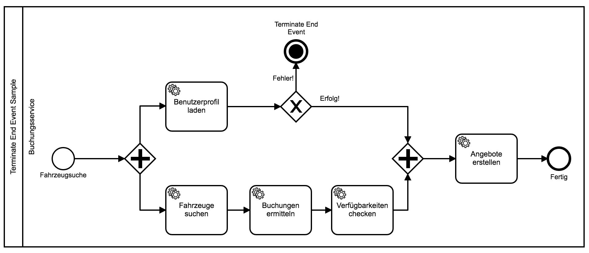

# Terminate End Event

## Definition

`TerminateEndEvents` sind eine besondere Art von `EndEvent`, die benutzt werden
um ein **irreguläres** Prozessende zu signalisieren.

## Anwendungsfall

Das `TerminateEndEvent` wird für die Modellierung von Fehlern verwendet, die so
gravierend sind, dass sie das sofortige Ende des **gesamten** Prozesses
zur Folge haben.

Der Ausführungsstatus anderer laufender Aktivitäten ist dabei irrelevant.
Ein `TerminateEndEvent` terminiert stets **alle** laufenden Aktivitäten und
letztendlich den gesamten Prozess.

Beispiel:

 

In diesem Beispiel haben wir zwei parallel ausgeführte Prozesspfade.
Der obere Pfad benutzt ein `TerminateEndEvent` um im Fehlerfall ein
sofortiges Prozessende herbeizuführen.

Das bedeutet, sollte dieses Event ausgelöst werden, dann wird auch der zweite
parallel ausgeführte Prozesspfad komplett abgebrochen, ungeachtet dessen,
welche dort definierte Aktivität gerade ausgeführt wird und ob die bisherige
Ausführung dieses Pfades erfolgreich war.

## Verhalten in der ProcessEngine

Wird ein `TerminateEndEvent` erreicht, ermittelt die ProcessEngine sämtliche
Instanzen von laufenden Aktivitäten und erzwingt ihr sofortiges Ende.
Diese werden dann in den Status `terminated` versetzt.

Nachdem sämtliche Aktivitäten beendet wurden, wird auch der Prozess selbst in
den Status `terminated` versetzt und beendet.

Da es sich beim `TerminateEndEvent` um ein irreguläres Prozessende handelt,
wird die ProcessEngine beim Auftreten eines solchen Events einen Fehler
werfen.

Diese Fehler können über ein reguläres `try/catch` gefangen werden:

```js
try {
  return executeProcessService.start(executionContextFacade,
                                     processModel,
                                     startEventId,
                                     correlationId,
                                     initialToken);
} catch (error) {
  // Do something with the error
}
```
