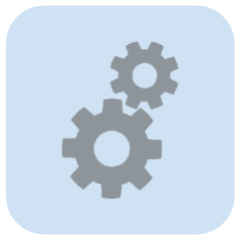

# Facts to Know

Diese Übersicht richtet sich an folgende Personen:

1. CEOs
1. CTOs

Wir wollen erklären:

1. warum die ProcessEngine das richtige Produkt und
1. warum Denken-Malen-Messen das richtige Vorgehen ist.

Unser oberstes Ziel, lautet:

> Software nie wieder wegwerfen müssen.

Dafür stehen alle unsere Ideen und Software.

## Was CEOs wissen müssen

1. Wir haben bewiesen, dass sich durch den Einsatz der ProcessEngine die

   * Translationskosten für Lösungen minimieren und
   * Wartungskosten für Software drastisch reduzieren lassen.

1. Verbesserung der Kommunikation über alle Unternehmensbereiche.

   Klassische Pflichten- und Lastenhefte (können) entfallen;
   Anforderungen werden klarer Kommuniziert.

1. Der Beitrag zur Wertschöpfung jedes Unternehmensteils wird offensichtlich.
1. Ganzheitliche Entwicklung an den Prozessen eines Partners ist unser Ziel.
1. BPMN und Workflow-Engines sind ein Schlüssel zur digitalen Transformation.
1. ProcessEngine-Software ist Open-Source
1. BPMN-Studio Desktop ist Open-Source

## Was CTOs wissen müssen

1. Wir geben **und** halten ein Stabilitätsversprechen:

   Drei API Domänen kapseln unsere Use-Cases-- für eine bessere Kommunikation;
   Stabilität wird durch Semantic Versioning unterstützt;
   es wird sorgfältigst Released und getestet.

1. Die ProcessEngine ist vollständig in TypeScript entwickelt.
1. Läuft vollständig im Browser, als stand-alone Backend **und** als Bibliothek.
1. Ideal integrierbar in Microservice Landschaften.
1. Unterstützung gängiger SQL-Datenbanken.
1. Implementierung in Technologien sind verfügbar, z.B. .NET und Java.
1. Das BPMN-Studio ist eine integrierte Entwicklungsumgebung für Prozesse.
1. Alle Open-Source Software der Marke process-engine.io ist unter MIT Lizenz verfügbar.
1. Kommerzieller Support ist über 5Minds IT-Solutions GmbH & Co. KG beziehbar.

1<!-- # Einleitung -->

<!-- <1!-- TODO: Eine Einleitung schreiben --1> -->

<!-- ## Was ist ProcessEngine.io? -->

<!-- Das Ziel von ProcessEngine.io ist die Gestaltung von Software-Projekten mit -->
<!-- BPMN voranzubringen. -->

<!-- Wir glauben daran, dass die Prozessmodellierung die Kommunikation in der -->
<!-- Softwareentwicklung entscheidend verbessern kann. -->

<!-- ProcessEngine.io ist keine einzelne Software; Es ist ein Dach, unter dem wir -->
<!-- Werkzeuge und Ideen bereitstellen, die: -->

<!-- * bei der Modellierung von Geschäftsprozessen bestmöglich unterstützen. -->
<!-- * Geschäftsprozesse ausführen können. -->
<!-- * die Ausführung von Prozessen messen und bei der Optimierung der Prozesse -->
<!--   helfen. -->

<!-- ## Was gibt es? -->

<!-- Das Ökosystem um ProcessEngine.io wird stets erweitert, wobei sich drei -->
<!-- tragende Säulen etabliert haben, um Konzepte und Funktionalität zu -->
<!-- kommunizieren: -->

<!-- 1. BPMN-Studio -->
<!-- 1. ProcessEngine.io -->
<!-- 1. ProcessEngine APIs -->

<!-- ### BPMN-Studio {#bpmn-studio} -->

<!--  -->

<!-- Das BPMN-Studio ist die integrierte Entwicklungsumgebung für Geschäftsprozesse. -->

<!-- Mit dieser Software lassen sich: -->

<!-- * Geschäftsprozesse modellieren, -->
<!-- * Prozesse für die Ausführung deployen und -->
<!-- * Prozesse analysieren und optimieren. -->

<!-- #### Weiterführende Links -->

<!-- * [Installationsanleitung](./getting-started/installation.md) -->
<!-- * [Dokumentation zu den Komponenten](./bpmn-studio/ueberblick.md) -->

<!-- ### ProcessEngine {#process-engine} -->

<!--  -->

<!-- Unter einer ProcessEngine ist eine Software zu verstehen, -->
<!-- die Geschäftsprozesse ausführen kann. -->

<!-- Es gibt mehrere Implementierungen der ProcessEngine, die sich für -->
<!-- unterschiedliche Einsatzszenarien eignen. -->

<!-- #### Weiterführende Links -->

<!-- * [TypeScript-Implementierung](./processengine/typescript/README.md) -->
<!-- * .NET-Implementierung (Bereits veröffentlicht, Dokumentation fehlt zurzeit) -->

<!-- ### ProcessEngine APIs {#apis} -->

<!-- Die Kommunikation mit der ProcessEngine erfolgt über zentrale APIs , die alle -->
<!-- Implementierungen überspannen und einen roten Faden darstellen, die Konzepte -->
<!-- verstehen. -->

<!-- Alle Implementierungen der ProcessEngine unterstützen diese APIs. Dadurch kann -->
<!-- die Implementierung der ProcessEngine ausgetauscht werden - ohne, dass sich die -->
<!-- Bedienung der ProcessEngine ändert. -->

<!-- #### Weiterführende Links -->

<!-- * [ConsumerAPI](./api/consumer_api/README.md) -->
<!-- * [TypeScript-Implementierung der ConsumerAPI](./processengine/typescript/consumer_api/README.md) -->
<!-- * [ManagementAPI](./api/management-api.md) -->
1<!-- # Einleitung -->

<!-- <1!-- TODO: Eine Einleitung schreiben --1> -->

<!-- ## Was ist ProcessEngine.io? -->

<!-- Das Ziel von ProcessEngine.io ist die Gestaltung von Software-Projekten mit -->
<!-- BPMN voranzubringen. -->

<!-- Wir glauben daran, dass die Prozessmodellierung die Kommunikation in der -->
<!-- Softwareentwicklung entscheidend verbessern kann. -->

<!-- ProcessEngine.io ist keine einzelne Software; Es ist ein Dach, unter dem wir -->
<!-- Werkzeuge und Ideen bereitstellen, die: -->

<!-- * bei der Modellierung von Geschäftsprozessen bestmöglich unterstützen. -->
<!-- * Geschäftsprozesse ausführen können. -->
<!-- * die Ausführung von Prozessen messen und bei der Optimierung der Prozesse -->
<!--   helfen. -->

<!-- ## Was gibt es? -->

<!-- Das Ökosystem um ProcessEngine.io wird stets erweitert, wobei sich drei -->
<!-- tragende Säulen etabliert haben, um Konzepte und Funktionalität zu -->
<!-- kommunizieren: -->

<!-- 1. BPMN-Studio -->
<!-- 1. ProcessEngine.io -->
<!-- 1. ProcessEngine APIs -->

<!-- ### BPMN-Studio {#bpmn-studio} -->

<!--  -->

<!-- Das BPMN-Studio ist die integrierte Entwicklungsumgebung für Geschäftsprozesse. -->

<!-- Mit dieser Software lassen sich: -->

<!-- * Geschäftsprozesse modellieren, -->
<!-- * Prozesse für die Ausführung deployen und -->
<!-- * Prozesse analysieren und optimieren. -->

<!-- #### Weiterführende Links -->

<!-- * [Installationsanleitung](./getting-started/installation.md) -->
<!-- * [Dokumentation zu den Komponenten](./bpmn-studio/ueberblick.md) -->

<!-- ### ProcessEngine {#process-engine} -->

<!--  -->

<!-- Unter einer ProcessEngine ist eine Software zu verstehen, -->
<!-- die Geschäftsprozesse ausführen kann. -->

<!-- Es gibt mehrere Implementierungen der ProcessEngine, die sich für -->
<!-- unterschiedliche Einsatzszenarien eignen. -->

<!-- #### Weiterführende Links -->

<!-- * [TypeScript-Implementierung](./processengine/typescript/README.md) -->
<!-- * .NET-Implementierung (Bereits veröffentlicht, Dokumentation fehlt zurzeit) -->

<!-- ### ProcessEngine APIs {#apis} -->

<!-- Die Kommunikation mit der ProcessEngine erfolgt über zentrale APIs , die alle -->
<!-- Implementierungen überspannen und einen roten Faden darstellen, die Konzepte -->
<!-- verstehen. -->

<!-- Alle Implementierungen der ProcessEngine unterstützen diese APIs. Dadurch kann -->
<!-- die Implementierung der ProcessEngine ausgetauscht werden - ohne, dass sich die -->
<!-- Bedienung der ProcessEngine ändert. -->

<!-- #### Weiterführende Links -->

<!-- * [ConsumerAPI](./api/consumer_api/README.md) -->
<!-- * [TypeScript-Implementierung der ConsumerAPI](./processengine/typescript/consumer_api/README.md) -->
<!-- * [ManagementAPI](./api/management-api.md) -->
