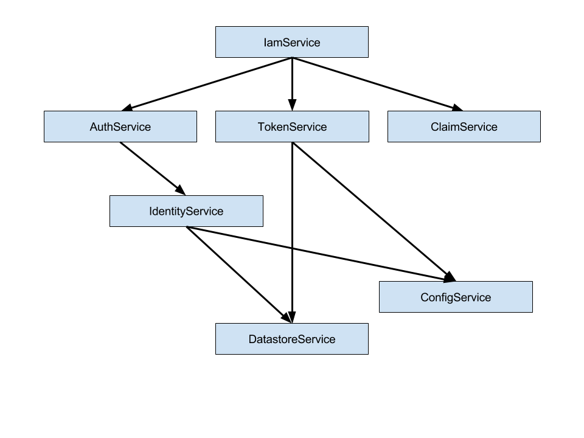

# Dependency Injection

Es wird addict-ioc als IoC Container genutzt.

Eine detaillierte Dokumentation kann auf dessen [GitHub](https://github.com/5minds/addict-ioc) Seite gefunden werden.

Es wird die Konstruktorinjektion verwendet, um Abhängigkeiten in Instanzen zu injizieren. 

## Dependency Graph

Wann immer eine Klasseninstanz benötigt wird, wird der IoC-Container dafür sorge tragen, dass er seine Abhängigkeiten instanziiert und auflöst.

Wenn man nicht an die Umkehrung des Kontrollmusters gewohnt ist, wird dies möglicherweise als Overhead gesehen, aber es ist das genaue Gegenteil.

Außer an Orten, an denen man mit sehr dynamischen Abhängigkeiten zu tun hat, werden alle Klassen instanziiert, da sie eine Abhängigkeit von einer anderen Klasse sind.

Das führt zu einem sauberen, einfach zu pflegenden Code und ermöglicht es, zusätzliche Funktionen basierend auf dem Dependency Graph zu verwenden.

## IoC Modules

Der Stack ist in Module aufgeteilt. Wenn aus diesen Modulen eine Anwendung erstellt wird, ist es möglich, dass eine Anwendung alle Module verwendet, während eine andere Anwendung nur einen Teil dieser Module benötigt.

Für eine klare Trennung der Module wurde sich dazu entschieden, jede Modulregistrierung innerhalb eines eigenen Moduls auf den IoC-Container zu organisieren.

Konventionell wird dieses Modul im Stammordner als `ioc_module.js` gefunden.

Wenn das `ioc_module.js` im IoC-Container registriert ist, wird erwartet, dass es alles registriert, was das Modul anzubieten hat.

Es gibt jedoch Anwendungsfälle, in denen bestimmte Modulklassen mit eigenen überschrieben werden. In solchen Fällen steuert man genauer, welche Registrierungen des Moduls geladen werden.

Neben dem `ioc_module.js` werden Dateien wie` ioc.services.js` oder `ioc.entity_types.js` gefunden.

Diese Dateien (IoC-Teile) enthalten nur eine bestimmte Kategorie von Registrierungen.

Das `ioc_module.js` ist dafür verantwortlich, alle IoC-Teile zu laden, damit die Person oder das Programm, das das Modul benutzt, nicht seine IoC-Teile kennen muss, um es zu laden.
