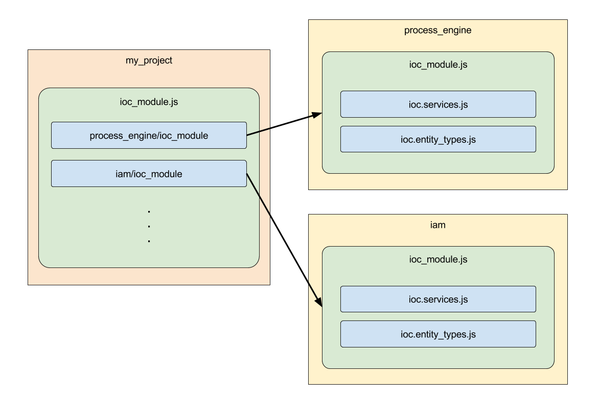

# Dependency Injection

Wir nutzen addict-ioc als unseren IoC Container.

Eine detaillierte Dokumentation kann auf dessen [GitHub](https://github.com/5minds/addict-ioc) Seite gefunden werden.

Wir verwenden die Konstruktorinjektion, um Abhängigkeiten in Instanzen zu injizieren 

## Dependency Graph

Wann immer wir eine Klasseninstanz benötigen, werden wir den IoC-Container dafür sorge tragen lassen, dass er seine Abhängigkeiten instanziiert und auflöst.

Wenn Sie nicht an die Umkehrung des Kontrollmusters gewöhnt sind, sehen Sie dies möglicherweise als Overhead, aber es ist genau das Gegenteil.

Außer an Orten, an denen Sie mit sehr dynamischen Abhängigkeiten zu tun haben, werden alle Klassen instanziiert, da sie eine Abhängigkeit von einer anderen Klasse sind.

Das führt zu einem sauberen, einfach zu pflegenen Code und ermöglicht es uns, zusätzliche Funktionen basierend auf dem Dependency Graph zu verwenden.

## IoC Modules

Unser Stack ist in Module aufgeteilt. Wenn wir aus diesen Modulen eine Anwendung erstellen, möchten wir vielleicht, dass eine Anwendung alle Module verwendet, während eine andere Anwendung nur einen Teil dieser Module benötigt.

Für eine klare Trennung der Module haben wir uns dazu entschieden, jede Modulregistrierung innerhalb eines eigenen Moduls auf den IoC-Container zu organisieren.

Konventionell finden Sie dieses Modul im Stammordner als `ioc_module.js`.

Wenn das `ioc_module.js` im IoC-Container registriert ist, wird erwartet, dass es alles registriert, was das Modul anzubieten hat.

Es gibt jedoch Anwendungsfälle, in denen Sie bestimmte Modulklassen mit Ihren eigenen überschreiben möchten. In solchen Fällen möchten Sie genauer steuern, welche Registrierungen des Moduls geladen werden.

Neben dem `ioc_module.js` finden Sie Dateien wie` ioc.services.js` oder `ioc.entity_types.js`.

Diese Dateien - nennen wir sie IoC-Teile - enthalten nur eine bestimmte Kategorie von Registrierungen.

Das `ioc_module.js` ist dafür verantwortlich, alle IoC-Teile zu laden, damit die Person oder das Programm, das das Modul benutzt, nicht seine IoC-Teile kennen muss, um es zu laden.
