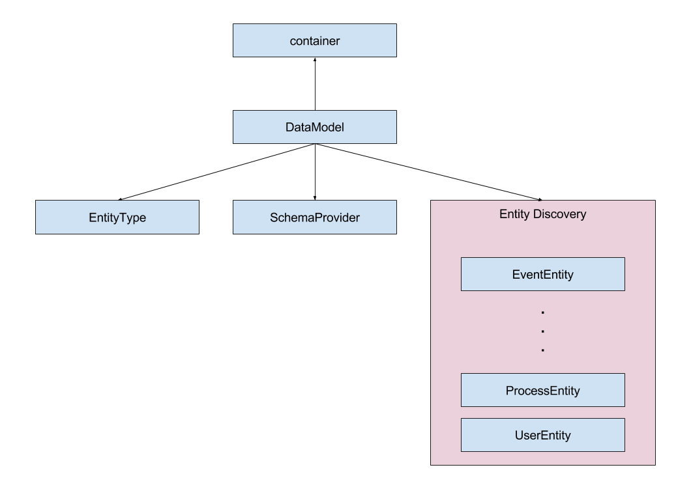

# Discovery

Wann immer es einen dynamischen Zweig in unserem Dependency Graph gibt, verwenden wir einen Ermittlungsmechanismus, der auf den Registrierungen des IoC-Container basiert.

In diesem Beispiel hat das `DataModel` eine Abhängigkeit vom `Container` (welches die IoC-Containerinstanz selbst ist) und unter anderem hat es eine dynamische Abhängigkeit von Entitäten. Dem Dependency Graph ist nicht bewusst, dass das "DataModel" Entitäten verwendet, das `DataModel` fragt nur den `Container` für alle Registrierungen, die als eine Entität markiert sind.

Mit diesem Mechanismus kann die Anzahl der Entitäten zwischen Anwendungen variieren, ohne dass der zugrundeliegende Code geändert werden muss.

Die aktuellen Discoveries sind:

Discovery Tag | Beschreibung
---------|----------
 Schema | JSON-Schemas basierend auf den TypeScript-Definitionen
 Entity | Klassen, die von der `Entity`-Basisklasse abgeleitet sind, die der generische `EntityType` konsumiert
 Router | Von der `RouterBase`-Basisklasse abgeleitete Klassen, die `HttpExtension` konsumiert
 Extension | Klassen, die dem Erweiterungsmuster des Bootstrapper folgen
 TokenAdapter | Klassen, die die `ITokenAdapter'-Schnittstelle implementieren, die der `TokenService` verbraucht 
 FeatureGenerator | Klassen nach dem Generatormuster des `FeatureService`
