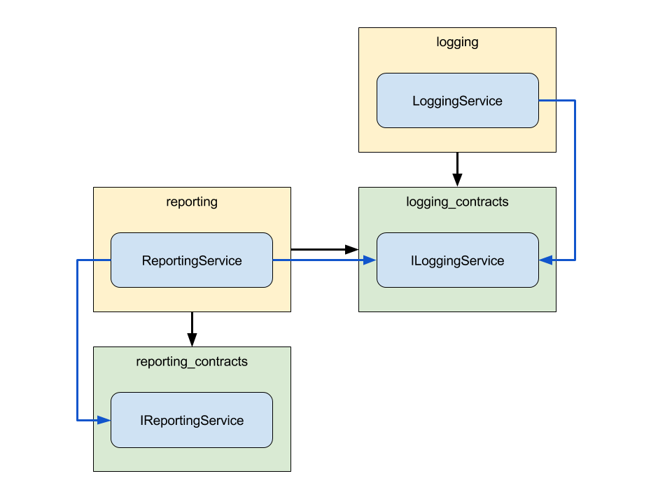

# Contracts

Wir haben bereits gelernt, dass Module reguläre NPM-Pakete mit Abhängigkeiten sind. Wenn wir mit einem Stack dieser Größe arbeiten, müssen wir sicherstellen, dass jede Komponente durch Dependency Injection austauschbar ist, ohne den Code zu ändern.

Stellen Sie sich vor, wir haben eine Klasse `ReportingService` in einem Modul `reporting`, das von der Klasse `LoggingService` des Moduls `logging` abhängt.

Das NPM-Paket `reporting` hätte keine Abhängigkeit von `logging`, sondern von `logging_contracts`.

Auch die Klasse `ReportingService` verweist nicht auf die Klasse `LoggingService`. Stattdessen verwendet es die Schnittstelle `ILoggingService` von` logging_contracts`.

Jetzt, da das `reporting`-Modul keine Referenzen auf die Implementierung hat, können wir die Implementierung vollständig durch Dependency Injection ändern, solange unser Ersatz den Vertrag erfüllt (implementiert die Schnittstelle).
