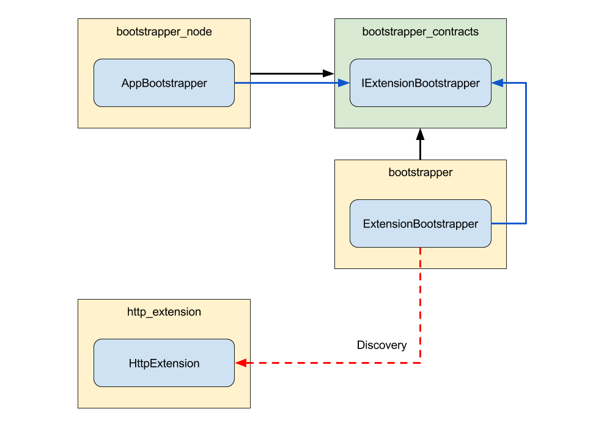

# Extensions

Der Einstiegspunkt für den gesamten Stack ist der `AppBootstrapper`. Er verwendet den `ExtensionBootstrapper`, um Erweiterungen zu entdecken. Nach der Entdeckung hat der `ExtensionBootstrapper` zwei Phasen. Zuerst initialisiert er alle Erweiterungen, indem er die `initialize`-Methode aufruft. Dann startet er sie durch Aufruf der `start`-Methode.

Wenn die beiden Phasen abgeschlossen sind und der Bootstrapper abgeschlossen ist, wird die Anwendung als gestartet angesehen.

Obwohl sich Erweiterungen technisch für alle Arten von Anwendungen eignen, verwenden wir sie ausschließlich, um die Kommunikationsendpunkte einer Anwendung darzustellen.

Zum Beispiel startet die `HttpExtension` einen HTTP-Server und entdeckt Komponenten, die Routen auf dem HTTP-Server registrieren können. Eine `AmqpExtension` könnte etwas Ähnliches wie das AMQP-Protokoll machen.

