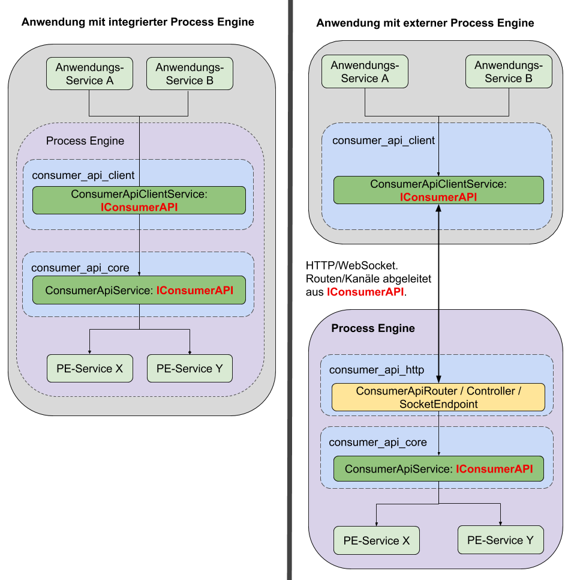

# Schnittstelle: ConsumerAPI

Die ConsumerAPI dient zur Ausführung von Prozessmodellen und steuert die daraus
resultierende Interaktion mit der ProcessEngine.

Sie ermöglicht es einem Consumer mit einer ProcessEngine zu kommunizieren,
unabhängig davon, wo diese sich befindet.
Es kann sich um eine ProcessEngine handeln, die remote auf einem Server liegt,
oder um eine ProcessEngine, die direkt in die Anwendung integriert ist.

Dadurch wird eine lose Kopplung zwischen ProcessEngine und Consumer erreicht,
was eine leichte Austauschbarkeit garantiert.

Die fachliche Stabilität ist eine der wichtigsten Anforderungen
an die ConsumerAPI.

Das hier vorgestellte Konzept gilt für **sämtliche** technischen Implementierungen,
egal ob TypeScript, .NET, oder anderen Implementierungen, die in Zukunft einmal
folgen könnten.

> ## TODOs und allgemeine offene Fragen
>
> * Spezifikation des EventTrigger-Payloads
> * Werden bei der Rest-API die Validierungen geliefert?
> * Auflistung der IConsumerAPI-Methoden zu den REST-APIs

## Technischer Aufbau



Wie im Diagramm zu erkennen, unterscheidet man zwischen zwei Anwendungsfällen:

### Anwendung mit _integrierter_ Process Engine

In diesem Fall greifen externe Anwendungsservices auf den **ConsumerAPI-core**
zu, der dann wiederum mit den Services der Process Engine kommuniziert.

### Anwendung mit _externer_ Process Engine

Hier kommt zusätzlich ein **ConsumerClient** mit ins Spiel.
Dieser kommuniziert über HTTP-Routen und Messagebus-Kanäle mit der ConsumerAPI
der externen Process Engine.

Sowohl der **consumer-api_client** als auch der **consumer-api_core** leiten
ihre Schnittstellen aus dem `IConsumerAPI` Interface ab, wodurch sichergestellt
ist, dass sich beide Komponenten auf die exakt gleiche Art verwenden lassen.

Das gewährleistet auch eine sehr leichte Austauschbarkeit, da es mit nur wenig
Aufwand möglich ist z.B. eine Process Engine, die in einer Anwendung intern
verwendet wird, gegen eine externe Process Engine auszutauschen, die z.B.
auf einem zentralen Server liegt.

### consumer-api_core und consumer-api_http

Das consumer-api_core Paket dient der Kommunikation mit der Process Engine.

In einer Anwendung mit integrierter Process Engine wird die ConsumerAPI
als Service direkt verwendet.

Wird eine externe Process Engine verwendet, dient das consumer-api_http-Paket
als Schnittstelle für den consumer-api_client um mit dem
consumer-api_core zu kommunizieren.

### consumer-api_client-Paket

Der consumer-api_client dient der Kommunikation mit der ConsumerAPI
einer **externen** Process Engine.

Das Paket besteht aus folgenden Komponenten:

* Einem _Service_, den die implementierende Anwendung verwenden kann
* Einem _Repository_, welches über HTTP, bzw. Messagebus mit der ConsumerAPI
  der externen Process Engine kommuniziert

### REST/Messagebus-Schnittstelle

consumer-api_client und consumer-api_core kommunizieren über eine REST- und eine
Messagebus-Schnittstelle.

Diese Schittstellen dienen keinem anderen Zweck und sollten dementsprechend
auch niemals über eine andere Komponente als dem consumer-api_client verwendet
werden.

Durch die gemeinsame Verwendung des `IConsumerApi` Interfaces leiten sich
die Routen und Pfade der Schnittstellen direkt aus diesem ab.

#### HTTP-Routen

Alle Routen besitzen ein Präfix, das sich nach der aktuellen
API-Version richtet.
Bei einer API-Version 1 würde dies folgendermaßen aussehen:

```REST
/api/consumer/v1
```

So ergibt sich z.B. folgende URL für das Starten von Prozessinstanzen:

```REST

```


Eine Erklärung zur Routenbenennung kann [hier](./consumer_api/dealing_with_events.md#auslösen-eines-prozessinstanz-events) eingesehen werden.

Die Aufgaben der jeweiligen Routen wird im folgenden Abschnitt genauer erklärt.

## Aufgaben der ConsumerAPI

Über die ConsumerAPI müssen folgende Aufgaben erledigt werden können:

* [Auflisten startbarer Prozessmodelle](./consumer_api/tasks/list-startable-process-models.md)
  * [Alle Prozessmodelle abfragen](./consumer_api/tasks/list-startable-process-models.md#alle-prozessmodelle-abfragen)
  * [Einzelnes Prozessmodell abfragen](./consumer_api/tasks/list-startable-process-models.md#einzelnes-prozessmodell-abfragen)
* [Starten einer Prozessinstanz](./consumer_api/tasks/start-process-instance.md)
  * [Starten und auf ein SystemEvent warten](./consumer_api/tasks/start-process-instance.md#starten-und-auf-ein-system-event-warten)
  * [Starten und auf ein bestimmtes EndEvent warten](./consumer_api/tasks/start-process-instance.md#starten-und-auf-ein-bestimmtes-endevent-warten)
* [Abfragen von BPMN-Ereignissen auf die der Prozess wartet](./consumer_api/tasks/list-triggerable-events.md)
* [Auslösen von Ereignissen](./consumer_api/tasks/trigger-event.md)
* [Auflisten wartender UserTasks](./consumer_api/tasks/list-waiting-usertasks.md)
* [Abschließen eines UserTasks](./consumer_api/tasks/finish-user-task.md)
* [Erhalten von Prozessbenachrichtigungen](./consumer_api/tasks/receive-process-notifiations.md)
  * [Arten von Prozessbenachrichtigungen](./consumer_api/tasks/receive-process-notifiations.md#arten-von-prozessbenachrichtigungen)
  * [Erhalten von BpmnEvents](./consumer_api/tasks/receive-process-notifiations.md#erhalten-von-bpmn-events)
  * [Erhalten von Infos zu start und ende von Aktivitäten](./consumer_api/tasks/receive-process-notifiations.md#erhalten-von-infos-zu-start-und-ende-von-aktivitäten)
  * [Erhalten von SystemEvents](./consumer_api/tasks/receive-process-notifiations.md#erhalten-von-system-events)
  * [Erhalten von BPMN-Signalen](./consumer_api/tasks/receive-process-notifiations.md#erhalten-von-bpmn-signalen)
