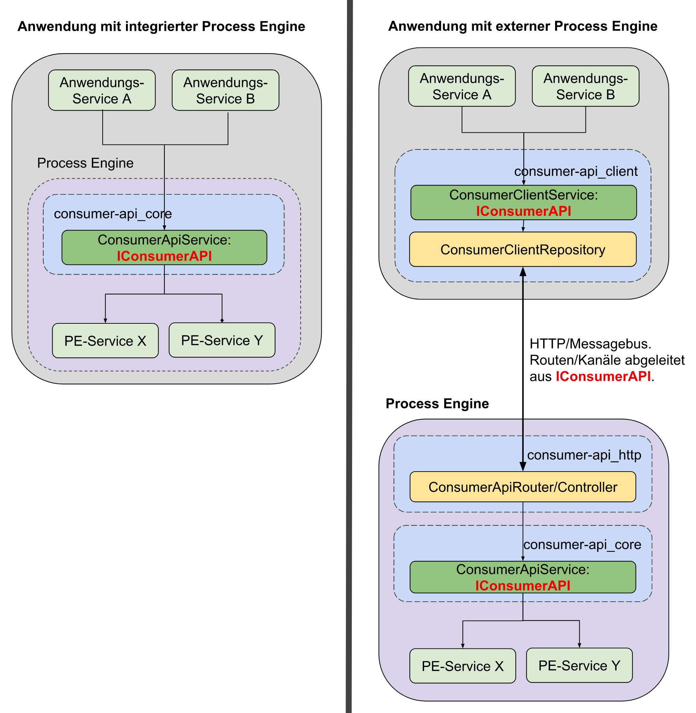

## Technischer Aufbau der Consumer API

Wie im Diagramm zu erkennen, unterscheidet man zwischen zwei Anwendungsfällen:

### Anwendung mit _integrierter_ Process Engine

In diesem Fall greifen externe Anwendungsservices auf den **ConsumerAPI-Core**
zu, der dann wiederum mit den Services der Process Engine kommuniziert.

### Anwendung mit _externer_ Process Engine

Hier kommt zusätzlich ein **ConsumerClient** mit ins Spiel.
Dieser kommuniziert über HTTP-Routen und Messagebus-Kanäle mit der ConsumerAPI
der externen Process Engine.

### Module

Sowohl der **ConsumerAPI-Client** als auch der **ConsumerAPI-Core** leiten
ihre Schnittstellen aus dem `IConsumerAPI` Interface ab, wodurch sichergestellt
ist, dass sich beide Komponenten auf die exakt gleiche Art verwenden lassen.

Das gewährleistet auch eine sehr leichte Austauschbarkeit, da es mit nur wenig
Aufwand möglich ist z.B. eine Process Engine, die in einer Anwendung intern
verwendet wird, gegen eine externe Process Engine auszutauschen, die z.B.
auf einem zentralen Server liegt.

#### ConsumerAPI-Core

Das ConsumerAPI-Core Paket dient der Kommunikation mit der Process Engine.

In einer Anwendung mit integrierter Process Engine wird die ConsumerAPI
als Service direkt verwendet.

#### ConsumerAPI-Client-Paket

Der ConsumerAPI-Client dient der Kommunikation mit der ConsumerAPI
einer **externen** Process Engine.

#### ConsumerAPI-Http

Wird eine externe Process Engine verwendet, dient das `ConsumerAPI-Http` Paket
als Schnittstelle für den ConsumerAPI-Client um mit dem ConsumerAPI-Core zu
kommunizieren.
