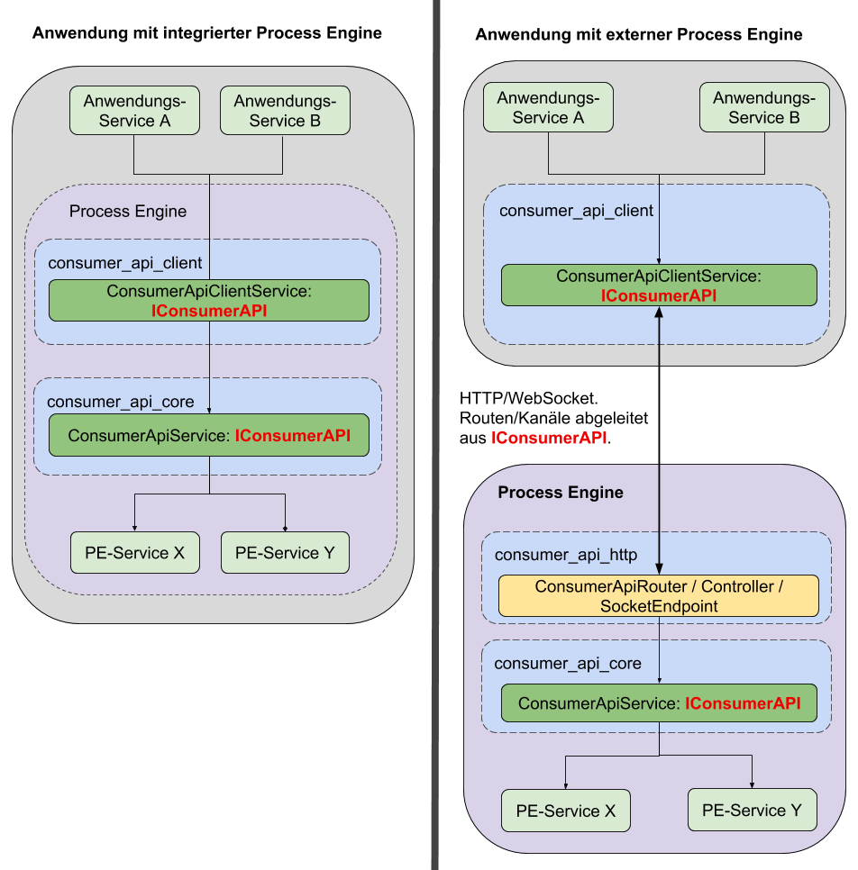

## Technischer Aufbau



Wie im Diagramm zu erkennen, unterscheidet man zwischen zwei Anwendungsfällen:

### Anwendung mit _integrierter_ ProcessEngine

In diesem Beispiel befindet sich die ProcessEngine direkt in der Anwendung.
Die externen Services der implementierenden Anwendung greifen auf den
`ConsumerApiClientService` zu.
Dieser wiederum benutzt den `ConsumerApiCore` um Anfragen an die ProcessEngine
zu stellen.

Wichtig hierbei ist: Die externen Services greifen **nur** auf den
`ConsumerApiClient` zu, **nicht** direkt auf den `ConsumerApiCore`!

### Anwendung mit _externer_ ProcessEngine

Auch hier benutzen die externen Anwendungen den `ConsumerApiClient`.

In diesem Anwendungsfall benutzt der `ConsumerApiClient` jedoch Http Routen
und Messagebuskanäle um mit einer externen ProcessEngine zu kommunizieren.

Die externe ProcessEngine implementiert dazu das `ConsumerApiHttp` Paket, welche
einen Router und einen Controller für das Http Handling bereit stellt.

## Komponenten

Nachfolgend werden nun die einzelnen Komponenten der ConsumerAPI
im Detail erklärt.

### ConsumerApiContracts

Dieses Paket definiert die gemeinsam genutzten Schnittstellen.
Neben einem `IConsumerApiService` Interface, welches die gemeinsam genutzten
Funktionen definiert, sind hier auch die Messagebuspfade und REST-Routen
definiert, über welche die ConsumerAPI Pakete miteinander kommunizieren.

Sowohl `ConsumerApiClient` als auch `ConsumerApiCore` leiten
ihre Schnittstellen aus dem `IConsumerApiService` Interface ab, wodurch
sichergestellt ist, dass sich beide Komponenten auf die exakt gleiche Art
verwenden lassen.

Dieser Aufbau gewährleistet auch die geforderte Austauschbarkeit, da es durch
diese Architektur mit nur wenig Aufwand möglich ist eine interne ProcessEngine
gegen eine ausgelagerte zu tauschen, oder umgekehrt.
Dadurch, dass implementierende Anwendung die ConsumerAPI verwendet, wird sie
von dem Austausch nichts mitbekommen.

### ConsumerApiClient

Der `ConsumerApiClient` steuer die Kommunikation zwischen der implementierenden
Anwendung und der ConsumerAPI selbst.

Dieser Client kann sowohl mit einer in der Anwendung integrierten ProcessEngine
kommunizieren, als auch mit ProcessEngines, die in einer externen Anwendung
liegen.

Daher ist der `ConsumerApiClient` grundsätzlich die Schnittstelle, die durch alle
externen Anwendungsservices verwendet werden sollte, unabhängig davon, welche
Art von ProcessEngine verwendet wird.

### ConsumerApiCore

Das `ConsumerApiCore` Paket dient der direkten Kommunikation mit der
ProcessEngine.

In einer Anwendung mit integrierter ProcessEngine wird dieses Paket direkt
in diese implementiert.

Wenn eine externe ProcessEngine angesteuert werden soll, wird dieses Paket
in die Anwendung implementiert, in welcher sich die ProcessEngine befindet.

### ConsumerApiHttp

Wird eine externe ProcessEngine verwendet, dient das Paket `ConsumerApiHttp`
als Schnittstelle für den `ConsumerApiClient` um mit dem
`ConsumerApiCore` zu kommunizieren.

Das Paket muss sich stehts in der gleichen Anwendung wie `ConsumerApiCore` befinden.

### REST/Messagebus-Schnittstelle

Wird eine externe ProcessEngine verwendet, kommunizieren `ConsumerApiClient`
und `ConsumerApiCore` über eine REST- und eine Messagebus-Schnittstelle.

Die REST-Schnittstelle wird durch `ConsumerApiHttp` bereitgestellt,
der Messagebus wird durch die ProcessEngine selbst verwaltet.

Diese Schittstellen dienen keinem anderen Zweck und sollten niemals über
eine andere Komponente als dem `ConsumerApiClient` verwendet werden.

#### HTTP-Routen

Alle Routen besitzen ein Präfix, das sich nach der aktuellen
API-Version richtet.
Bei einer API-Version 1 würde dies folgendermaßen aussehen:

```REST
/api/consumer/v1
```

So ergibt sich z.B. folgende URL für das Abfragen wartender UserTasks in einer Correlation:

```REST
GET /api/consumer/v1/correlations/:correlation_id/user_tasks
```

Eine Erklärung zur Routenbenennung kann [hier](./dealing_with_events.md#auslösen-eines-prozessinstanz-events) eingesehen werden.
