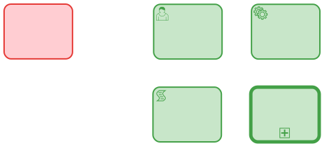
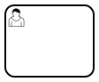
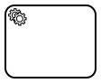
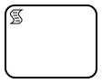
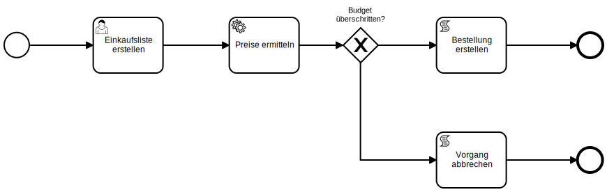
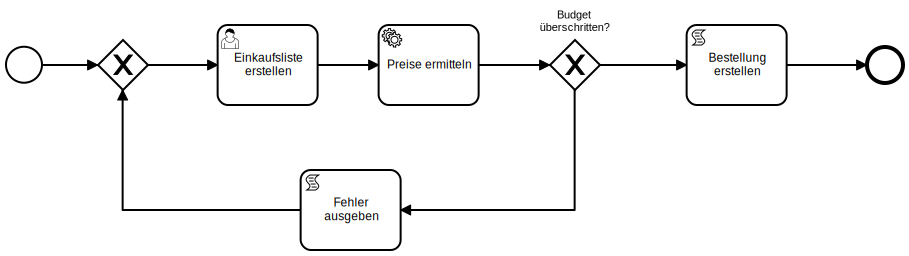

# Styleguide

## Sprache in Modellen

In Modellen ist immer die Sprache des Anwenders zu verwenden.

### Aktivitäten bezeichnen

Verwende das **Objekt-Verrichtungsprinzip**.

Die Beschreibung der Aktivitäten ergibt sich aus der Formel `[Objekt] + [Verb]`.

| Schlecht 👎                        | Gut 👍                   |
|------------------------------------|-------------------------|
| Zuerst muss der Einkauf der Lebensmittel erledigt werden | Lebensmittel einkaufen |

### Ereignisse bezeichnen

Verwende das **Objekt-Zustandsprinzip**.

Die Beschreibung der Aktivitäten ergibt sich aus der Formel `[Objekt] +
[Zustand]`.

| Schlecht 👎                        | Gut 👍                   |
|------------------------------------|-------------------------|
| Die Lebensmittel wurden zuerst eingekauft. | Lebensmittel eingekauft |

## Grafisches Design

Der Prozessfluss wird immer von links (oben) nach rechts (unten) modelliert.

Es gibt keine kreuzende oder überlappende Pfade.

## Aktivitäten typisieren

Wir verwenden keine untypisierten Aktivitäten (rot); stattdessen typisieren wir
alle Aktivitäten sinnvoll (grün); dadurch erkennt der Betrachter sofort den
Fokus der Aktivität.

### Beispiele für typisierte Aktivitäten

#### Benutzeraktivität

Eine Benutzeraktivität wird immer von einem Menschen erledigt; es handelt sich
dabei um eine von der ProcessEngine zugewiesene Aufgabe; etwa die Genehmigung eines Antrags, die Prüfung von offiziellen Dokumenten oder die Bearbeitung einer Anfrage.

| Symbol | Beispiel |
| :----: | -------- |
|  |  |

Der Benutzer erstellt eine Einkaufsliste, zum Beispiel:
 - Tomate
 - Gurke
 - Sägespäne

#### Service Aktivität

Eine Serviceaktivität wird von einer Software ausgeführt. Hierbei handelt es sich etwa die Abfrage von Daten einer API, die automatische Verbuchung einer Rechnung oder das Generieren eines Angebots für einen Kunden.

| Symbol | Beispiel |
| :----: | -------- |
|  |  |

1. Der Benutzer erstellt eine Einkaufsliste, zum Beispiel:

   - Tomate
   - Gurke
   - Sägespäne

1. Die Preise der Positionen werden von einem Service ermittelt.

#### Skriptaktivität

Eine Skriptaktivität enthält ein Skript, das von der ProcessEngine ausgeführt
wird.
Die ProcessEngine unterstützt JavaScript als Skriptsprache.
Skriptaktivitäten erlauben das Ausgeben von Text auf einer Konsole oder generell alle Aufgaben, die mit JavaScript erledigt werden können.

| Symbol | Beispiel |
| :----: | -------- |
|  |  |

1. Der Benutzer erstellt eine Einkaufsliste, zum Beispiel:
 - Tomate
 - Gurke
 - Sägespäne
1. Die Preise der Positionen werden von einem Service ermittelt.
1. Der Gesamtpreis wird von einem Skript ausgegeben.

#### Aufrufaktivität

Die Aufrufaktivität erlaubt das Aufrufen eines anderen Prozesses in einem
Prozess.

| Symbol | Beispiel |
| :----: | -------- |
|  |  |

Der gesamte Prozess wird durch die Aufrufaktivität aufgerufen.

## Verwendung von Gateways

[Gateways](../anhang/GLOSSARY.md#gateway) teilen den Prozessfluss in einem
BPMN-Diagramm in mehrere Flüsse auf, oder führen mehrere Flüsse wieder zusammen.

Beachte folgende Regeln zum korrekten Modellieren von
[Gateways](../anhang/GLOSSARY.md#gateway):

1. Ein Split-Gateway hat einen eingehenden und einen oder mehrere ausgehende
   Pfeile.

   

1. Ein Join-Gateway hat einen oder mehrere eingehende und einen ausgehenden
   Pfeil.

   

1. Split- und Join-Gateways korrespondieren (z.B. XOR-Split-Gateway mit
   XOR-Join-Gateway).

## Weitere Regeln

1. Es sollte immer ein [**Pool**](../anhang/GLOSSARY.md#pool) verwendet werden.
1. Es sollte immer eine oder mehrere [**Lanes**](../anhang/GLOSSARY.md#lane)
   verwendet geben.

   

1. Ein Prozess hat ein Startevent und mindestens ein Endevent.

1. Eine [Aktivität](../anhang/GLOSSARY.md#aktivität) hat einen eingehenden und
   einen ausgehenden Pfeil.

1. Zum Teilen und Zusammenführen von
   [Sequenzflüssen](../anhang/GLOSSARY.md#sequenzfluss) werden Gateways
   verwendet.

1. Boundary-[Ereignisse](../anhang/GLOSSARY.md#ereignis) haben einen ausgehenden
   Pfeil.
