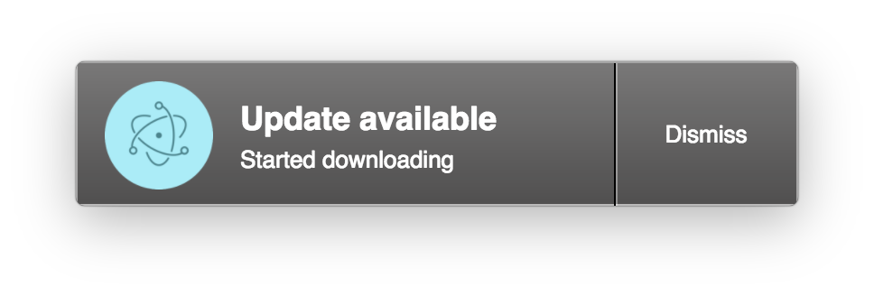
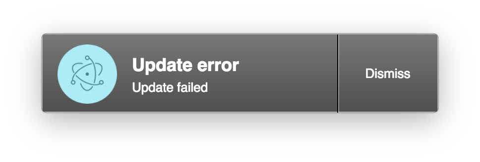

# Auto Updater

Die Funktion zur automatischen Aktualisierung in BPMN Studio gibt dem Benutzer
die Möglichkeit BPMN Studio einfach zu aktualisieren.

## Funktionsweise

Bei jedem Start von BPMN Studio wird im Hintergrund nach Aktualisierungen
gesucht. Die Suche nach neuen Versionen passiert automatisch auf dem gleichen
Release Channel der installierten Version.

Wenn eine neue Version von BPMN Studio gefunden wurde, wird diese automatisch
heruntergeladen:

Sobald das Update heruntergeladen wurde, wird ein Dialog angezeigt, der darüber
Informiert. Nun kann entweder BPMN Studio direkt neugestartet werden oder auf
einen manuellen Neustart gewartet werden.

Falls ein Fehler während des gesamten Vorgangs auftritt wird eine Fehlermeldung
angezeigt:

## Release Channels

Es gibt aktuell zwei Release Channels.

**Stable**:

Versionen aus diesen Channel wurden getestet und sind für den produktiven
Einsatz bestimmt.

**Prerelease**:

Versionen aus diesem Channel wurden *nicht* getestet. Prereleases stellen den
aktuellen Entwicklungsstand dar und beinhalten daher die neusten Funktionen,
aber auch unbekannte Fehler.
