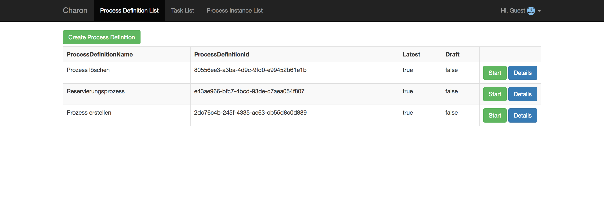
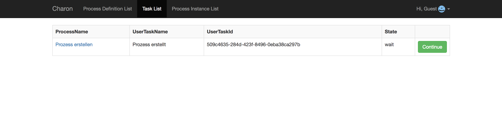
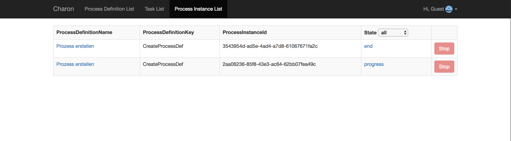
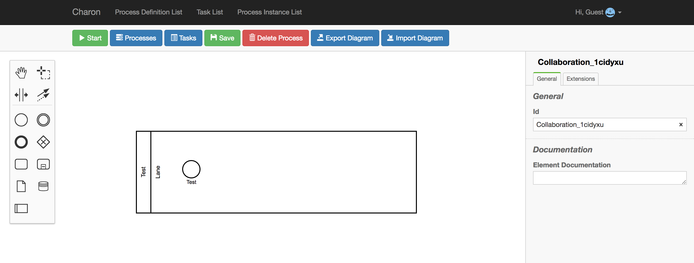

# Beschreibung der Dialoge

## Process Definition List

Der "Process Definition List"-Dialog zeigt alle Prozessmodelle, die zurzeit
in der Datenbank vorhanden sind.
Die drei, schon beim ersten Start der Anwendung vorhandenen, Prozesse sind vorgefertigt
und sind bereits in der Datenbank enthalten.

Oben links befindet sich der "Create Process Definition"-Button.
Dieser öffnet einen Dialog zum Erstellen eines neuen Prozessmodells.
Dieses neue Prozessmodell kann nach dem erstellen mit dem entsprechenden
"Details"-Button, rechts in der Tabelle, bearbeitet werden.

Der "Start"-Button links neben dem "Details"-Button dient lediglich zum Starten
der entsprechenden Prozessdefinition.

## Task List

Der "Task List"-Dialog zeigt alle Tasks, die für den angemeldeten User verfügbar sind.
Oben im Bild wird ein Task, des "Prozess erstellen"-Prozesses, angezeigt.
Nun wartet dieser Task auf eine weitere Eingabe von diesem Benutzer.
Mit einem Klick auf den "Continue"-Button, rechts in der Tabelle, wird
der Nutzer zu dem entsprechenden Dialog geführt.

## Process Instance List

Der "Process Instance List"-Dialog zeigt alle Prozessinstanzen, die entweder
gerade ausgeführt werden, oder schon ausgeführt wurden. Mit dem Dropdown, in
der Spalte "State", kann man die Tabelle nach dem sog. "State" sortieren.

## Der Prozess Editor

In der Mitte des Bildschirms wird der Prozess Editor angezeigt.
Links finden sich alle Werkzeuge, die zum Bearbeiten eines Prozesses
notwendig sind. Eine weitere Toolbar befindet sich oberhalb des Editors.
Dessen Funktionen sind hier aufgeführt:

- Start - Startet eine Instanz dieses Prozesses
- Processes - Zeigt eine Liste der Prozessinstanzen von diesem Prozess
- Tasks - Zeigt eine Liste von Tasks, die mit diesem Prozess zusammenhängen
- Save - Speichert die Änderungen an diesem Prozess
- Delete Process - Löscht diesen Prozess
- Export Diagramm - Exportiert dieses Diagramm als .bpmn-Datei
- Import Diagramm - Importiert ein Diagramm aus einer .bpmn-Datei
