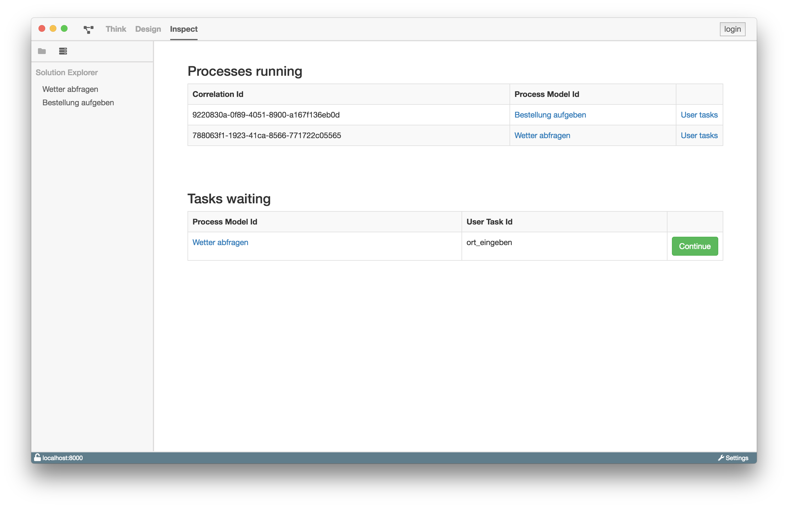

# Dashboard

Das Dashboard ist in der Navigationsleiste zu finden und zeigt die aktuell
laufenden Prozesse der verbundenen ProcessEngine. Zusätzlich wird eine Liste
der anstehenden UserTasks angezeigt. Es gibt die Möglichkeit UserTasks einer
bestimmten Korrelation anzuzeigen.
