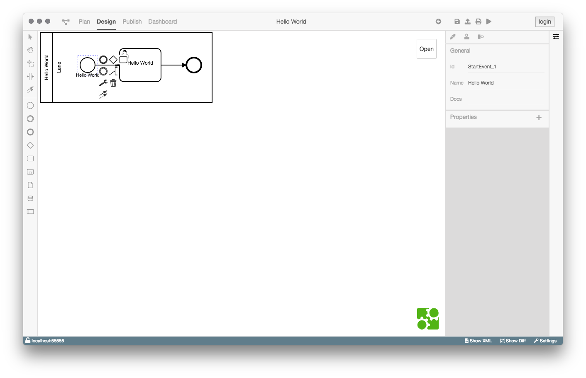
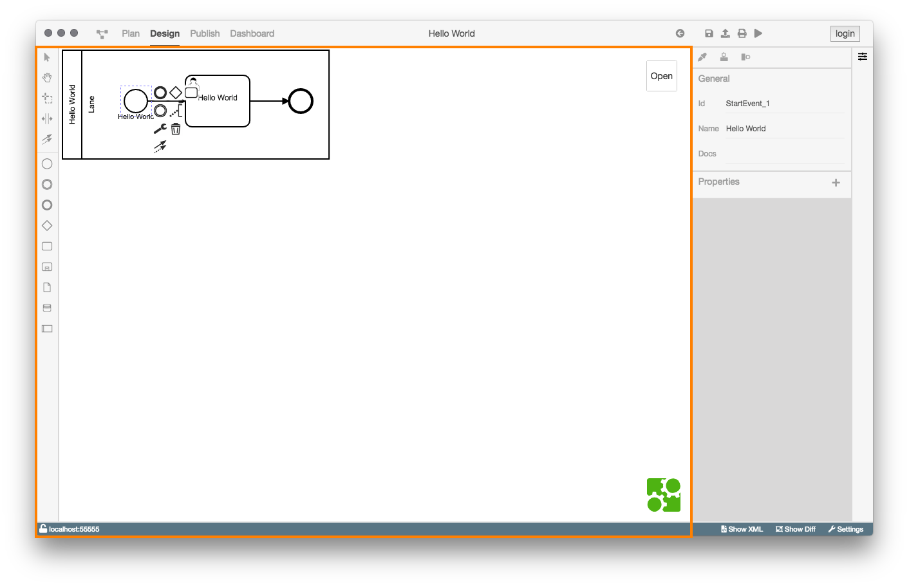
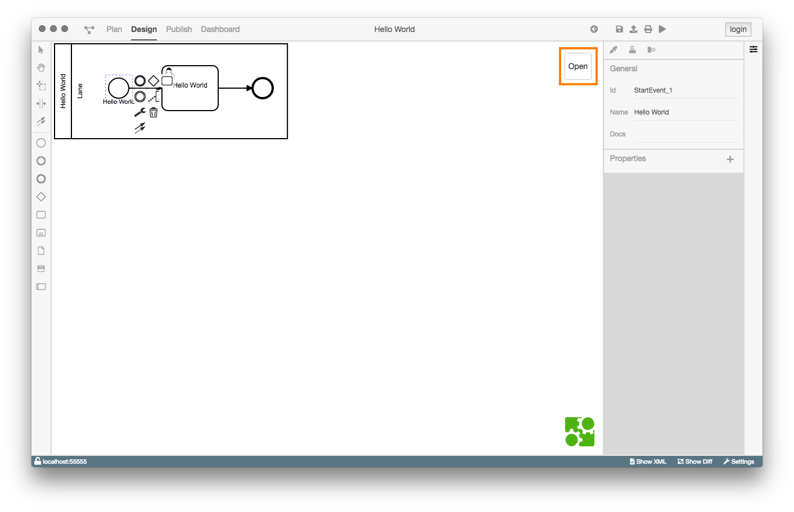
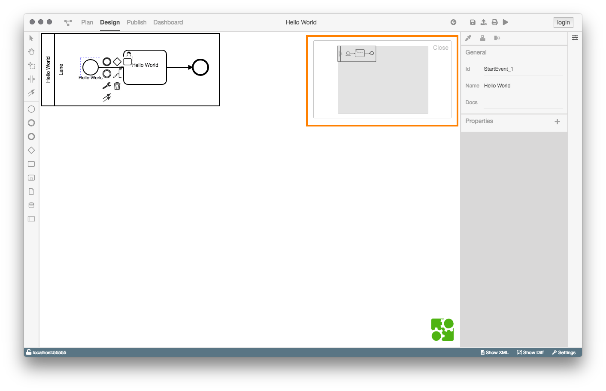
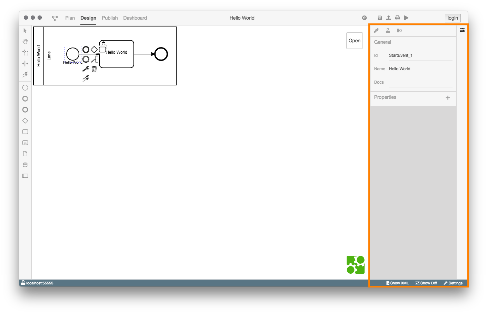
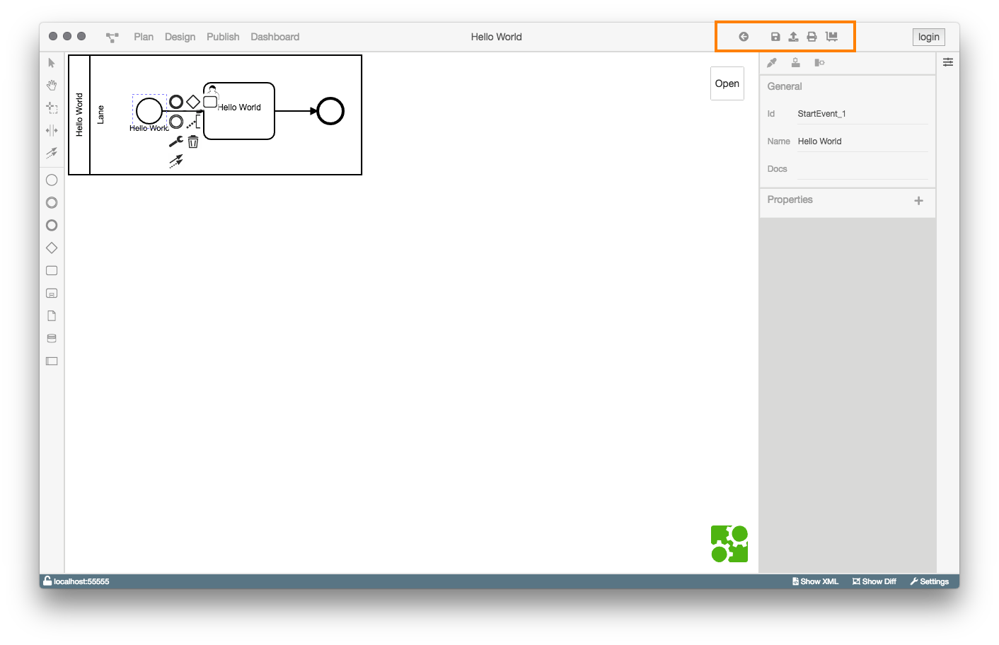

# Design-Ansicht

## Aufgaben und Motivation

Die Design-Ansicht ermöglicht dem Benutzer einen Prozess zu betrachten,
zu modellieren zu konfigurieren, zu deployen/starten und zu exportieren.

## Aufbau und Strukturierung

Wenn die Design-Ansicht geöffnet wurde, wird in der Mitte des BPMN-Studios
(Modellierungsfläche) das Diagramm angezeigt.

Die Design-Ansicht ist in vier Bereiche aufgeteilt:

1. Modellierungsfläche

   

   In der linken Werkzeugleiste findet man im oberen Teil die Standardwerkzeuge
   zum bearbeiten von BPMN-Diagrammen und im unteren Teil BPMN-Elemente.

   Oben rechts in der Modellierungsfläche gibt es eine Minimap, welche sich
   mit dem _Open_ Button öffnen lässt.

   

   Die Minimap zeigt das Diagramm im Ganzen und erlaubt es dem Nutzer sie zur
   Navigation zu nutzen und zu zoomen.

   

2. Property Panel

   

   Das Property Panel bietet die Möglichkeit ein angewähltes Element
   zu konfigurieren und diesem Eigenschaften hinzuzufügen.

   Zusätzlich bietet das Property Panel eine Werkzeugleiste an, in der sich
   Tools befinden, um die optische Darstellung des Diagramms anzupassen.

   Es ist möglich:

   - Ein oder mehrere Elemente zu färben.
   - Mehrere Elemente horizontal auszurichten.
   - Mehrere Elemente vertikal auszurichten.

3. Aktionsmenü

   Der Aufbau des Aktionsmenüs hängt davon ab, ob sich das Diagramm im
   Dateisystem des Nutzers oder in der Datenbank der ProcessEngine befindet.

   

   

   Der Unterschied zwischen den beiden Menüs ist der Button ganz rechts.

   Befindet sich das Diagramm auf dem Dateisystem, kann es mit dem `Deploy Button`
   (Bild links) auf die ProcessEngine geladen/deployed werden.

   Wenn die Design-Ansicht mit einem Diagramm aus der ProcessEngine geöffnet ist
   sieht man stattdessen einen `Start Button` (Bild rechts), mit dem der
   Prozess ausgeführt werden kann.

   Die anderen Buttons haben immer die selbe Funktionalität.

   - Erster Button von Links: Navigiert eine Seite zurück.
   - Zweiter Button von Links: Speichert den Prozess.
   - Button in der Mitte: Exportiert das Diagramm (.bpmn, .svg, .jpeg, oder .png).
   - Zweiter Button von Rechts: Öffnet einen Drucken Dialog.

4. Statusleiste

   

   Die beiden Buttons `Show XML` und `Show Diff` sind nur in der Statusleiste der Design-Ansicht sichtbar.

   Der `Show XML` Button wechselt zur [XML-Ansicht](../xml-view/xml-view.md) und zeigt das aktuelle XML
   des Diagramms.

   Der `Show Diff` Button wechselt zur [Diff-Ansicht](../diff-view/diff-view.md).
