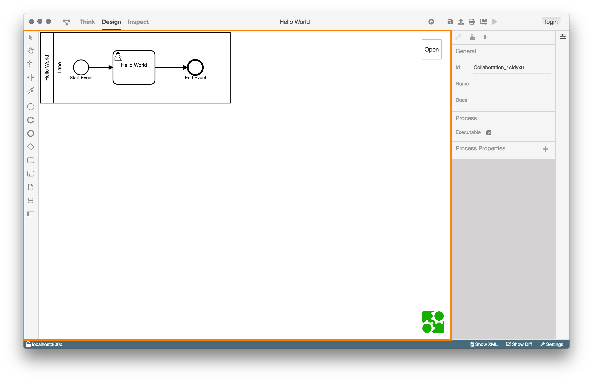
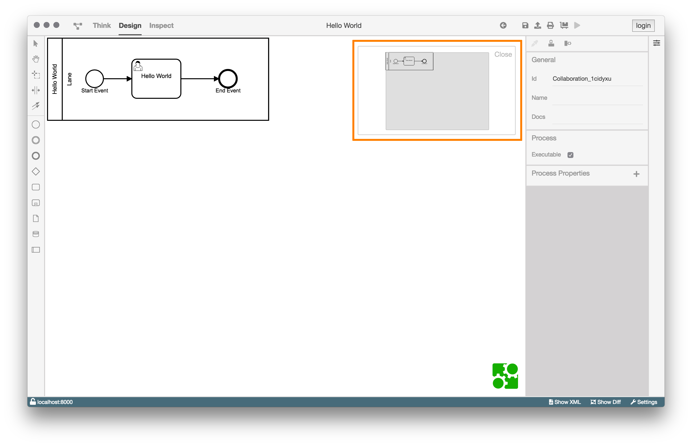
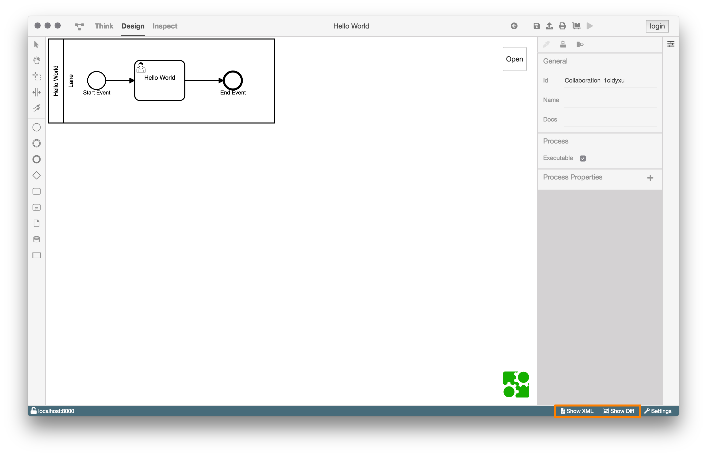

# Design-Ansicht

## Aufgaben und Motivation

Die Design View ermöglicht dem Benutzer einen Prozess zu betrachten,
zu modellieren und zu konfigurieren.

## Aufbau und Strukturierung

Wenn die Design View geöffnet wurde, wird in der Mitte des BPMN-Studios
(Modellierungsfläche) das Diagramm angezeigt.

Die Design View ist grundsätzlich in vier Bereiche aufgeteilt.

1. Modellierungsfläche

  

  Die Modellierungsfläche kann mit der linken Werkzeugleiste genutzt werden.
  Dort sind alle BPMN Elemente enthalten, die für die Modellierung gebraucht
  werden.

  Oben rechts in der Modellierungsfläche gibt es eine Minimap.

  

  Die Minimap zeigt das Diagramm komplett und kann es auch verschieben und
  zoomen.

  

2. Property Panel

  

  Das Property Panel bietet die Möglichkeit ein angewähltes Element
  zu konfigurieren und diesem Eigenschaften in Form von Properties
  hinzuzufügen.

  Zusätzlich bietet das Property Panel eine Werkzeugleiste an, in der sich
  Tools befinden, um die optische Darstellung des Diagramms anzupassen.

  Es ist Möglich:

  - Ein oder mehrere Elemente zu färben
  - Mehrere Elemente horizontal auszurichten
  - Mehrere Elemente vertikal auszurichten

3. Aktionsmenu

  Das Aktionsmenu gibt es in zwei Varianten.
  Eine Variante des Aktionsmenu ist in der Design View mit einem geöffnetem
  Diagramm, welches sich auf dem Dateisystem des eigenen Computers befindet.

  

  Der Unterschied zwischen dem folgenden und obrigen Aktionsmenu ist der
  Button ganz rechts.

  Befindet sich das Diagramm auf dem Dateisystem, kann es mit dem `Deploy Button`
  auf die ProcessEngine geladen/deployed werden.

  Wenn die Design View mit einem Diagramm aus der ProcessEngine geöffnet ist
  sieht man stattdessen diesen `Start Button`, mit dem der Prozess ausgeführt
  werden kann.

  

  Die anderen Buttons haben immer die selbe Funktionalität.

  - Erster Button von Links: Navigiert eine Seite zurück
  - Zweiter Button von Links: Speichert den Prozess
  - Button in der Mitte: Exportiert das Diagramm (.bpmn, .svg, .jpeg, oder .png)
  - Zweiter Button von Rechts: Öffnet einen Drucken Dialog

4. Statusleiste

  

  Die beiden Buttons `Show XML` und `Show Diff` sind nur in der Statusleiste
  sind nur in der Design View sichtbar.

  Der `Show XML` Button wechselt zur [XML View](../xml-view/xml-view.md) und zeigt das aktuelle XML
  des Diagramms.

  Der `Show Diff` Button wechselt zur [Diff View](../diff-view/diff-view.md).
