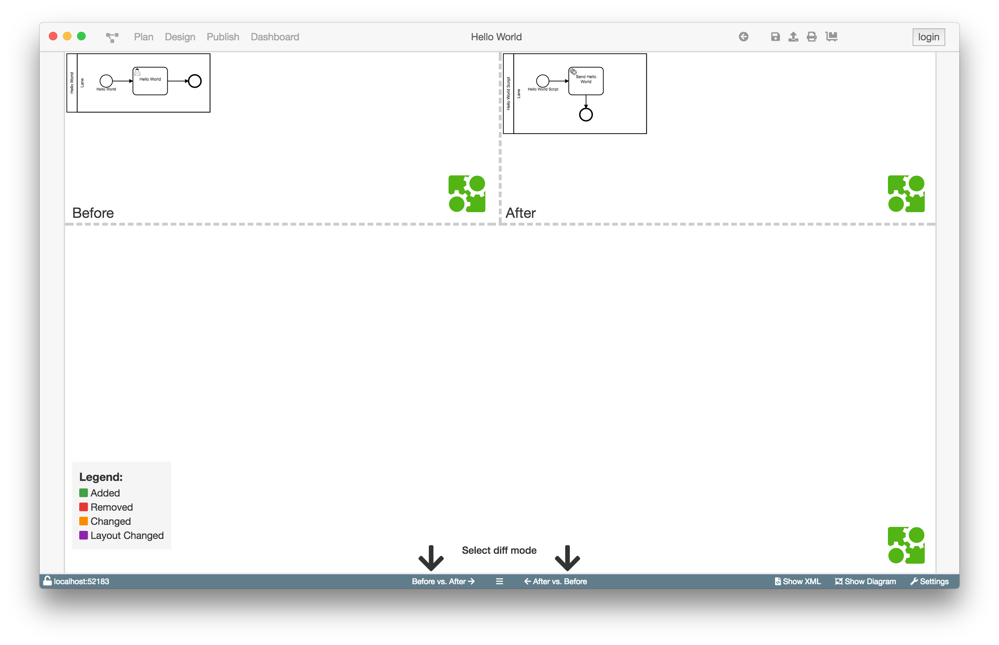
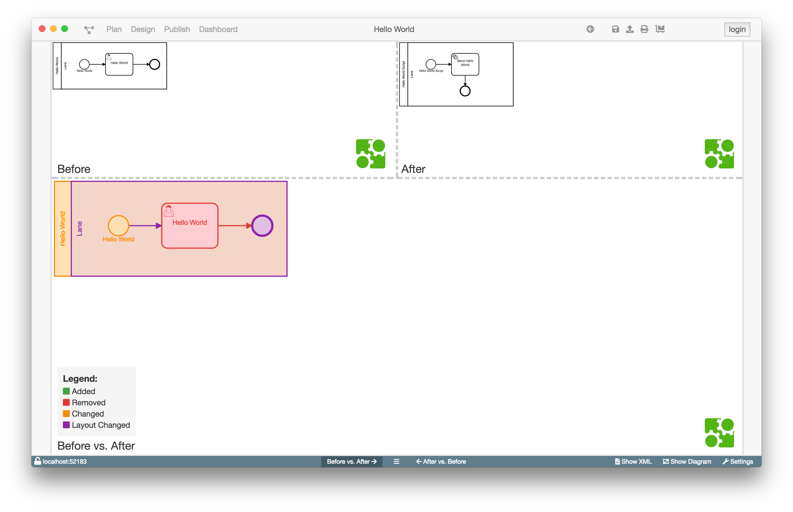
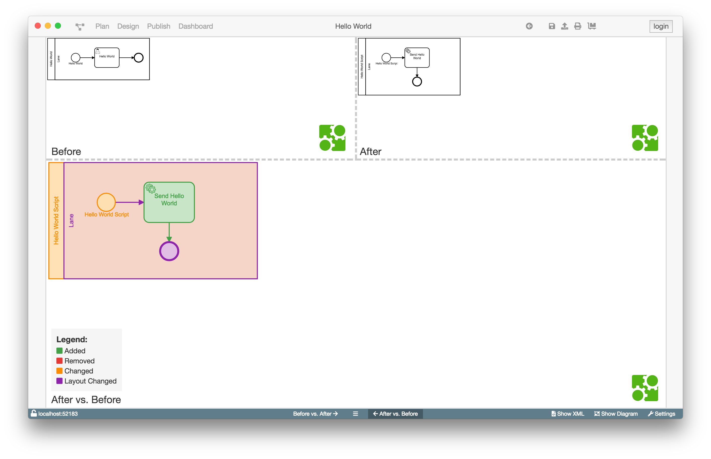
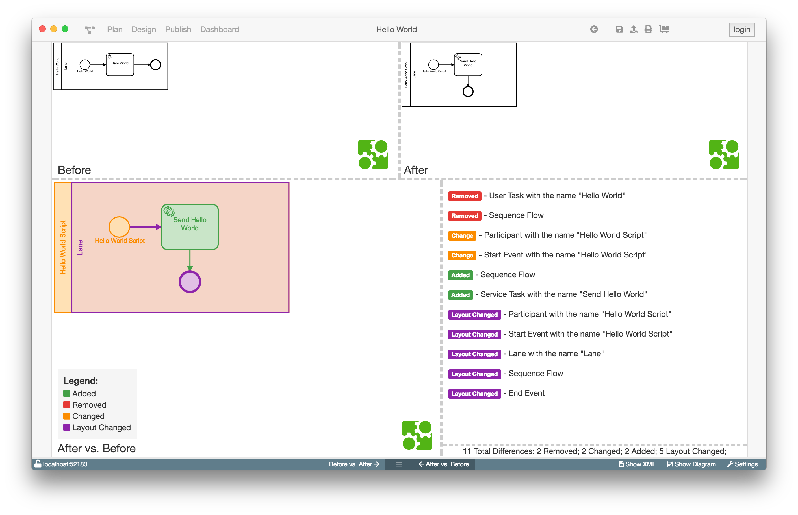

# Diff-Ansicht

## Aufgaben und Motivation

Die Diff-View ermöglicht dem Anwender den Unterschied zwischen zwei Diagrammen
so einfach wie möglich zu erkennen.

Dazu stellt die Diff-View die Unterschiede der Diagramme sowohl grafisch als
auch tabellarisch da.
Die grafische Ansicht kann zwischen Vorher gegen Nachher und Nachher gegen Vorher
gewechselt werden, sodass sicher gestellt ist, dass die Änderungen immer
übersichtlich dargestellt werden können und Änderungen schnellstmöglich erkannt
werden können.
Die Listenansicht zeigt einfach alle Änderungen zwischen
den beiden Diagrammen an. Diese sind dabei nach Änderungsart sortiert und
werden zusammen mit dem Typ und (falls vorhanden) dem Namen des betroffenen
Elements angegeben.

## Aufbau und Strukturierung

Wenn die Diff-View über den "Show Diff"-Button geöffnet wurde werden das Vorher
und das Nachher Diagramm angezeigt, mit einem Hinweis auf die Buttons zur
Auswahl des Diff Modus.

Klickt man auf einen der beiden Modus-Auswahl-Button wird unten das
entsprechende Diagram, je nach Modus das Vorher oder Nachher Diagramm,
angezeigt in dem die geänderten Elemente makiert sind.
Welche Farbe was bedeutet kann unten links in der Ecke in der Legende abgelesen
werden.

Zwischen den beiden Modus-Auswahl-Button befindet sich der Button zum Ein-/
Ausblenden der Listenansicht.

Die Listenansicht zeigt alle Änderungen an. Diese sind nach der Art
der Änderung sortiert in der folgenden Reihenfolge:

1. Entfernt
1. Geändert
1. Hinzugefügt
1. Layout geändert

Ausserdem sind die Art des Elements und (falls vorhanden) der Name mit
angegeben, um das gemeinte Element identifizieren zu können.

## Funktion

Die Diff-View zeigt die Änderungen zwischen dem zuletzt gespeicherten und dem
aktuellen Diagramm an.

Die Vorher gegen Nachher Ansicht zeigt die Änderungen anhand der Basis des
alten Diagramms an, also alle Elementen die gelöscht oder geändert wurden.
Die Nachher gegen Vorher Ansicht zeigt die Änderungen anhand der Basis des
neuen Diagramms an, also mit allen Elementen die hinzugefügt oder geändert
wurden.
