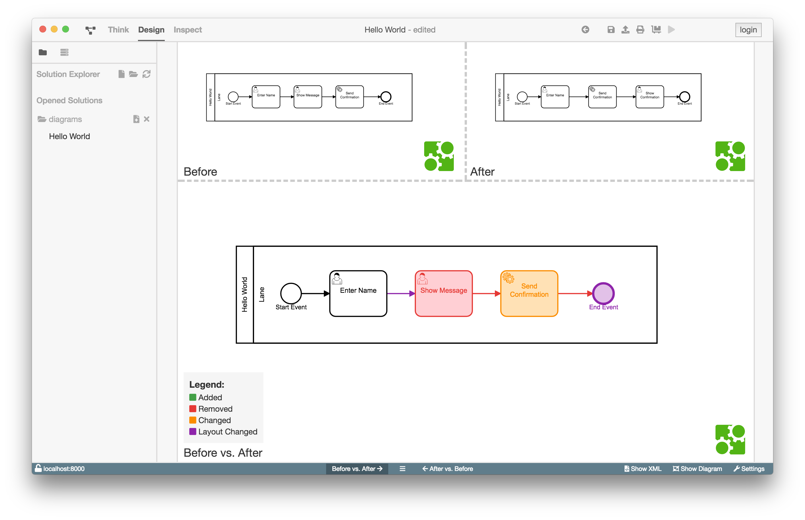

# Diff-Ansicht

## Aufgaben und Motivation

Mit Hilfe der Diff-Ansicht ist es dem Benutzer möglich, Änderungen nach dem letzten
Speicherstand zu erkennen.

Die Unterschiede zwischen den beiden Versionen werden als Graph und als Liste
dargestellt.

In der grafischen Ansicht kann der Benutzer zwischen "Vorher gegen Nachher"
(Before vs. After) oder "Nachher gegen Vorher" (After vs. Before) wählen. Die
Schaltflächen dazu befinden sich mittig in der unteren Statusleiste.

In der Listenansicht werden die Änderungen mit Typ und ggf. Elementnamen
aufgezeigt. Die Liste ist nach Änderungsart sortiert. Über die

Schaltfläche kann die Listenansicht eingeblendet und
ausgeblendet werden.

## Aufbau und Strukturierung

Die Diff-Ansicht lässt sich mittels des `Show Diff` -Buttons, welcher sich in
der unteren Rechten Ecke des BPMN-Studios befindet, öffnen. In der linken
oberen Spalte wird der zuletzt gespeicherte Stand des Diagramms, und in der
rechten oberen Spalte der aktuelle Stand angezeigt. In der mittleren Fläche
befindet sich das Diagram, in welchem die Änderungen, je nach gewähltem Diff
Modus, durch farbige Markierungen dargestellt werden.

Klickt man auf einen der beiden Modus-Auswahl-Buttons wird, in dem noch leeren
Abschnitt der Diff-Ansicht, das entsprechende Diagramm mit den markierten Änderungen
angezeigt.
Die Farbbedeutung kann unten links in der Ecke in der Legende abgelesen
werden.

Mittels den beiden Moduls-Auswahl Buttons lässt sich der Diff Modus ändern.
Standartmäßig befindet man sich beim öffnen der Diff - Ansicht immer im
_After vs. Before_ Modus, in welchem das aktuelle Diagram als Basis dient und
die gemachten Änderungen seit dem letztem Speichern markiert werden.

Zwischen den beiden Modus-Auswahl-Buttons befindet sich der Button zum Ein-/
Ausblenden der Listenansicht.

Die Listenansicht zeigt alle Änderungen an. Diese sind nach der Art
der Änderung in folgender Reihenfolge sortiert:

1. Entfernt
2. Geändert
3. Hinzugefügt
4. Layout geändert

Um das Element genau zu identifizieren werden die Art und der Name des
Elements angegeben.

## Funktion

Die Diff-Ansicht zeigt die Änderungen zwischen dem zuletzt gespeicherten und dem
aktuellen Diagramm an.

Die "Vorher gegen Nachher" Ansicht zeigt das alte Diagramm mit Markierungen bei
gelöschten oder veränderten Elementen, wohingegen bei der "Nachher gegen Vorher"
Ansicht die Änderungen anhand des neuen Diagramms dargestellt werden.
