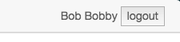

# Login

Der Login Button befindet sich oben rechts im BPMN-Studio.

Nach einem Klick auf den Button wird man auf die Anmeldeseite
des eingestellten IdentityServers geleitet, um sich anzumelden.

Nach erfolgreichem Login leitet das BPMN-Studio zurück zur vorherigen
Seite und der Login Button oben rechts ist durch den Benutzername
und einem Logout Button ersetzt.

