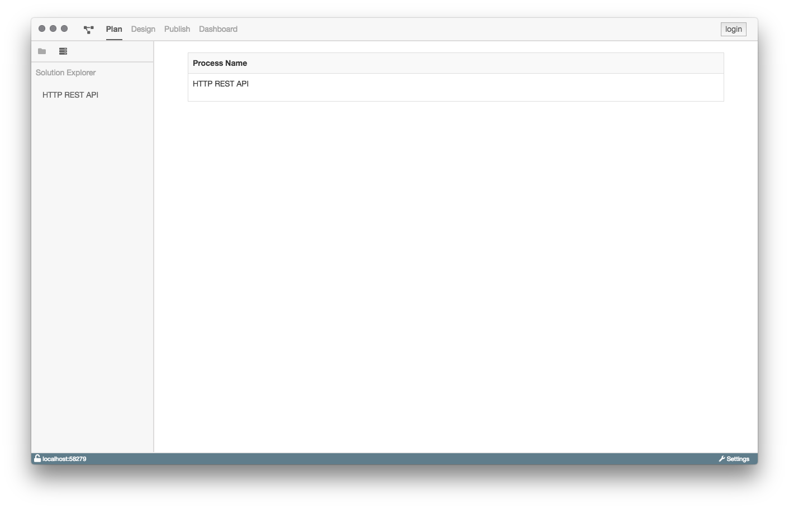

# Plan-Ansicht

Die Plan-Ansicht zeigt alle Prozessmodelle an, welche in der Datenbank der
aktuell verbunden ProcessEngine existieren.

## Aufgaben und Motivation

Ziel der Plan-Ansicht ist es, dem Benutzer einen Überblick über alle
bestehenden Prozessmodelle zu geben.

## Aufbau und Strukturierung

Die Plan-Ansicht besteht aus einer Tabelle. In ihr werden die Prozessmodelle
mit ihrem Namen aufgelistet.

## Funktion

Jedes Prozessmodell kann angeklickt werden. Es öffnet sich die entsprechende
[Design-Ansicht](../design-view/design-view.md)
des Prozessmodells.
