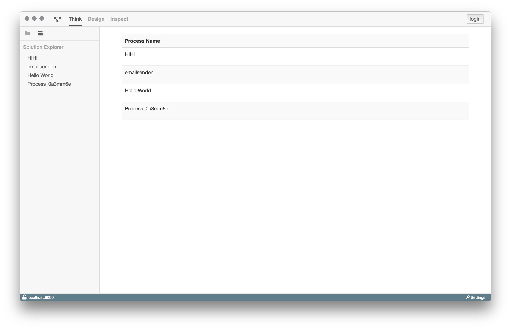

# Plan-Ansicht

Die Plan-Ansicht zeigt alle Prozessmodelle, die zurzeit in der Datenbank
vorhanden sind. Falls keine Prozessmodelle in der Tabelle aufgeführt werden,
müssen diese noch deployed werden.

Über die Plan-Ansicht kann man die Design-Ansicht eines Prozesses öffnen,
in der man dann die Möglichkeit hat diesen zu modellieren, zu deployen,
zu exportieren oder auch zu starten.

Um die Ansicht zu öffnen klickt man in der Plan-Ansicht auf den Tabelleneintrag.
