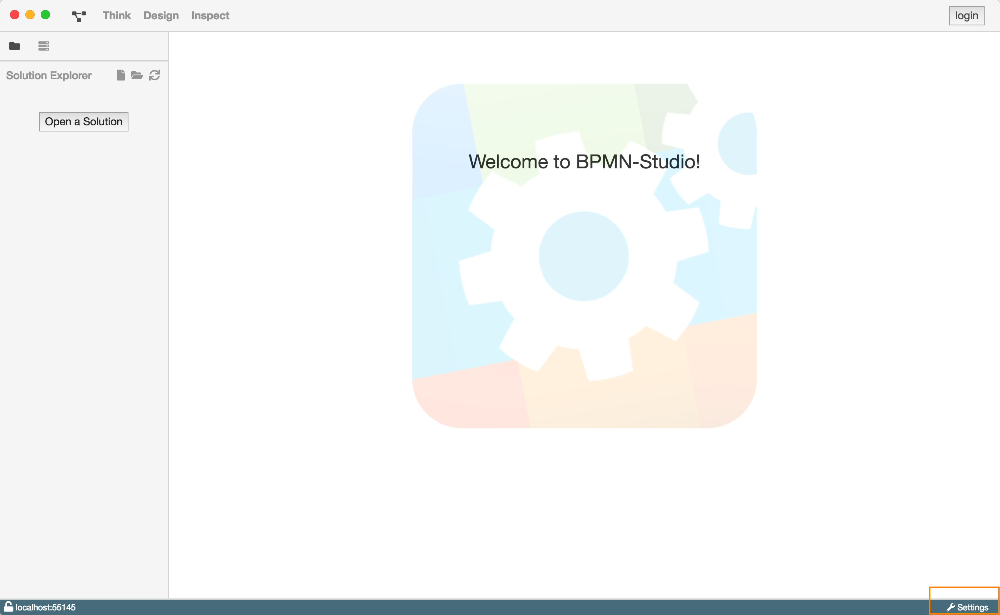
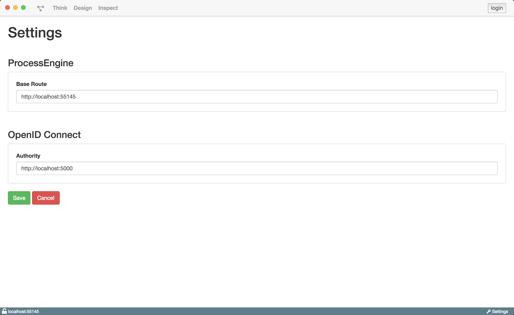

# Settings

## Aufgaben und Motivation

Die Settings dienen dazu, die Konfiguration vom BPMN-Studio zu bearbeiten.

## Aufbau und Strukturierung

Die Einstellungen können immer über die Schaltfläche `Settings` unten rechts
in der Statusleiste geöffnet werden.

Die Ansicht besteht aus verschiedenen Kategorien, unter welchen einzelne
Konfigurationspunkte zu finden sind:

**Einstellungen für die ProcessEngine:**

Hier kann der Endpunkt der ProcessEngine konfiguriert werden, den das
BPMN-Studio verwenden soll. Bei dem Endpunkt handelt es sich um eine HTTP URL.

Falls BPMN-Studio als Electron Anwendung ausgeführt wird, ist diese Einstellung
automatisch auf die interne ProcessEngine gesetzt. Falls die interne
ProcessEngine nicht verwendet wird, zeigt BPMN-Studio einen Hinweis an:

**Einstellungen für OpenId Connect:**

In dieser Sektion kann die Authority gesetzt werden. Diese wird für die Login
Funktionalität verwendet. Die Authority muss eine HTTP URL enthalten.

## Funktion

Über den `Save` Button können die neuen Einstellungen übernommen werden. Diese
überschreiben die alte Konfiguration.

Mit dem `Cancel` Button können die Einstellungen verworfen werden. Die alten
Einstellungen werden nicht überschrieben.
