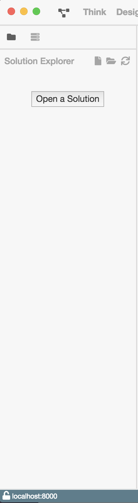

# Solution Explorer

Der Solution Explorer bietet die Funktionalität Ordner (Solutions) oder Dateien
zu öffnen. Darüber hinaus ist er in allen Ansichten verfügbar. Somit kann von
jeder Ansicht aus zu der Designansicht eines Prozesses navigiert werden.

Zusätzlich zeigt er die deployten Prozesse der verbundenen ProcessEngine.

Man kann diesen über das Icon links neben `Plan` in der Navigation öffnen
und schließen.

