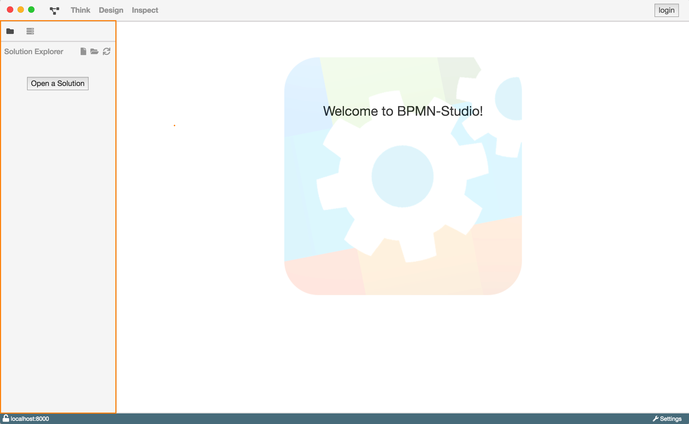
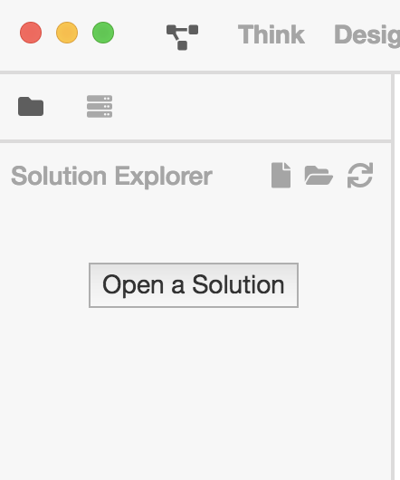
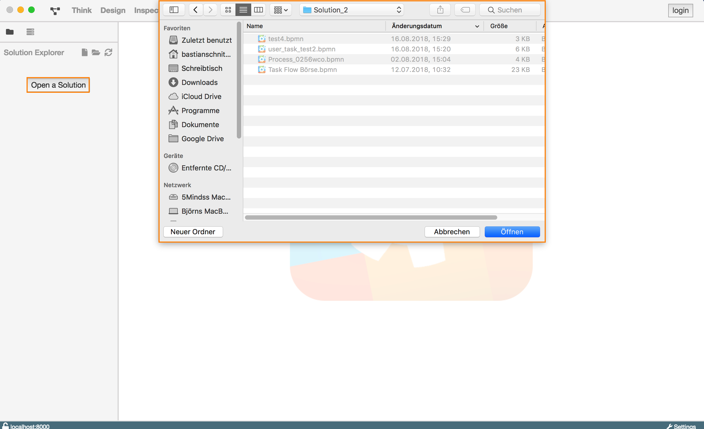
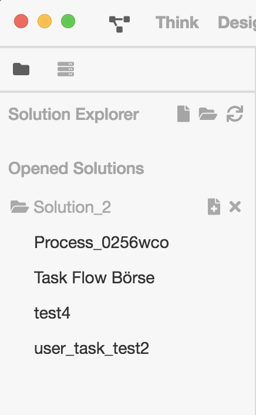
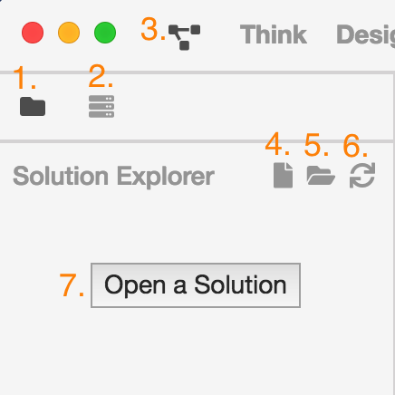
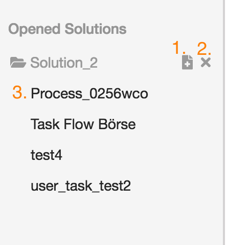

# Solution Explorer

## Was ist eine Solution?

Eine Solution stellt in unserer Philosophie einen Teil der Projektstruktur dar.
In ihr werden alle Diagramme die zur Lösung eines Problems notwendig sind
gebündelt und organisiert. Auf einem Dateisystem ist eine Solution nichts
anderes als ein Ordner der eine Menge von Diagrammen enthält.

## Aufgaben und Motivation

Der Solution Explorer soll es dem Anwender so einfach wie möglich machen
zwischen den einzelnen Diagrammen einer Solution oder sogar zwischen
verschiedenen Solutions zu wechseln.

Um das zu erreichen zeigt der Solution Explorer die verschiedenen geöffneten
Solutions, sowie einzelne geöffnete Diagramm untereinander an. Um sie zu
unterscheiden sind Solutions mit einem Ordnersymbol gekennzeichnet und ihre
zugehörigen Diagramme werden eingerückt darunter dargestellt. Ein einfacher
Klick öffnet ein Diagram in der Detailansicht. Dies ermöglicht das schnelle
und einfach Springen zwischen Diagrammen und Solutions.

## Aufbau und Strukturierung

In seinem Startzustand, also beim erstmaligen Öffnen des BPMN-Studios, zeigt der
Solution Explorer alle verfügbaren Diagramme, auf der aktuell angebunden
ProcessEngine, untereinander an.

Schon hier kann der Nutzer mit einem einzigen Klick in die Detailansicht des
angeklickten Diagrammes gelangen und dieses editieren.

Mit einem Klick auf das Ordnersymbol im Reiter des Solution Explorers kann
die Anzeige für Solutions die sich auf dem Dateisystem des Benutzers befinden
geöffnet werden. Beim ersten Öffnen des Reiters werden nur die Grundfunktionen
und ein Button zum Öffnen einer Solution angezeigt.

Ein Klick auf diesen Button öffnet den Datei-Öffnen-Dialog, der es dem Nutzer
erlaubt einen beliebigen Ordner in seinem Dateisystem zu suchen oder anzulegen
und zu öffnen.

Mit einem Klick auf "Öffnen" bestätigen wir den ausgewählten Ordner.

Der Solution Explorer wird nun den ausgewählten Ordner als Solution anzeigen.
Auch von hier kann der User mit einem Klick auf den Namen eines Diagrams in die
entsprechende Detailansicht gelangen und das Diagram bearbeiten.

**Hinweis:** Es werden nur .bpmn-Dateien angezeigt, andere Dateitypen werden
nicht importiert.

## Funktionen

Solution Explorer in der Dateisystemansicht:

| Nr. | Bezeichnung | Beschreibung |
| :-: | ----------- | ------------ |
| 1. | *Reiter "Dateisystemansicht" | Öffnet die Dateisystemansicht des Solution Explorers. |
| 2. | Reiter "ProcessEngineansicht" | Öffnet die Ansicht zur Anzeige aller Diagramme auf der aktuell angebunden ProcessEngine. |
| 3. | Solution Explorer öffnen/schließen | Öffnet und schließt den Solution Explorer. |
| 4. | Datei öffnen | Öffnet einen Datei-Öffnen-Dialog zum öffnen einer einzelnen .bpmn-Datei. |
| 5. | Solution öffnen | Öffnet ein Ordner-Öffnen-Dialog zum öffnen eines Ordners auf dem Dateisystem des Nutzers als Solution. |
| 6. | Refresh | Aktualisiert den Solution Explorer und alle in ihm enthaltenen Solutions. |
| 7. | Open a Solution | Siehe 5. |

Geöffnete Solution im Solution Explorer:

| Nr. | Bezeichnung | Beschreibung |
| :-: | ----------- | ------------ |
| 1. | Neues Diagram anlegen | Erstellt ein neues Diagram innerhalb dieser Solution. |
| 2. | Solution schließen | Schließt diese Solution im Solution Explorer. |
| 3. | Diagramme | Öffnet die Detailansicht des ausgewählten Diagrammes. |
