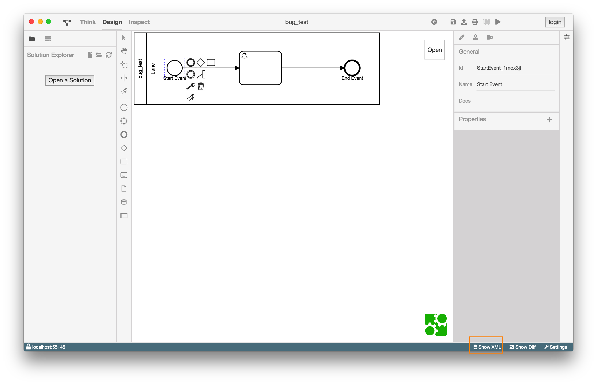

# XML-Ansicht

## Aufgaben und Motivation

Die XML-Ansicht ist eine Erweiterung des Design-Ansicht. In dieser Ansicht wird
die XML des Diagramms dargestellt.

## Aufbau und Strukturierung

Die XML-Ansicht kann aus der Design-Ansicht heraus über die Schaltfläche
`Show XML` unten rechts in der Statusleiste geöffnet werden.

Anstelle der Diagramm-View, wird die XML des geöffneten Diagramms angezeigt.
Dieses XML entspricht der technischen Speicherung des aktuell geöffneten
BPMN-Diagramms.

Das zentrale Textfeld verfügt über ein Syntaxhervorhebung und Zeilennummerierung
auf der linken Seite. Es ist zurzeit nicht möglich, dass XML zu editieren.

## Funktion

Der Inhalt des XML-Ansicht kann nicht editiert werden. Allerdings kann der
Inhalt kopiert werden.
