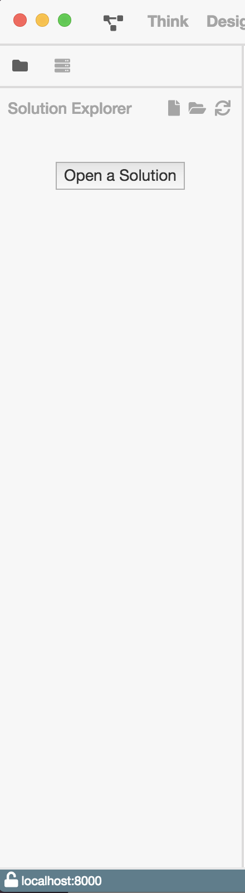
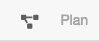
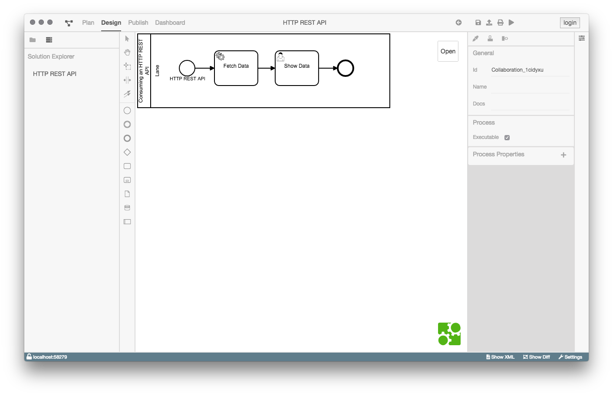
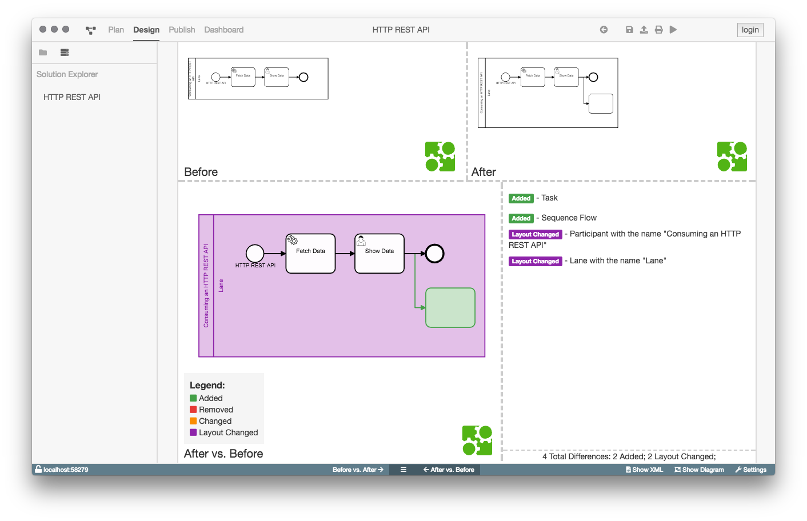
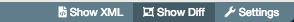
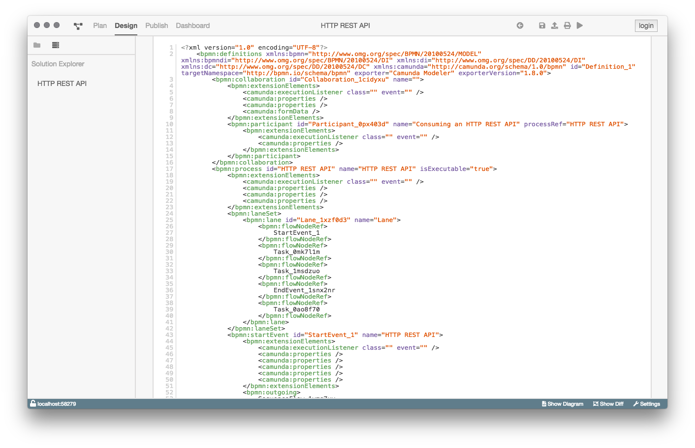
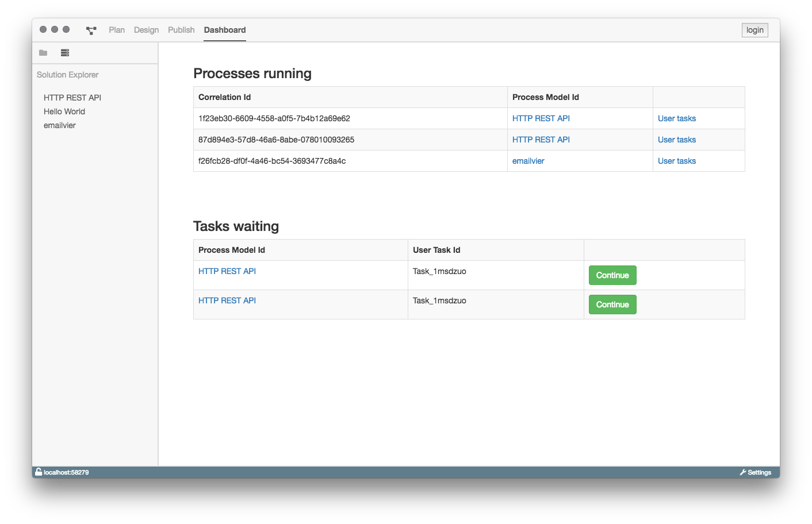
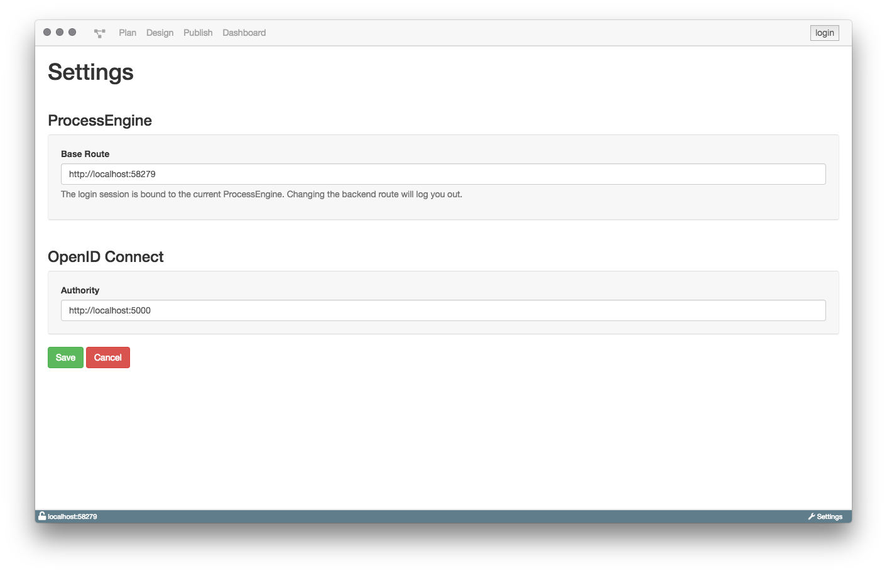

# Überblick

## BPMN-Studio

Das BPMN-Studio besteht aus einer vielzahl von verschiedenen Komponenten.

## SolutionExplorer
Zum einen ist der [SolutionExplorer](components/solution-explorer/solution-explorer.md) ein wichtiger Bestandteil des Studios.

Man kann diesen über das Icon links neben `Plan` in der Navigation erreichen.

## Plan View

Die [Plan View](components/plan-view/plan-view.md) zeigt alle Prozessmodelle, die zurzeit
in der Datenbank vorhanden sind. Falls keine Prozessmodelle in der
Tabelle aufgeführt werden, müssen diese noch deployed werden.

Über die [Plan View](components/plan-view/plan-view.md), oder über den
[SolutionExplorer](components/solution-explorer/solution-explorer.md) kann 
man die Detail Ansicht eines Prozesses öffnen, in der man dann die Möglichkeit
hat diesen zu Modellieren, Deployen, Exportieren oder auch Starten kann.

Um die Ansicht zu öffnen klickt man entweder in der [Plan View](components/plan-view/plan-view.md)
auf den Tabelleneintrag, oder auf den Prozessnamen im 
[SolutionExplorer](components/solution-explorer/solution-explorer.md).

## Detail View

Die [Detail View](components/detail-view/detail-view.md) behandelt alle
Diagramm relevanten sachen. Hauptsächlich wird hier das Prozessmodell
modelliert und konfiguriert.

## Diff View

Die [Diff View](components/diff-view/diff-view.md) kann über die Statusbar
aufgerufen werden, allerdings nur wenn die [Detail View](components/detail-view/detail-view.md)
geöffnet ist.

Sie zeigt an, in welchen Bereichen sich ein Diagramm verändert hat.
Zusätzlich gibt es ein Changelog der Änderungen.

## XML View

Die [XML View](components/xml-view/xml-view.md) Zeigt die aktuelle XML
des Prozessmodells. 

## Dashboard

Das [Dashboard](components/dashboard/dashboard.md) ist über die Navigationsleiste
zu finden und zeigt die aktuell laufenden Prozesse der verbundenen ProcessEngine.
Zusätzlich bekommt man eine Liste der anstehenden UserTasks angezeigt.
Es gibt die Möglichkeit UserTasks einer bestimmten Prozessinstanz (Correlation) anzuzeigen.

## Config Panel

Das [Config Panel](components/config-panel/config-panel.md) kannn über die Statusbar
aufgerufen werden.

Dort kann sich zum Beispiel mit einer externen ProcessEngine verbunden werden.
