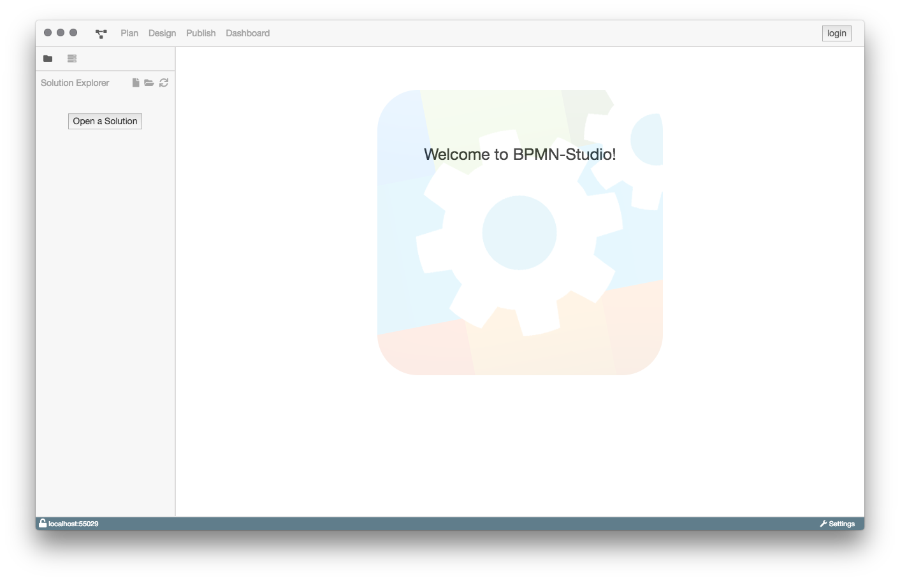
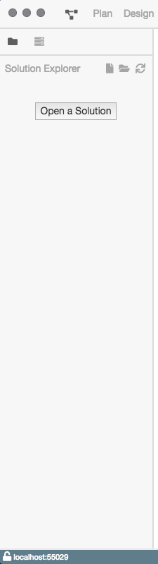
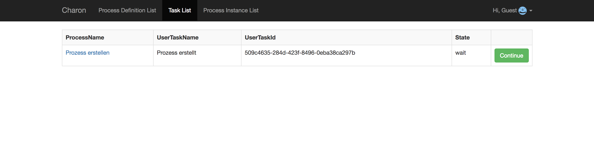
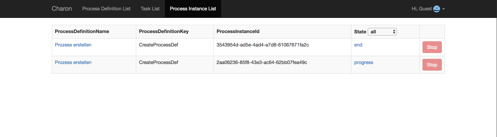
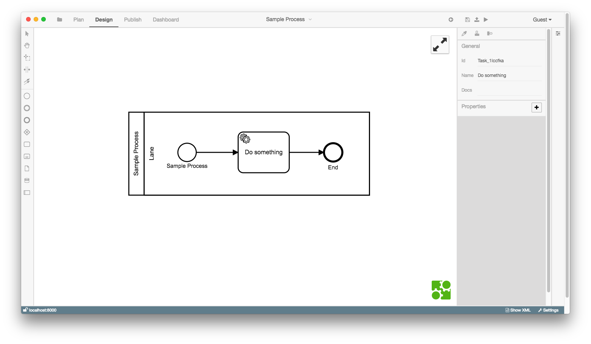

# Überblick

## BPMN-Studio

Das BPMN-Studio besteht aus einer vielzahl von verschiedenen Komponenten.

Zum einen ist der [SolutionExplorer](components/solution-explorer/solution-explorer.md) ein wichtiger Bestandteil des Studios.

Man kann diesen über das BILD Icon links neben `Plan` in der Navigation erreichen.

Der "Process Definition List"-Dialog zeigt alle Prozessmodelle, die zurzeit
in der Datenbank vorhanden sind.

Beim Start der Anwendung sind zwei Prozesse vorhanden:

1.  Prozess löschen
1.  Prozess erstellen

Oben links befindet sich der "Create Process Definition"-Button.
Er öffnet einen Dialog zum Erstellen eines neuen Prozessmodells.
Dieses neue Prozessmodell kann nach dem Erstellen mit dem entsprechenden
"Details"-Button, rechts in der Tabelle, bearbeitet werden.

Der "Start"-Button links neben dem "Details"-Button dient zum Starten einer
Prozessinstanz anhand des Prozessmodells.

## Task List

Der "Task List"-Dialog zeigt alle Tasks, die für den angemeldeten Benutzer
verfügbar sind.

Im Bild wird ein Task des "Prozess erstellen"-Prozesses angezeigt. Der Task
wartet darauf, von einem Benutzer bearbeitet zu werden. Mit einem Klick auf den
"Continue"-Button wird der Nutzer zu einer Oberfläche zum bearbeiten des Task
geführt.

## Process Instance List

Der "Process Instance List"-Dialog zeigt die Prozessinstanzen, die:

- gerade ausgeführt werden.
- schon ausgeführt wurden.

Insgesamt stellt der Dialog eine Liste aller Prozessinstanzen dar.

Mit dem Dropdown in der Spalte "State" kann man die Tabelle nach dem Status
der Prozessinstanz sortieren.

## Der Prozess Editor

In der Mitte des Bildschirms wird der Prozess Editor angezeigt.
Am linken Bildschirmrand finden sich alle Werkzeuge, die zum Bearbeiten eines Prozesses
notwendig sind. Eine weitere Toolbar befindet sich oberhalb des Editors.

Diese bietet die folgenden Funktionen:

- Start - Startet eine neue Prozessinstanz anhand des Prozessmodells.
- Processes - Zeigt eine Liste von Prozessinstanzen zu dem Prozessmodell.
- Tasks - Zeigt eine Liste von Tasks, die zu dem Prozessmodell gehören.
- Save - Speichert die Änderungen am Prozessmodell.
- Delete Process - Löscht das Prozessmodell.
- Export Diagramm - Exportiert das Diagramm als .bpmn-Datei
- Import Diagramm - Importiert ein Diagramm aus einer .bpmn oder .xml-Datei
