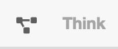

# Überblick

## BPMN-Studio

Das BPMN-Studio besteht aus einer vielzahl von Komponenten.

## SolutionExplorer
Der [SolutionExplorer](components/solution-explorer/solution-explorer.md) 
ist ein wichtiger Bestandteil des BPMN-Studios.

Man kann diesen über das Icon links neben `Plan` in der Navigation öffnen
und schließen.

## Plan View

Die [Plan View](components/plan-view/plan-view.md) zeigt alle Prozessmodelle, 
die zurzeit in der Datenbank vorhanden sind. Falls keine Prozessmodelle in 
der Tabelle aufgeführt werden, müssen diese noch deployed werden.

Über die [Plan View](components/plan-view/plan-view.md), oder über den
[SolutionExplorer](components/solution-explorer/solution-explorer.md) kann 
man die Detail Ansicht eines Prozesses öffnen, in der man dann die Möglichkeit
hat diesen zu Modellieren, zu Deployen, zu Exportieren oder auch Starten kann.

Um die Ansicht zu öffnen klickt man entweder in der 
[Plan View](components/plan-view/plan-view.md) auf den Tabelleneintrag, oder 
auf den Prozessnamen im 
[SolutionExplorer](components/solution-explorer/solution-explorer.md).

## Detail View

Die [Detail View](components/detail-view/detail-view.md) behandelt alle
Diagramm relevanten sachen. Hauptsächlich wird hier der Prozess
modelliert und konfiguriert.

## Diff View

Die [Diff View](components/diff-view/diff-view.md) kann in der 
[Detailansicht](components/detail-view/detail-view.md) über die Statusleiste
aufgerufen werden.

Sie zeigt an, in welchen Bereichen sich ein Diagramm verändert hat.
Zusätzlich gibt es ein Changelog der Änderungen.

## XML View

Die [XML View](components/xml-view/xml-view.md) Zeigt die aktuelle XML
des Prozessmodells. 

## Dashboard

Das [Dashboard](components/dashboard/dashboard.md) ist in der Navigationsleiste
zu finden und zeigt die aktuell laufenden Prozesse der verbundenen
ProcessEngine. Zusätzlich wird eine Liste der anstehenden UserTasks angezeigt.
Es gibt die Möglichkeit UserTasks einer bestimmten Prozessinstanz (Correlation)
anzuzeigen.

## Config Panel

Das [Config Panel](components/config-panel/config-panel.md) kannn über die
Statusleiste aufgerufen werden.

Dort kann sich mit einer externen ProcessEngine, und einem anderen
IdentityServer verbunden werden.
