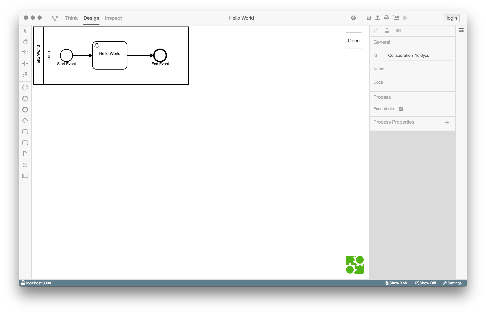
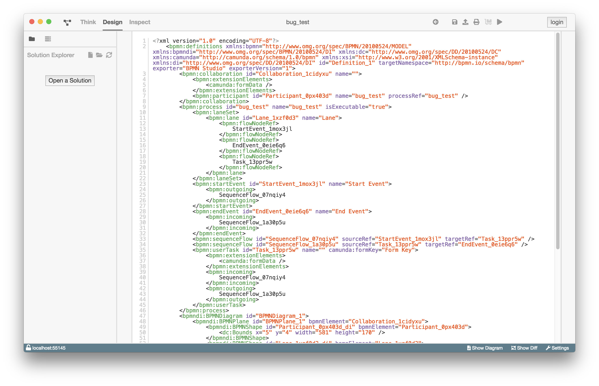

# Überblick

## BPMN-Studio

Im Folgenden werden die wichtigsten Komponenten des BPMN-Studio näher
beschrieben.

## SolutionExplorer
Der [SolutionExplorer](components/solution-explorer/solution-explorer.md) 
ist ein wichtiger Bestandteil des BPMN-Studios. Er bietet die Funktionalität
Ordner (Solutions) oder Dateien zu öffnen. Darüber hinaus ist er in allen
Ansichten verfügbar. Somit kann von jeder Ansicht aus zu der Designansicht
eines Prozesses navigiert werden.

Zusätzlich zeigt er die deployten Prozesse der verbundenen ProcessEngine.

Man kann diesen über das Icon links neben `Plan` in der Navigation öffnen
und schließen.

## Plan View

Die [Plan View](components/plan-view/plan-view.md) zeigt alle Prozessmodelle, 
die zurzeit in der Datenbank vorhanden sind. Falls keine Prozessmodelle in 
der Tabelle aufgeführt werden, müssen diese noch deployed werden.

Über die [Plan View](components/plan-view/plan-view.md) kann man die 
Designansicht eines Prozesses öffnen, in der man dann die Möglichkeit hat
diesen zu modellieren, zu deployen, zu exportieren oder auch zu starten.

Um die Ansicht zu öffnen klickt man in der 
[Plan View](components/plan-view/plan-view.md) auf den Tabelleneintrag.

## Design View

Die [Design View](components/design-view/design-view.md) bietet die
Möglichkeit das Diagramm zu betrachten, zu modellieren und zu konfigurieren.
Die Ansicht kann über den Solution Explorer, oder über die 
[Plan View](components/plan-view/plan-view.md) aufgerufen werden.

## Diff View

Die [Diff View](components/diff-view/diff-view.md) kann in der 
[Design View](components/design-view/design-view.md) über die Statusleiste
aufgerufen werden.

Sie zeigt an, in welchen Bereichen sich ein Diagramm verändert hat.
Zusätzlich gibt es ein Changelog der Änderungen.

## XML View

Die [XML View](components/xml-view/xml-view.md) zeigt die aktuelle XML
des Prozessmodells. 

## Dashboard

Das [Dashboard](components/dashboard/dashboard.md) ist in der Navigationsleiste
zu finden und zeigt die aktuell laufenden Prozesse der verbundenen
ProcessEngine. Zusätzlich wird eine Liste der anstehenden UserTasks angezeigt.
Es gibt die Möglichkeit UserTasks einer bestimmten Korrelation anzuzeigen.

## Config Panel

Das [Config Panel](components/config-panel/config-panel.md) kannn über die
Statusleiste aufgerufen werden.

Dort lässt sich einstellen, mit welcher ProcessEngine sich das BPMN-Studio
verbindet und an welchem Server sich der Benutzer authentifiziert.

## Login

Der Login Button befindet sich oben rechts im BPMN-Studio.
Nach einem Klick auf den Button wird man auf die Anmeldeseite
des eingestellten IdentityServers geleitet, um sich anzumelden.

Nach erfolgreichem Login leitet das BPMN-Studio zurück zur vorherigen
Seite und der Login Button oben rechts ist durch den Benutzername
und einem Logout Button ersetzt.

## Waiting Room

Der Waiting Room erscheint, sobald ein Prozess gestartet wurde und ausgeführt
wird. Er wird so lange angezeigt bis der Prozess und seine Tasks beendet wurden.
Man kann den Waiting Room verlassen und den Prozess, falls ein UserTask ansteht,
später weiter ausführen. Wenn der Prozess keinen UserTask enthält, wird der
Prozess automatisch nach Fertigstellung seiner Tasks beendet.
