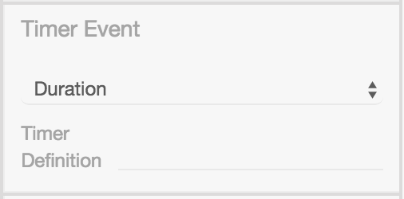

# Basic Editing

## Modeler

Im Kern benutzt BPMN-Studio
[bpmn-js](https://bpmn.io/toolkit/bpmn-js/)
um das Editieren und Designen von Diagrammen zu ermöglichen.

Das Tool bpmn-js, das sich intern auf
[diagram-js](https://github.com/bpmn-io/diagram-js)
stützt, ist ein Unterprojekt von
[bpmn.io](https://github.com/bpmn-io).
Das Projekt bpmn.io ist ein Open-Source-Projekt von camunda.

Weitere Informationen finden Sie auf der Website zu
[bpmn.io](https://bpmn.io/).

Für eine genaue Anleitung zur Modellierung von BPMN-Diagrammen und Prozessen,
bietet das
[Tutorial](https://camunda.com/bpmn/)
von camunda einen guten Einstieg.

## Property Panel

Das Property Panel im BPMN-Studio ist eine Erweiterung für die bpmn-io
Komponente (Modeler/Designer) und ist in der Design-Ansicht auf der rechten
Seite zu finden.

Über den Button in der Ecke rechts oben ist es möglich das Property Panel ein-
bzw. auszublenden.

Das Property Panel erlaubt es Benutzern Eigenschaften an einzelnen
BPMN-Elementen hinzuzufügen, zu entfernen und zu konfigurieren. Diese
Eigenschaften sind unsichtbar und werden nicht in der grafischen Darstellung
zur Anzeige gebracht

Verschiedene BPMN-Elemente haben unterschiedliche Konfiguratinsmöglichkeiten im
Property Panel. Im Nachfolgenden, werden diese Möglichkeiten beschrieben.

Die Abschnitte

* `General Section` und
* `Properties Section`createCamundaProperties

sind für alle Elemente vorhanden.

Darüber hinaus gibt es Möglichkeiten, die abhängig von dem ausgewähltem Element sind.
Im Property Panel gibt es folgende Sections:

1. [General (alle Elemente)](#general)
1. [Forms (UserTasks)](#forms)
1. [Message (Receive Task, Start/Boundary Events)](#message-escalation-error-signal)
1. [Escalation (Boundary/End Events)](#message-escalation-error-signal)
1. [Error (Boundary/End Events)](#message-escalation-error-signal)
1. [Signal (Start/Boundary/End Events)](#message-escalation-error-signal)
1. [Conditional (Start/Boundary/End Events)](#conditional-event)
1. [Script (ScriptTasks)](#script)
1. [Call Activity (Call Activity Task)](#call-activity)
1. [Timer (Start/Boundary Events)](#timer)
1. [Process (Collaboration)](#process)
1. [Properties (alle Elemente)](#extension-properties)

### General

Die `General Section` behandelt mit

1. ID,
1. Name,
1. und Docs

die grundlegenden Informationen eines Elements.

Beispiel:


Das ID-Feld enthält eine technische ID; sie wird automatisch vergeben und
sollte nicht verändert werden.

Das Name-Feld ist der Anzeigename des Elements und wird auf der grafischen
Darstellung angezeigt. Die genaue Position ist abhängig von dem Element und
kann

1. unter dem Element (z.B. Events),
1. in dem Element (z.B. Tasks, Lanes),
1. nicht (z.B. Gateways)

angezeigt werden.

Das Docs-Feld wird zur Dokumentation des Elements gedacht; es kann ein Freitext
platziert werden.

Dieser Text wird in dem BPMN-XML gespeichert und weitergeben. Damit ist die
Dokumentation eines Elementes für andere sichtbar.

Tipp: In dem Docs-Feld ist eine gute Beschreibung hilfreich, sie ist im Diagramm
nur nicht sichtbar; ist eine sichtbare Anmerkung im Diagramm gewünscht, kann
alternativ/zusätzlich eine TextAnnotation verwendet werden.

### Forms

Die komplette `Forms Section` ist nur sichtbar, wenn ein UserTask ausgewählt ist.

<!-- TODO: Was ist ein Form Field?? -->

Es können mehrere Form Fields angelegt und entfernt werden.
Zusätzlich kann man für jeden UserTask optional einen `Form Key` setzen.

Wenn ein UserTask angewählt ist, sieht die `Forms Section` so aus:


Nach dem hinzufügen eines Form Fields über den `+` Button, erscheint ein
weiterer Teil der Section:


In der `Form Field Section` gibt es die Möglichkeit festzulegen

1. welche ID das Form Field erhalten soll,
2. welchen Typ das Form Field haben soll,
3. welches Label gesetzt werden soll,
4. welcher Standardwert enthalten sein soll.

**Wichtig:** Die **ID** ist ein Pflichtfeld. Sie muss **einmalig** und
**nicht leer** sein.

Es stehen folgende Typen als Auswahl zur Verfügung:

1. `string`
1. `long`
1. `boolean`
1. `date`
1. `enum`
1. `custom type`

**Info**:

Wenn der Typ `enum` ausgewählt ist, erscheint eine weitere Section,
in der anhand von Key-Value-Paaren angegeben wird, welche Einträge
die Enum-Auswahl beinhalten soll.

Im BPMN-Studio wird ein UserTask vom Typ `enum` während der Ausführung als
Dropdown dargestellt.

#### Dynamische Werte für Formularfelder

Bei der Anzeige von UserTasks kann es hilfreich sein, Beschriftungen mit
dynamischen Werten zu versehen, die sich erst während der Prozessausführung
ergeben.

Jeder Task, der im Diagramm ausgeführt wird, hält ein Zwischenergebnis fest. Auf
dieses Zwischenergebnis kann man sich mittels der `Id` des Tasks beziehen, der
das gewünschte Zwischenergebnis erzeugt hat.

Diese Funktion kann in den Werten für `Label`, `Default Value` genutzt
werden.

##### Zugriff auf die Token History

Nehmen wir einen UserTask mit einem Form Field an, der als `Default Value` das
Ergebnis eines vorherigen Tasks mit der `Id` "my_task" nutzen möchte. Der
`Default Value` wird hierbei folgendermaßen beschrieben:

```
${token.history.my_task}
```

##### Zugriff auf den aktuellen Token

Gehen wir vom gleichen Beispiel wie beim Zugriff auf die Token History aus.
Diesmal ist der Task mit der `Id` "my_task" der direkte Vorgänger des UserTasks.
In diesem Fall können wir den gleichen Wert wie zuvor über folgenden Wert
verwenden.

```
${token.current}
```

### Message, Escalation, Error, Signal

Die

- Message Section,
- Escalation Section,
- Error Section und
- Signal Section

haben einen ähnlichen Aufbau. Alle Sections sind sichtbar, wenn entweder ein
Boundary- oder ein End-Event von einem der genannten Typen angewählt ist.

Die `Message Section` wird auch bei einem angewähltem `SendTask`, oder
`ReceiveTask` angezeigt.

Die Sections folgen einem ähnlichen Aufbau: Über den `+`-Button kann

* ein Message-Event,
* ein Error-Event,
* ein Escalation-Event oder
* ein Signal-Event

hinzugefügt werden.

Das hinzugefügte Event ist dann im Dropdown automatisch ausgewählt.
Anschließend setzt man die Werte, wie zum Beispiel beim Error Event den

- Name,
- Code,
- und die Message.

So sieht zum Beispiel die `Error Section` aus:


### Conditional Event

Die `Conditional Event Section` wird nur bei angewähltem `Conditional` Boundary
Event sichbar.

Hier kann

- eine Condition,
- ein Variable Name und
- ein Variable Event

angegeben werden.


### Script

Die `Script Section` wird nur bei angewählten `ScriptTask` sichtbar.

Der `ScriptTask` wird mit

- dem Format,
- dem Script und
- einer Result Variablen

konfiguriert. Aktuell kann JavaScript als Code ausgeführt werden kann. Dafür
bedient man sich des Script-Felds im Property Panel.

**Beispiel:**

Als Test kann man zum Beispiel `console.log('Das ist ein Test!')` angeben; es
würde im Backend während der Ausführung des Tasks geloggt werden.


### Call Activity

Die `Call Activity Section` wird bei einem `Call Activity` Task angezeigt
und sieht wie folgt aus:


Wenn die Call Activity konfiguriert ist- also ein Prozess ausgewählt wurde-
wird während der Ausführung der ausgewählte Prozess gestartet und nach
Beendigung wieder zurück zum eigentlichen Prozess gewechselt.

Allerdings funktioniert es nur, wenn beide Prozesse auf der verbundenen
ProcessEngine deployed sind.

### Timer

Die `Timer Section` erscheint bei Timer Boundary Events.

Es gibt drei Modi:

1. Date
1. Duration
1. Cycle

**Info**: Die Timer Definition muss im richtigen Format angegeben werden.

Das zu verwendende Zeitformat ist
[hier](https://docs.camunda.org/manual/7.9/reference/bpmn20/events/timer-events/)
definiert.



### Process

Das erscheinen der `Process Section` erreicht man, indem man kein Element
auswählt, sondern außerhalb einer Lane klickt.

Im Property Panel unter General beginnt nun die ID mit dem Text `Collaboration`
und zusätzlich die `Process Section` unter der `General Section` erscheinen.

Hier kann der Prozess als ausführbar gesetzt werden.


An einer Collaboration können zusätzlich, wie bei BPMN-Elementen Properties
hinzugefügt werden.


### Extension Properties

Die Extension Properties werden bei jedem BPMN-Element angezeigt.
Mittels Key-Value-Paaren können dem Element Eigenschaften hinzugefügt werden.

Ein Anwendungsbeispiel ist zum Beispiel die Verwendung eines `ServiceTasks`.
Um einen `ServiceTask` zu konfigurieren muss dieser drei Eigenschaften erhalten.

Er erhält

<!-- TODO: Explain what a module is -->
- das Modul,
- die Methode und
- zugehörige Parameter

in Form einer Liste, welche mit eckigen Klammern umschlossen ist und deren
Elemente mit Kommata getrennt werden.


**Wichtig**: Die URL muss in Anführungszeichen angegeben werden.
