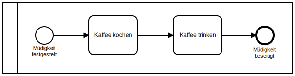
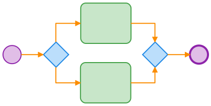
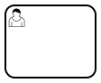
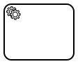
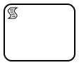
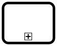
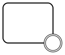
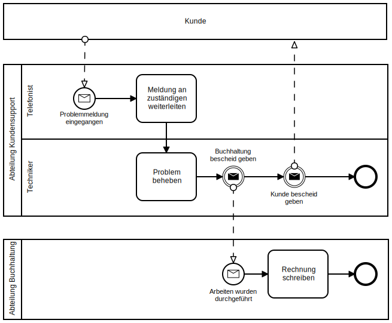

# BPMN Basics

## Definition von BPMN

Die Verwendung der **B**usiness **P**rocess **M**odel and **N**otation
(**BPMN**) erlaubt die Modellierung von Geschäftsprozessen.

BPMN ist ein Standard, der dazu grafische Symbole und deren Verwendung
definiert.

## Überblick über die Verwendung von BPMN

Man unterscheidet zwischen zwei Arten von Prozessmodellen, die beide mit BPMN
Modelliert werden können:

1. **Strategische** Prozessmodelle:

   - Sie beschreiben einen Ablauf so kompakt wie möglich.
   - Man erhält schnell einen Überblick über den gesamten Prozess.
   - Die Sprache ist abstrakt und logisch, und dient dem schnellen Verständnis
     des ganzen Prozesses.
   - Diese Prozesse sind nicht automatisierbar.

1. **Operative** Prozessmodelle:

   - Sie beschreiben einen Ablauf so konkret wie möglich.
   - Es ist genau definiert, was wann wie geschehen muss.
   - Die Sprache ist physisch und konkret, und dient der tatsächlichen
     Ausführung des Prozesses.
   - Diese Prozesse sind in Teilen oder als Ganzes automatisierbar.

## Grundlegende BPMN-Elemente

Hier werden die wichtigsten BPMN-Elemente beschrieben:

- [Aktivität](#aktivität) (grün)
- [Sequenzfluss](#sequenzfluss) (orange)
- [Gateway](#gateway) (Blau)
- [Ereignis](#ereignis) (Lila)
- [Pools und Lanes](#pools-und-lanes) (hier nicht dargestellt)

### Aktivität

Eine Aktivität symbolisiert, dass etwas getan werden soll.

#### Spezialformen der Aktivität

|       Name        |                     Symbol                     |                                                                  Beschreibung                                                                   |
| ----------------- | ---------------------------------------------- | ----------------------------------------------------------------------------------------------------------------------------------------------- |
| Benutzeraktivität |      | Stellt eine Aktivität dar, die eine Benutzerinteraktion erfordert.                                                                              |
| Serviceaktivität  |   | Stellt eine Aktivität dar, die einen Dienst wie einen Webdienst oder eine automatisierte Anwendung verwendet.                                   |
| Skriptaktivität   |    | Stellt eine Aktivität dar, die ein Skript beinhaltet, welches von einer Process Engine ausgeführt werden soll.                                  |
| Aufrufaktivität   |  | Stellt eine Aktivität dar, die einen anderen Prozess aufruft. Sobald der aufgerufene Prozess beendet ist, ist auch die Aufrufaktivität beendet. |

### Sequenzfluss

Ein Sequenzfluss wird verwendet, um die Ablauf-Reihenfolge der Prozesselemente
darzustellen.

### Gateway

Ein Gateway teilt den Prozessfluss in mehrere Flüsse auf, oder führt mehrere
Flüsse wieder zusammen.

#### Spezialformen des Gateways

|         Name          |                      Symbol                       |                                                                 Beschreibung                                                                 |
| --------------------- | ------------------------------------------------- | -------------------------------------------------------------------------------------------------------------------------------------------- |
| Exklusives Gateway |  | <ul><li>Folge <b>einem</b> der Ausgangsflüssen</li><li>Setze den Prozess fort sobald <b>einer</b> der Eingangsflüsse erreicht wird</li></ul> |
| Paralleles Gatway  |   | <ul><li>Folge <b>allen</b> Ausgangsflüssen</li><li>Setze den Prozess fort sobald <b>alle</b> Eingangsflüsse erreicht wurden</li></ul>        |

### Ereignis

Ein Ereignis symbolisiert, dass etwas passiert. Ereignisse können:
- Ein eigenes Element im Diagramm sein.

  

- An eine Aktivität gebunden sein.

  

#### Spezialformen des Ereignisses

Die Art des Ereignisses wird in dessen Symbol durch vier Charakteristika dargestellt:

##### 1. Art der Linie des Kreises

|       Name       |                          Symbol                          |                                    Beschreibung                                     |
| ---------------- | -------------------------------------------------------- | ----------------------------------------------------------------------------------- |
| Startereignis    |                     | Eine einzelne, dünne Linie bedeutet: Das Ereignis startet den Prozess.              |
| Zwischenereignis |  | Doppelte, dünne Linien bedeuten: Das Ereignis tritt während des Prozessablaufs auf. |
| Endereignis      |                 | Eine einzelne, dicke Linie bedeutet: Das Ereignis beendet den Prozess.              |

##### 2. Durchgezogene oder gestrichelte Linie

|                Name                 |                        Symbol                         |                                                                               Beschreibung                                                                               |
| ----------------------------------- | ----------------------------------------------------- | ------------------------------------------------------------------------------------------------------------------------------------------------------------------------ |
| Unterbrechendes Ereignis         |                   | Durchgezogenen Linien bedeuten: je nach Kontext wird bei Eintritt<ul><li>Der Oberprozess abgebrochen.</li><li>Die zugehörige Aktivität abgebrochen.</li></ul>            |
| Nicht unter- brechendes Ereignis |  | Gestrichelten Linien bedeuten: je nach Kontext wird bei Eintritt<ul><li>Der Oberprozess nicht abgebrochen.</li><li>Die zugehörige Aktivität nicht abgebrochen.</li></ul> |

##### 3. Ausgefülltes oder nicht ausgefülltes Symbol

|          Name           |                     Symbol                     |                                             Beschreibung                                              |
| ----------------------- | ---------------------------------------------- | ----------------------------------------------------------------------------------------------------- |
| Eintretendes Ereignisse |  | Ein nicht ausgefülltes Symbol bedeutet: Der Prozess läuft erst weiter, wenn das Ereignis eintritt. |
| Auslösendes Ereignis    |   | Ein Ausgefülltes Symbol bedeutet: Das Ereignis wird ausgelöst und der Prozess läuft weiter.        |

##### 4. Gewähltes Symbol

|   Name    |                                              Symbol                                               |                           Beschreibung                            |
| --------- | ------------------------------------------------------------------------------------------------- | ----------------------------------------------------------------- |
| Nachricht |   | Empfang und Versand von Nachrichten.                              |
| Zeit      |                                                         | Periodisch zeitliche Ereignisse, Zeitpunkte oder Zeitspannen.     |
| Signal    |     | Sendet oder reagiert auf ein Signal.                              |
| Bedingung |     | Reagiert auf veränderte Bedingungen im Bezug auf Geschäftsregeln. |
| Fehler    |       | Auslösen oder Behandeln von Fehlern.                              |

### Pools und Lanes

Ein Prozess besteht aus einem oder mehreren Pools. Jeder Pool stellt einen
Prozessbeteiligten dar, z.B. ein Unternehmen, einen Kunden, eine Abteilung oder
ein System.

Ein Pool kann in Lanes unterteilt sein, um genauer zu beschreiben, wer für die
Erledigung von Aktivitäten zuständig ist. Eine Lane kann z.B. eine Benutzerrolle
oder ein System sein.

#### Eigenschaften des Pools

Falls der Inhalt eines Pools nicht bekannt oder für den Prozess nicht von
Bedeutung ist, kann er zugeklappt werden. Der Pool wird dann als Rechteck mit
Beschriftung dargestellt, hat aber keinen weiteren Inhalt.

Sequenzflüsse können über mehrere Lanes gehen, aber nicht über mehrere Pools.

Die Process Engine hat zurzeit noch folgende Einschränkungen:
- Es wird nur ein Pool pro Diagramm unterstützt.
- Ein Pool muss immer eine Lane haben.

## Weitere BPMN-Elemente

BPMN definiert neben den Basiselementen weitere Elemente. BPMN-Elemente die hier
nicht beschrieben werden, werden von der Process Engine noch nicht unterstützt.

Die [Anmerkung](#anmerkung) ist zurzeit das einzige Element in dieser Kategorie.

### Anmerkung

Eine Anmerkung ist ein Kommentar im BPMN-Diagramm. Sie wird von der Process
Engine nicht beachtet.

