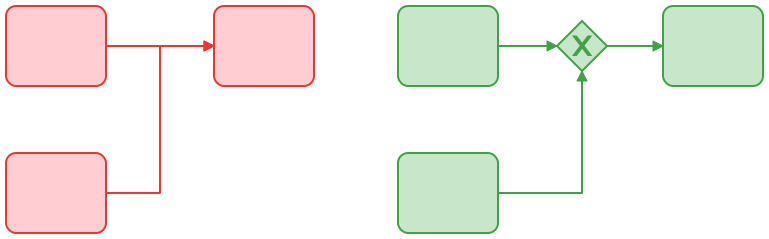
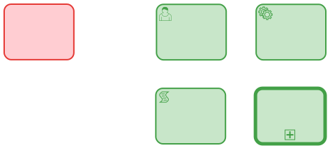
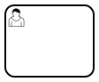
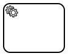
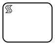
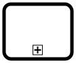
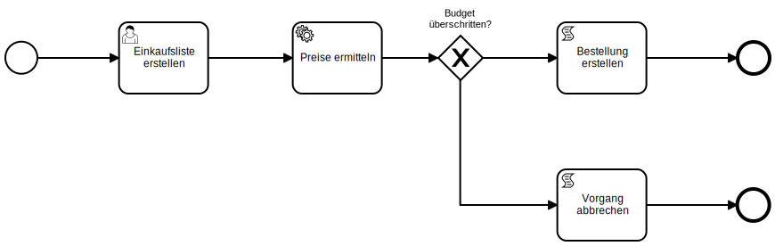
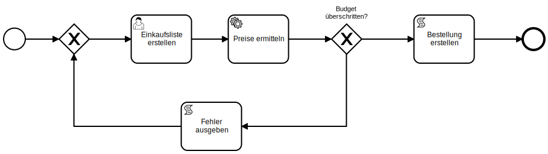
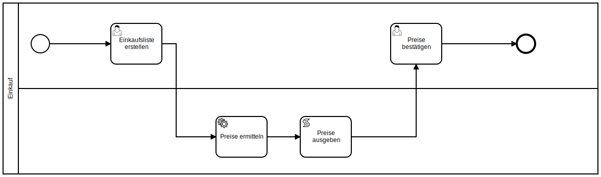

# Styleguide

## Sprache in Modellen

In Modellen ist immer die Sprache des Anwenders zu verwenden.

### Aktivitäten bezeichnen

Verwende das **Objekt-Verrichtungsprinzip**.

[Objekt] + [Verb] - Pattern

Statt:

"Zuerst muss der Einkauf der Lebensmittel erledigt werden"

Lieber:

"Lebensmittel einkaufen"

### Ereignisse bezeichnen

Verwende das **Objekt-Zustandsprinzip**.

[Objekt] + [Zustand] - Pattern

Statt:

“Die Lebensmittel wurden zuerst eingekauft.”

Lieber:

“Lebensmittel eingekauft”

## Graphisches Design

Der Prozessfluss wird immer von links (oben) nach rechts (unten) modelliert.

Es gibt keine kreuzende oder überlappende Pfade.

## Aktivitäten typisieren

Wir verwenden keine untypisierten Aktivitäten (rot);
stattdessen typisieren wir alle Aktivitäten sinnvoll (grün);
dadurch erkennt der Betrachter sofort den Fokus der Aktivität.

### Beispiele für typisierte Aktivitäten

#### Benutzeraktivität

Eine Benutzeraktivität wird immer von einem Menschen erledigt; es handelt sich
dabei um eine von der Process Engine zugewiesene Aufgabe.

| Symbol | Beispiel |
| :----: | -------- |
|  | Die Genehmigung eines Antrags; die Prüfung von offiziellen Dokumenten oder die Bearbeitung einer Anfrage. |

- Der Benutzer erstellt eine Einkaufsliste.

#### Service Aktitvät

Eine Serviceaktivität wird von einer Software ausgeführt.

| Symbol | Beispiel |
| :----: | -------- |
|  | Das Abfragen von Daten einer API; die automatische Verbuchung einer Rechnung oder das Generieren eines Angebots für einen Kunden. |

- Der Benutzer erstellt eine Einkaufsliste.
- Die Preise der Positionen werden von einem Service ermittelt.

#### Skriptaktivität

Eine Skriptaktivität enthält ein Skript, das von der Process Engine ausgeführt
wird.

Die Process Engine unterstützt JavaScript als Skriptsprache.

| Symbol | Beispiel |
| :----: | -------- |
|  | Das Ausgeben von Text auf einer Konsole oder generell alle Aufgaben, die mit JavaScript erledigt werden können. |

- Der Benutzer erstellt eine Einkaufsliste.
- Die Preise der Positionen werden von einem Service ermittelt.
- Der Gesamtpreis wird von einem Skript ausgegeben.

#### Aufrufaktivität

Die Aufrufaktivität ist die einzige Möglichkeit einen anderen Prozess in
einem Prozess aufzurufen.

| Symbol | Beispiel |
| :----: | -------- |
|  | Der Aufruf eines anderen Prozesses in diesem Prozess. |

Der gesamte Prozess wird durch die Aufrufaktivität aufgerufen.

## Verwendung von Gateways

Viele Prozesse laufen nicht immer gleich ab. Wir nutzen Gateways, um diese
Variationen abzubilden.

Beachte folgende Regeln, zum korrekten modellieren von Gateways:

- Ein Split-Gateway hat einen eingehenden und einen oder mehrere ausgehende Pfeile.

- Ein Join-Gateway hat einen oder mehrere eingehende und einen ausgehenden Pfeil.

- Split- und Join-Gateways korrespondieren (z.B. XOR-Split-Gateway mit
  XOR-Join-Gateway).

## Weitere Regeln

- Es sollte immer ein **Pool** verwendet werden.
- Es sollte immer eine oder mehrere **Lanes** verwendet geben.

- Ein Prozess hat ein Startevent und mindestens ein Endevent.
- Eine Aktivität hat einen eingehenden und einen ausgehenden Pfeil.
- Zum Teilen und Zusammenführen von Prozessflüssen werden Gateways verwendet.
- Boundary-Ereignisse haben einen ausgehenden Pfeil.
