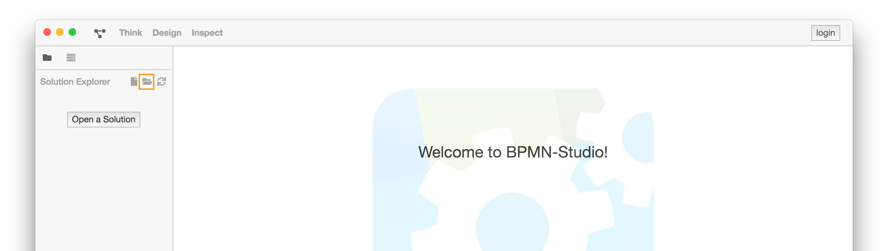
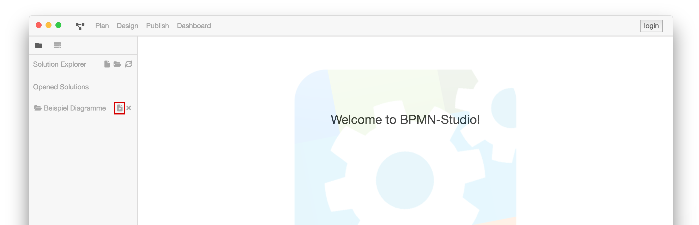
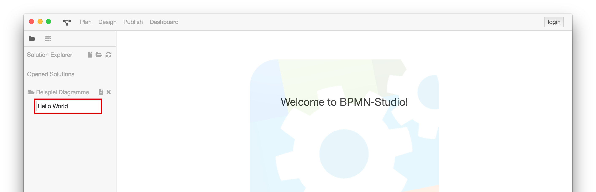
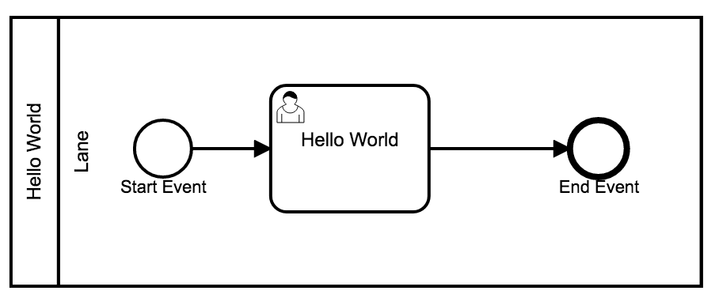
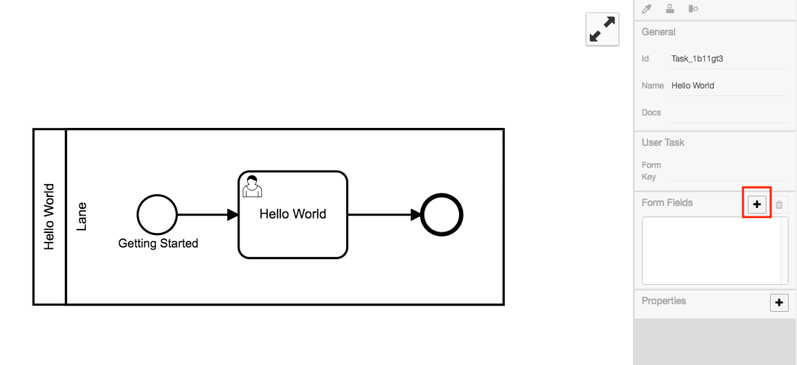
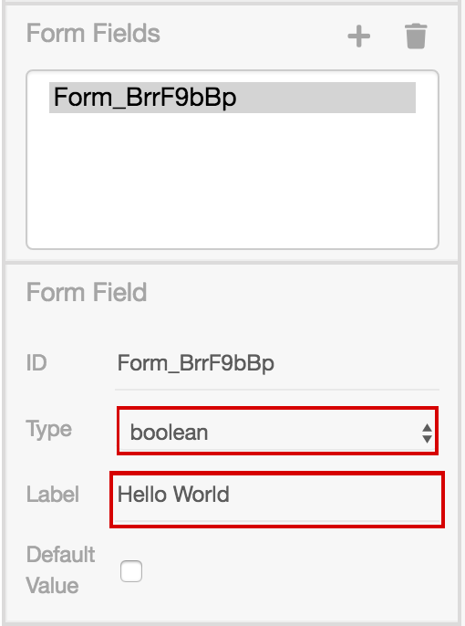

# Hello BPMN-World

Um die Möglichkeiten der ProcessEngine zu demonstrieren, wird ein Beispiel
Diagramm erstellt.

Ziel ist es ein BPMN-Diagramm mit einem
[Single User Task](../../GLOSSARY.md#user-task) zu erstellen.

Das Diagramm sieht folgendermaßen aus:

Dieser [User Task](../../GLOSSARY.md#user-task) wird die folgenden zwei
Elemente enthalten:

1. die Nachricht `Hello World`
2. eine Schaltfläche zum Bestätigen

Letzteres dient dazu, den [Task](../../GLOSSARY.md#task) zu beenden.

## Erstellung eines neuen Diagramms

Zunächst wird ein neues Diagramm benötigt. Dieses kann über den Solution
Explorer erstellt werden. Dafür muss man eine Solution öffnen, dazu klickt
man im Solution Explorer auf den "Open a Solution"-Button.

Es öffnet sich ein Fenster zur Auswahl eines Ordner, der geöffnet werden soll.
Sobald man ein Ordner geöffnet hat kann man ein Diagramm erstellen. Dazu klickt man auf den
"Datei hinzufügen"-Button.

Es erscheint ein Textfeld, in dem der Name für die Datei eingegeben wird.
In diesem Fall wird `Hello World` gewählt.

Die Design-Ansicht öffnet sich mit dem gerade erstellten Diagramm.

So sieht das Ganze dann aus:

../images/getting-started/hello-world/create-new-diagram.mp4

## Modellierung eines Diagramms

Die Design-Ansicht zeigt uns ein Diagramm mit einer
[Lane](../../GLOSSARY.md#lane), einem Startevent und einem Endevent.

Durch das Auswählen eines Elements öffnet sich ein Kontextmenü; dieses Menü
erlaubt es neue Elemente hinzuzufügen; diese werden direkt mit dem ausgewählten
Element verbunden.

Der Sequenzfluss vom Startevent zum Endevent wird zunächst entfernt.
An dem Startpunkt wird dann ein [UserTask](../../GLOSSARY.md#user-task)
mit dem Namen `Hello Word` verbunden; an diesem dann das Endevent.

Das Ganze sollte dann so aussehen:

Und so wird es gemacht:

../images/getting-started/hello-world/create-hello-world.mp4

## Integration eines Diagramms

Ein [UserTask](../../GLOSSARY.md#user-task) kann so eingestellt werden,
dass dem Benutzer eine grafische Oberfläche dargestellt wird. In diesem Fall
wird eine Confirm Ansicht gewählt.
Um das zu erreichen muss der UserTask folgendermaßen eingestellt werden:

  1. In dem Property Panel rechts unter dem Punkt Properties lässt sich die anzuzeigende
  Oberfläche mittels Key-Value Paaren definieren:

    Hier fügen wir eine Property namens `preferredControl` mit dem Wert `confirm` hinzu.

  

  1. Ein FormField mit dem Typ Boolean wird benötigt.
  Das Label stellt die Nachricht, die confirmed werden soll, dar.

  **Wichtig:** Wenn der UserTask eine Confirm Ansicht anzeigen soll, muss 
  immer das **ERSTE** FormField vom Typ `boolean` sein.
  Die Id spielt dabei keine Rolle.

  

**Zusammenfassung**

Was wir getan haben:
- einen [User Task](../../GLOSSARY.md#user-task) namens `Hello World` erstellt.
- den Task mit einer Konfiguration für die Oberfläche versehen.
- die verschiedenen Ausführungsschritte miteinander verdrahtet.

Hier ist der komplette Ablauf mit Ausführung des Prozesses zu sehen:

../images/getting-started/hello-world/hello-world_full_example.mp4
