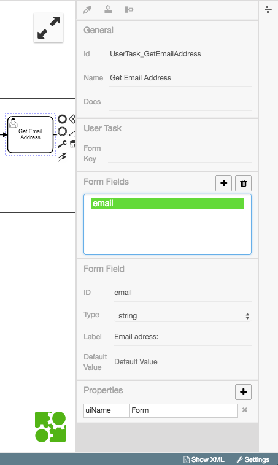

# Emails versenden

In diesem Beispiel wird ein Prozess für den Versand von Emails modelliert.
Das fertige Diagramm kann
[hier](https://github.com/process-engine/example_processes/tree/develop/solutions/SendEmail)
heruntergeladen werden.

## Motivation

Wir wollen mit diesem Beispiel zeigen, wie:

* der interne Email-Services der ProcessEngine verwendet wird.
* Benutzer zur Interaktion aufgefordert werden.
* eine Bestätigung des Benutzers zur Ablaufsteuerung verwendet wird.

## Prozessschritte anlegen

Wir erstellen ein Diagramm mit folgenden Bestandteilen:

1. Start Event
1. User-Task: `Enter Email Address`
1. User-Task: `Confirm Email Address`
1. Exclusive Gateway: unterscheidet, ob im vorherigen User-Task bestätigt wurde
1. Service-Task: `Send Email`
1. End Event

Im Folgenden wird Erstellung und Konfiguration dieser Elemente gezeigt.

### User-Task zur Eingabe der Emailadresse

Zu Beginn erstellt man einen User-Task mit dem Namen `Get Email
Address`. Dieser dient dazu, den User die Eingabe einer Emailadresse per Dialog
(UI) zu ermöglichen.

Da wir auf die Eingabe des Nutzers zugreifen werden, lohnt es sich, den
User-Task und das Formularfeld fachlich zu benennen.

Wir bezeichnen den User-Task als `usertask_enter_email` und das
Formularfeld als `email`. Wir empfehlen stets eine logische Benennung der
Diagrammelemente; sie sollte sich fachlich orientieren und erleichtert dadurch
das Verstehen, der Zugriffe auf Prozessdaten.

Bei dem Formularfeld fügen wir ein Label hinzu mit dem Inhalt:
`Please enter your Email address:`.

../images/getting-started/sending-emails/create_task_get_email_address.mp4

Es ergibt sich folgende Konfiguration:



### User-Task für Bestätigungsdialog (Confirm)

Ein weiterer User-Task soll dem Nutzer die Möglichkeit geben, den
Prozess abzubrechen, bzw. eine Bestätigung der Emailadresse zu erhalten.

Wir erstellen den User-Task mit der Id `usertask_email_confirm` und
dem Namen `Confirm Data`. Für User-Tasks zur Bestätigung benötigen
wir zudem die Property `preferredControl` mit dem Wert `confirm` und
ein Formularfeld vom Typ `Truth value`. Als Label benutzen wir:

```
${"Do you want to send an email to " + token.history.usertask_enter_email.form_fields.email + "?"}
```

Innerhalb der `${...}`-Syntax können wir auf Inhalte des Tokens
zugreifen.

`token.history.usertask_enter_email.form_fields.email` erlaubt den Zugriff auf
den Wert, den der Nutzer in dem vorherigen User-Task mit der Id
`usertask_enter_email` angegeben hat.

Mit dem `+`-Zeichen kann dieser Wert mit Zeichenketten verbunden werden.

../images/getting-started/sending-emails/create_task_confirm_data.mp4

### Exclusive Gateway (Exklusiver Pfad)

Als Nächstes wird eine Überprüfung angelegt.

Es ist zu prüfen, ob in dem `Confirm Data`-Task
Confirm oder Cancel ausgewählt wurde; wir benutzen ein `Gateway` dafür.

Diese Auswahl steuert den Fluss auf dem weiteren Prozessweg; Cancel beendet
den Prozess; Confirm löst den `Send email`-Task aus.

Die Fallunterscheidung erfolgt bei der Konfiguration der
Sequenzflüsse, die dem Exclusive Gateway folgen.

Einer der Flüsse führt zum End Event mit der Bedingung (Condition):

`token.history.usertask_enter_email.form_fields.email === "true"`.

Der andere Fluss trägt die Condition:

`token.history.usertask_enter_email.form_fields.email === "false"`

und führt zu dem Service-Task zum Versand der Mail.

../images/getting-started/sending-emails/create_gateway.mp4

### Service-Task für den Versand der Email

Der letzte Prozessschritt ist der `Send email`-Task.
Dieser muss die folgenden Eigenschaften erhalten:

```plain
module  MailService
method  send
params  [null, token.history.usertask_enter_email.form_fields.email, "Regarding Hello World", "Hello World!"]
```

Das `module` adressiert den internen ProcessEngine Service für den
Email-Versand. Durch die Auswahl der `method` wird die Aktion bestimmt, die der
Service ausführt; `send`, also den Versand der Email, in unserem Fall.
Die Angabe der `params` enthält, die Angaben, die für den Versand der Email notwendig sind.

../images/getting-started/sending-emails/create_service_task.mp4

## Vollständige Konfiguration

Hier ist eine Aufnahme der kompletten Konfiguration des Prozesses:

../images/getting-started/sending-emails/complete_configuration.mp4
