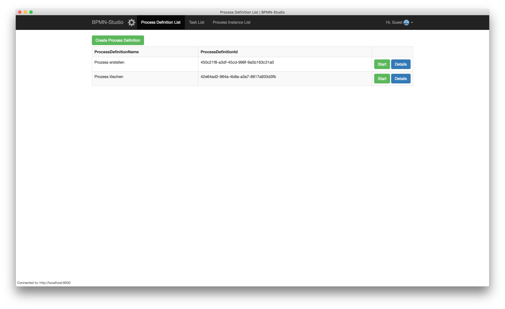

# Installation

## BPMN-Studio

Die aktuellste Version des BPMN-Studios und alle vorherigen Versionen
kann man
[hier](https://github.com/process-engine/bpmn-studio/releases)
herunterladen.

### Mac

Die oben verlinkten Releases enthalten eine `.dmg`-Datei.

Diese Datei kann direkt ausgeführt werden oder zur Installation in den `Programme`-Ordner verschoben werden.

### Windows

Für die Windows-Version sollte die `exe`-Datei des entsprechenden Releases heruntergeladen werden.

Diese kann zur Installation des BPMN-Studio ausgeführt werden. Nach der Installation ist das BPMN-Studio startbereit.

