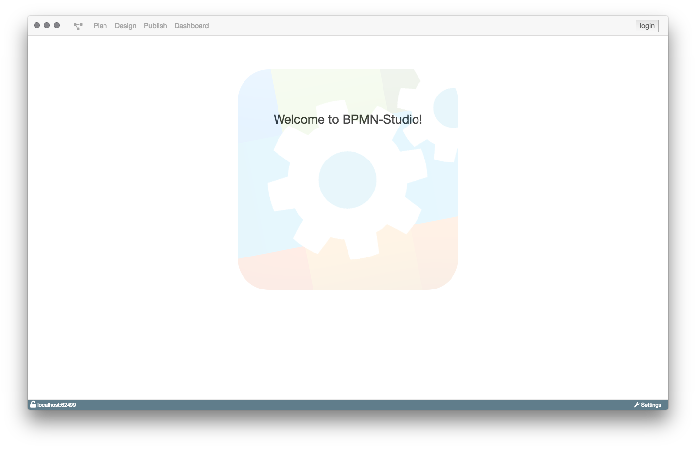

# Installation

## BPMN-Studio

Die aktuellste Version des BPMN-Studios und alle vorherigen Versionen
kann man
[hier](https://github.com/process-engine/bpmn-studio/releases)
herunterladen.

### Mac

Die oben verlinkten Releases enthalten eine `.dmg`-Datei.

Wir empfehlen BPMN-Studio in den `Programme`-Ordner zu schieben,
es kann aber auch direkt ausgeführt werden.

### Windows

Für die Windows-Version sollte die `.exe`-Datei des entsprechenden Releases
heruntergeladen werden.

Diese kann zur Installation des BPMN-Studio ausgeführt werden. Nach der 
Installation ist das BPMN-Studio startbereit.

### Nach der Installation

Wurde die Anwendung erfolgreich installiert und ausgeführt,
öffnet sich die Startseite des BPMN-Studios.

