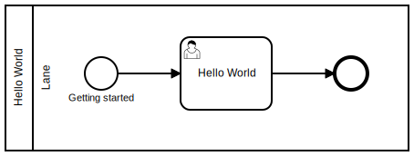
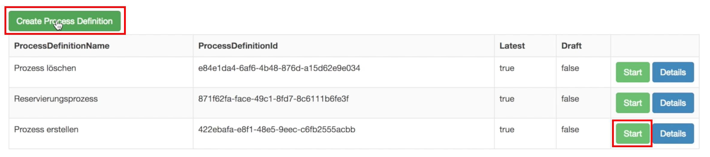
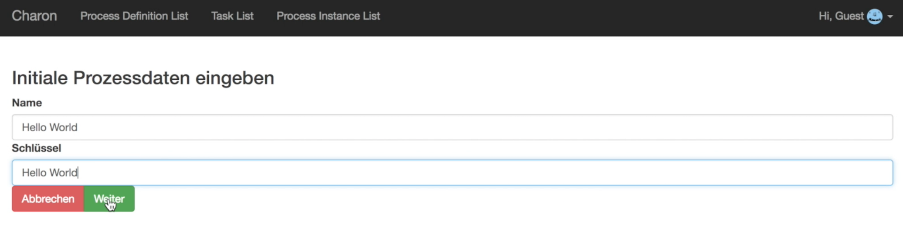
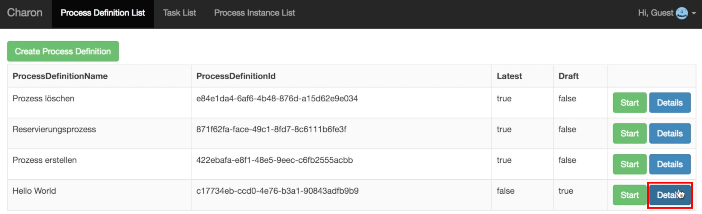
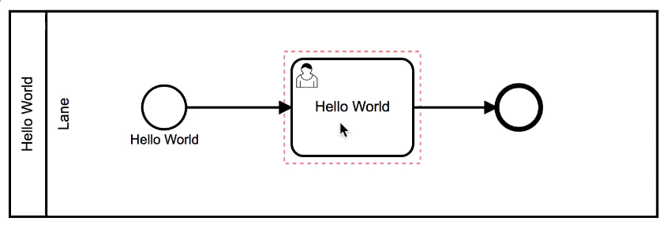
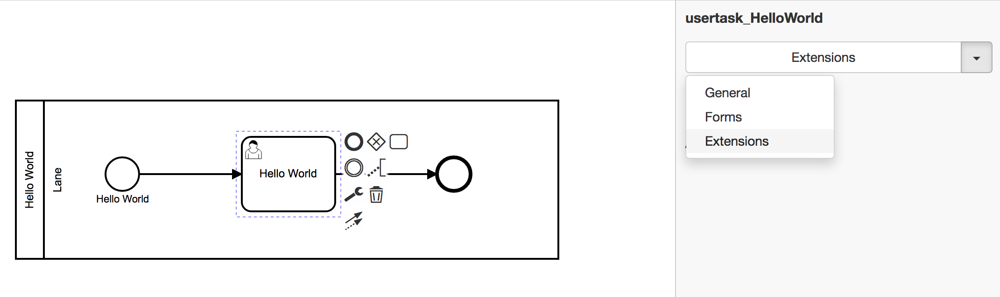
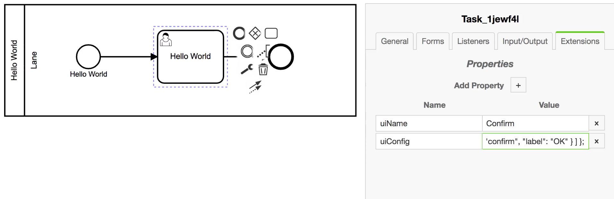

# Hello BPMN-World

Um die Möglichkeiten der ProcessEngine zu demonstrieren, wird ein Beispiel
Diagramm erstellt.

Ziel ist es ein BPMN-Diagramm mit einem
[Single User Task](../../anhang/GLOSSARY.md#user-task) zu erstellen.

Das Diagramm sieht folgendermaßen aus:



Dieser [User Task](../../anhang/GLOSSARY.md#user-task) wird die folgenden zwei
Elemente enthalten:

1. die Nachricht `Hello World`
2. eine Schaltfläche zum Bestätigen

Letzteres dient dazu, den [Task](../../anhang/GLOSSARY.md#task) zu beenden.

## Erstellung eines neuen Diagramms

Die Schaltfäche `Create Process Definition` dient zum Erstellen eines neuen
Diagramms. Alternativ kann auch der `Prozess erstellen`-Prozess ausgeführt
werden.



Es öffnet sich ein neuer Dialog; dort können ein Name und ein Schlüssel für das
Prozessmodell angegeben werden; in diesem Fall wird bei beiden `Hello World`
gewählt.



Die Task List erscheint; in der Liste befindet sich der Eintrag: `Prozess
erstellen`; nach Beendigung der Arbeiten im Backend, springt der UserTaskName
auf `Prozess erstellt` um; die `Continue` Schaltfläche kann betätigt werden; die
darauffolgende Nachricht kann über die `OK` Schaltfläche geschlossen werden.

Der `Process Definition List`-Reiter zeigt die Liste der Prozessmodelle an; die
`Details`-Schaltfläche des gerade erstellten Prozesses öffnet den Prozesseditor.



So sieht das Ganze dann aus:

../images/create-new-diagram.mp4

## Modellierung eines Diagramms

Der BPMN-Editor zeigt uns eine Ansicht mit einer
[Lane](../../anhang/GLOSSARY.md#lane) und einem Startevent.

Durch das Auswählen eines Elements öffnet sich ein Kontextmenü; dieses Menü
erlaubt es neue Elemente hinzuzufügen; diese werden direkt mit dem ausgewählten
Element verbunden.

An dem Startpunkt wird dann ein [User Task](../../anhang/GLOSSARY.md#user-task)
mit dem Namen `Hello Word` verbunden; an diesem dann ein Endevent.

Das Ganze sollte dann so aussehen:



Und so wird es gemacht:

../images/create-hello-world.mp4

## Integration eines Diagramms

Ein [User Task](../../anhang/GLOSSARY.md#user-task) kann so eingestellt werden,
dass dem Benutzer eine grafische Oberfläche dargestellt wird. Die Konfiguration
kann wie folgt geschehen:

- Über die rechts befindliche Dropdown-Liste zur Ansicht `Extensions` wechseln
- Hier kann nun mit Hilfe von Key-Value-Paare eingestellt werden, wie die
Oberfläche aussehen soll



Es gibt zwei Felder:

1. `uiName`
1. `uiConfig`

Mit Hilfe von `uiName` wird die Art der UI Komponente festgelegt.

In diesem Fall benutzen wir einen Bestätigungsdialog. Als Wert für das Feld
`uiName` wählen wir dazu `Confirm`.

Mit Hilfe von `uiConfig` werden die Details der UI Komponente bestimmt.

In diesem Fall die Nachricht und die Bedienelemente, die angezeigt werden
sollen; bitte folgendes in das Feld `uiConfig` eintragen:

```javascript
${ "message": "Hello World!", "layout": [ { "key": "confirm", "label": "OK" } ] };
```



../images/integrate-hello-world.mp4

**Zusammenfassung**

Wir haben den [User Task](../../anhang/GLOSSARY.md#user-task) festgelegt, die
Konfiguration der Oberfläche hinterlegt und die Komponenten korrekt verschaltet.

Zeit den Prozess auszuführen:

../images/run-hello-world.mp4
