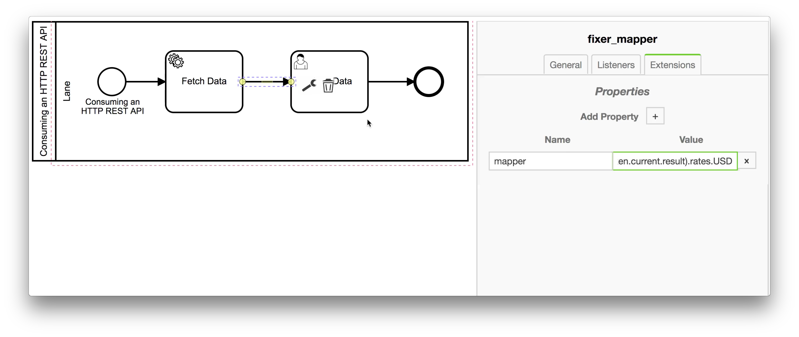

# Nutzung einer REST API

In diesem Beispiel werden Wechselkurse von einer REST API geladen und
dargestellt.

Erstelle dazu ein neues Diagramm, analog zum Hello World Beispiel.

Erstelle dann einen [Service Task](../../anhang/Glossary.md), um Daten zu laden
und einen [User Task](../../anhang/Glossary.md), um die Daten anzuzeigen:

../images/consuming-rest-api.mp4

Unter dem `Extensions` Reiter kann dem
[Service Task](../../anhang/Glossary.md) `Fetch Data` nun gesagt werden, was er tun soll: In diesem
Fall eine HTTP REST API abzurufen. Dazu muss im `Extension` Reiter die folgenden Properties hinzugefügt werden:

```
module   HttpService
method   get
params   ['http://api.fixer.io/latest]
```


Als Nächstes wird dem [Sequenzfluss](../../anhang/Glossary.md) von der `Fetch Data` zur `Show Data` Task mitgeteilt, wie
das Ergebnis interpretiert und an den User [Task](../../anhang/Glossary.md)
weitergegeben werden soll.

Die [Sequenzflusszuordnung](../../anhang/Glossary.md) definiert, wie die im
vorherigen [Task](../../anhang/Glossary.md) empfangenen Daten im Token
aufbewahrt werden.
In diesem Fall sollen nicht alle Wechselkurse angezeigt werden, sondern lediglich
der USD Kurs.

Um das zu erreichen wird ihm - wieder im `Extensions` Reiter - die Property `mapper | JSON.parse(token.current.result).rates.USD` mitgegeben.



Nach dem Mapping kann der nächste BPMN Knoten nach dem
[Sequenzfluss](../../anhang/Glossary.md) den USD Kurs durch den Zugriff auf
`token.current` nutzen.

Zum Schluss muss dem [User Task](../../anhang/Glossary.md) `Show Data` nur noch gesagt werden,
was er anzeigen soll.
Dazu setzen wir `Confirm` als `uiName`, um einen Bestätigungsdialog zu
verwenden und konfigurieren diesen mit folgender `uiConfig`:

```
${ "message": "1 EUR = " + token.current + " USD", "layout": [ { "key": "confirm", "label": "OK"}] };
```


So sollte das ganze dann aussehen:
../images/integrate-rest-api.mp4


Das sieht dann folgendermaßen aus:

../images/run-rest-api.mp4

