# Emails versenden

Das Beispiel "Verwendung einer REST API" wird um den Versand von Emails erweitert,
um die geladenen Daten zu versenden.

Dazu muss der Prozess nur mit folgenden drei Schritten abgeändert werden:

1. Die Abfrage der Email-Adresse
1. Eine Bestätigung anfordern
1. Der Versand einer Email mit dem Wechselkurs

Um das zu erreichen, müssen ein paar Vorbereitungen getroffen werden.

../images/preparation-send-email.mp4

Den Pool und das Startevent zu `Sending mails` umbenennen und
die Lane vergrößern, da mehr Platz benötigt wird.

#### 1.1  Vorbereitungen
Dazu klickt man doppelt auf den Poolname und gibt `Sending mails` ein.


Dasselbe wird auch bei dem Startevent gemacht.

Fertig sieht es so aus:

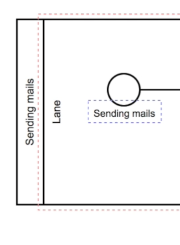

Als nächstes erstellt man einen [User Task](../../anhang/Glossary.md)
mit dem Namen `Get Email Address`,
der den User per UI dazu auffordert eine E-Mail anzugeben.

../images/get_email_address-send-email.mp4

#### 1.2 Usertask erstellen und konfigurieren

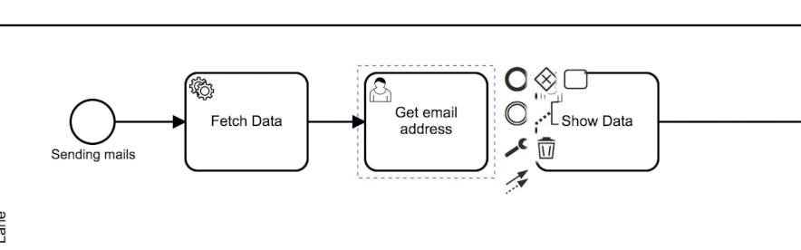

Hinzufügen einer ID:

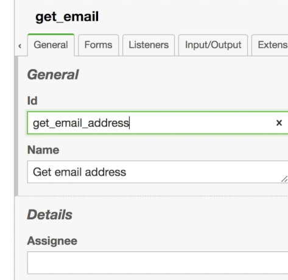

Hinzufügen eines Formfields:

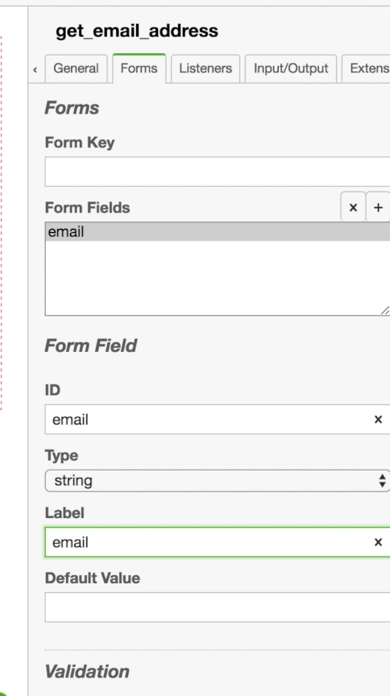

Hinzufügen einer Property:

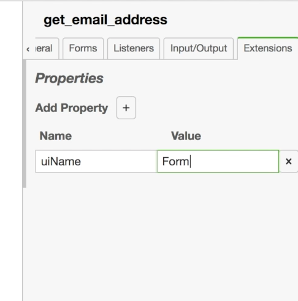

#### 1.3 Abändern vorhandener Tasks
Dann muss der `Show Data`-[Task](../../anhang/Glossary.md) zu `Confirm Data`
umbenannt werden und der Wert der
`uiConfig` Property zu folgendem Wert abgeändert werden:

```
${ "message": "1 EUR = " + JSON.parse(token.history.fetch_data.result).rates.USD + " USD - email: " + token.current.email, "layout": [ { "key": "confirm", "label": "OK"}, { "key": "cancel", "label": "cancel"}] };
```

Dabei ist zu beachten, dass der `Fetch Data`-[Task](../../anhang/Glossary.md)
die ID `fetch_data` bekommt.

../images/confirm_data-send-email.mp4

Umbenennen des `Show Data`-Task:

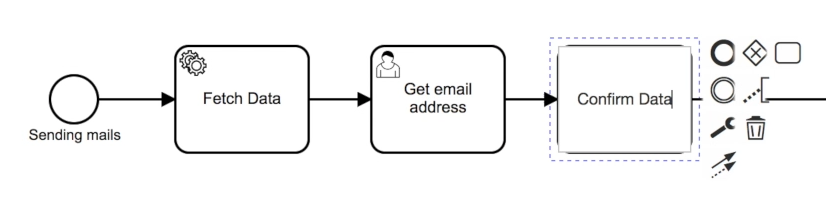

Anpassen der `uiConfig`:


Setzen einer ID beim `Fetch Data`-Task:

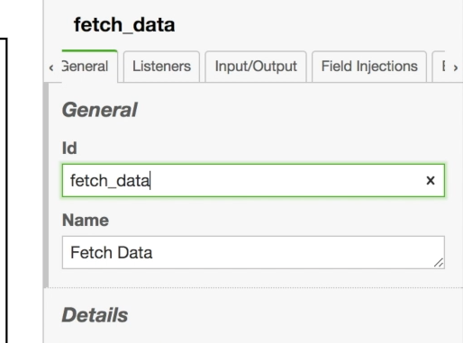

#### 2.1 Bestätigungsüberprüfung
Als nächstes wird eine Überprüfung angelegt.
Es ist zu prüfen, ob in dem `Confirm Data`-[Task](../../anhang/Glossary.md)
Confirm oder Cancel ausgewählt wurde; wir benutzen ein `Gateway` dafür.

Diese Auswahl hat Einfluss auf den weiteren Prozessweg. Cancel beendet den
Prozess und Confirm löst den `Send email`-[Task](../../anhang/Glossary.md) aus.

Der letzte Prozessschritt ist der `Send email`-[Task](../../anhang/Glossary.md).
Dieser muss die folgenden Eigenschaften
erhalten:

```
module  MailService
method	send
params	[null, token.history.get_email.email, "EUR to USD conversion rate", "1 EUR = " + JSON.parse(token.history.fetch_data.result).rates.USD + " USD"]
```

Nach diesem [Task](../../anhang/Glossary.md) muss der Prozess beendet werden.

../images/send_email-send-email.mp4

Hinzufügen eines Gateways:

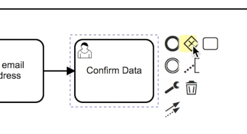

Hinzufügen von Flows und einem Service Task(`Send email`):

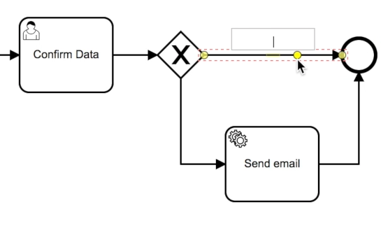

Hinzufügen der entsprechenden Überprüfungen:

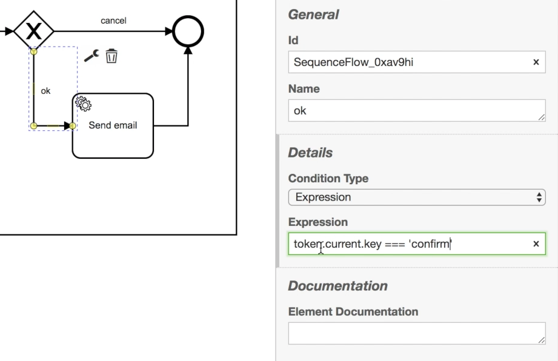

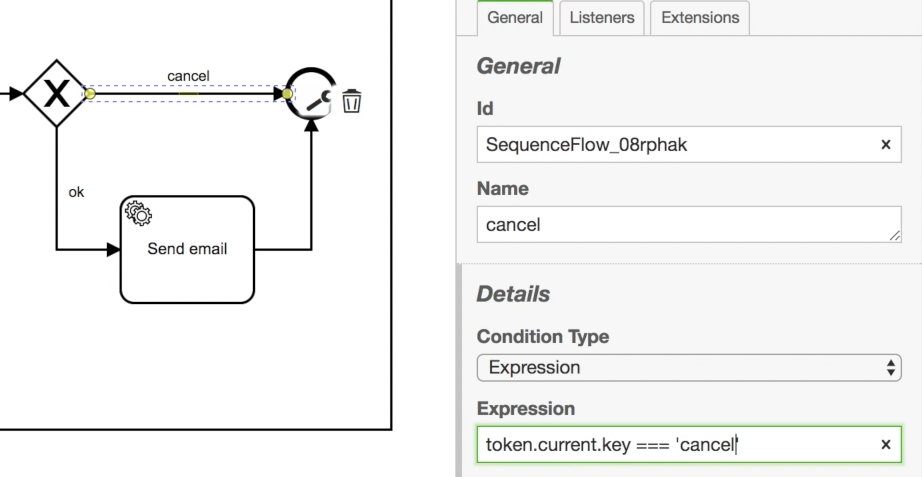

Setzen der Properties für den Service Task:

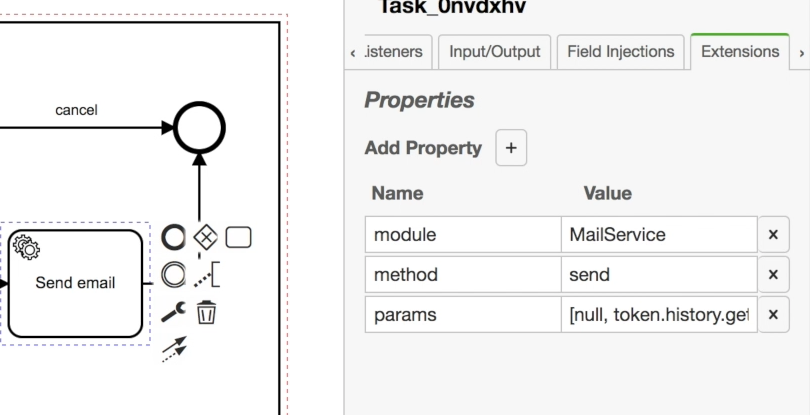

Dann kann das ganze getestet werden:

../images/run-sending-mails.mp4

Das fertige Prozessmodell sieht wie folgt aus:

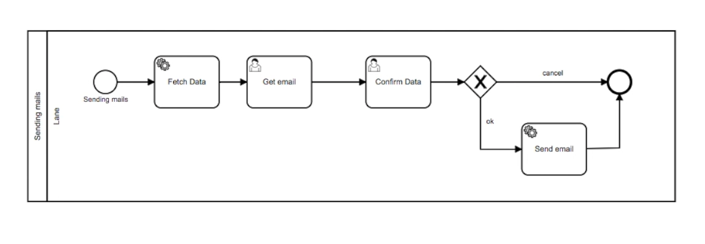
