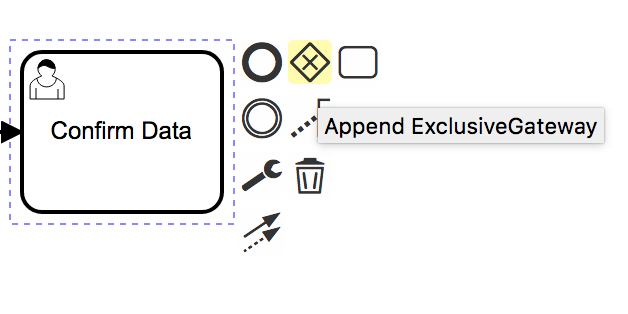
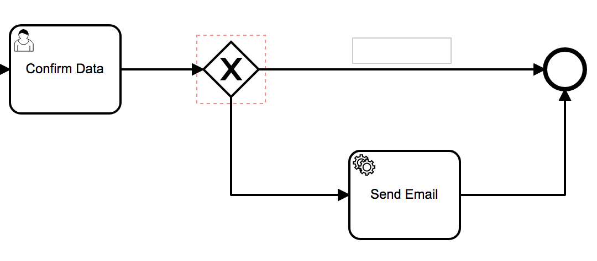
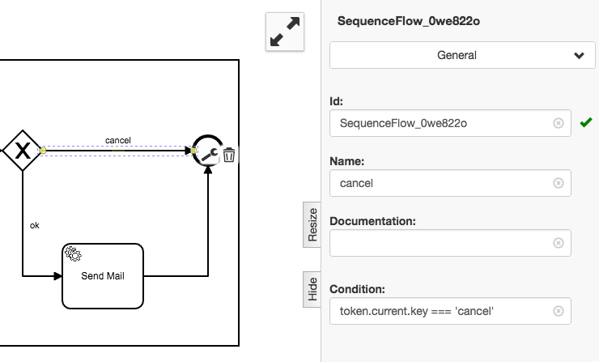
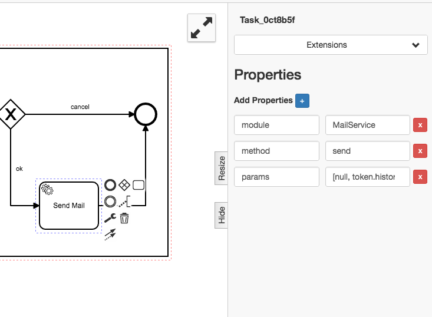

# Emails versenden

Das Beispiel "Verwendung einer REST API" wird um den Versand von Emails
erweitert, um die geladenen Daten zu versenden.

Dazu muss der Prozess um die folgenden drei
[Tasks](../../anhang/GLOSSARY.md#task) erweitert werden:

1. Die Abfrage der Email-Adresse
1. Die Anforderung einer Bestätigung
1. Den Versand einer Email mit dem Wechselkurs

#### 1.1  Vorbereitungen

Vorweg müssen ein paar Vorbereitungen getroffen werden.

../images/getting-started/sending-emails/preparation-send-email.mp4

Den [Pool](../../anhang/GLOSSARY.md#pool) und das Startevent zu `Sending mails`
umbenennen; die [Lane](../../anhang/GLOSSARY.md#lane) vergrößern, da mehr Platz
benötigt wird.

Dazu klickt man doppelt auf den Poolname und gibt `Sending mails` ein.


Dasselbe wird auch bei dem Startevent gemacht.

Fertig sieht es so aus:


#### 1.2 User Task erstellen und konfigurieren

Als nächstes erstellt man einen [User Task](../../anhang/GLOSSARY.md#user-task)
mit dem Namen `Get Email Address`. Dieser fordert den User per UI dazu auf eine
E-Mail anzugeben.

../images/getting-started/sending-emails/get_email_address-send-email.mp4

Auswählen der User Task:


Hinzufügen einer ID:


Hinzufügen eines Formfields:


Hinzufügen einer Property:


#### 1.3 Abändern vorhandener Tasks

Dann muss der `Show Data`-[Task](../../anhang/GLOSSARY.md#task) zu `Confirm
Data` umbenannt werden. Der Wert der `uiConfig` Property muss zu folgendem Wert
abgeändert werden:

```
${ "message": "1 EUR = " + JSON.parse(token.history.fetch_data.result).rates.USD + " USD - email: " + token.current.email, "layout": [ { "key": "confirm", "label": "OK"}, { "key": "cancel", "label": "cancel"}] };
```

Dabei ist zu beachten, dass der `Fetch
Data`-[Task](../../anhang/GLOSSARY.md#task) die ID `fetch_data` bekommt.

../images/getting-started/sending-emails/confirm_data-send-email.mp4

Umbenennen des `Show Data`-Task:


Anpassen der `uiConfig`:


Setzen einer ID beim `Fetch Data`-Task:


#### 2.1 Bestätigungsüberprüfung

Als Nächstes wird eine Überprüfung angelegt.

Es ist zu prüfen, ob in dem `Confirm Data`-[Task](../../anhang/GLOSSARY.md#task)
Confirm oder Cancel ausgewählt wurde; wir benutzen ein `Gateway` dafür.

Diese Auswahl hat Einfluss auf den weiteren Prozessweg. Cancel beendet den
Prozess; Confirm löst den `Send email`-[Task](../../anhang/GLOSSARY.md#task)
aus.

Der letzte Prozessschritt ist der `Send
email`-[Task](../../anhang/GLOSSARY.md#task). Dieser muss die folgenden
Eigenschaften erhalten:

```
module  MailService
method  send
params  [null, token.history.get_email.email, "EUR to USD conversion rate", "1 EUR = " + JSON.parse(token.history.fetch_data.result).rates.USD + " USD"]
```

Nach diesem [Task](../../anhang/GLOSSARY.md#task) muss der Prozess beendet
werden.

../images/getting-started/sending-emails/send-email.mp4

Hinzufügen eines Gateways:



Hinzufügen von Flows und einem
[Service Task](../../anhang/GLOSSARY.md#service-task)(`Send email`):



Hinzufügen der entsprechenden Überprüfungen:




Setzen der Properties für den
[Service Task](../../anhang/GLOSSARY.md#service-task):



Dann kann das ganze getestet werden:

../images/getting-started/sending-emails/run-sending-mails.mp4

Das fertige Prozessmodell sieht wie folgt aus:


